# 爬虫是什么？库怎么选？

用黑板图解方式，简明讲解《爬虫是什么？库怎么选？》。

## 阅读边界

本文依据原始课程的研究笔记、课程结构和发布文案整理。涉及产品、模型、版本、平台规则、价格或资格等可能变化的信息，实践前应以当前官方资料和实际环境为准。

## 爬虫是什么？Python 的爬虫库怎么选？

爬虫是什么？Python 库怎么选？

先把网页想成一座有目录的图书馆。爬虫就是按规则自动取书、找信息、记下结果的程序。

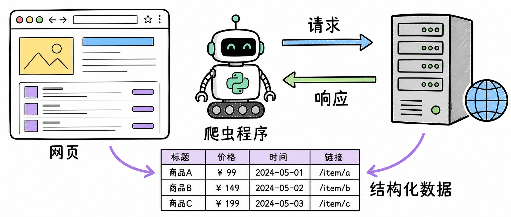

图解：“overview”这张示意图用于解释“爬虫是什么？Python 的爬虫库怎么选？”的关键关系；阅读时可结合本节的步骤、边界与结论逐项核对。

## 爬虫不是“读心术”

从请求到字段

它先发 HTTP 请求，再接收服务器返回的响应。网页内容通常是 HTML，程序要从这棵标签树里找到需要的字段。

页面里的链接，还能把它带到下一页。

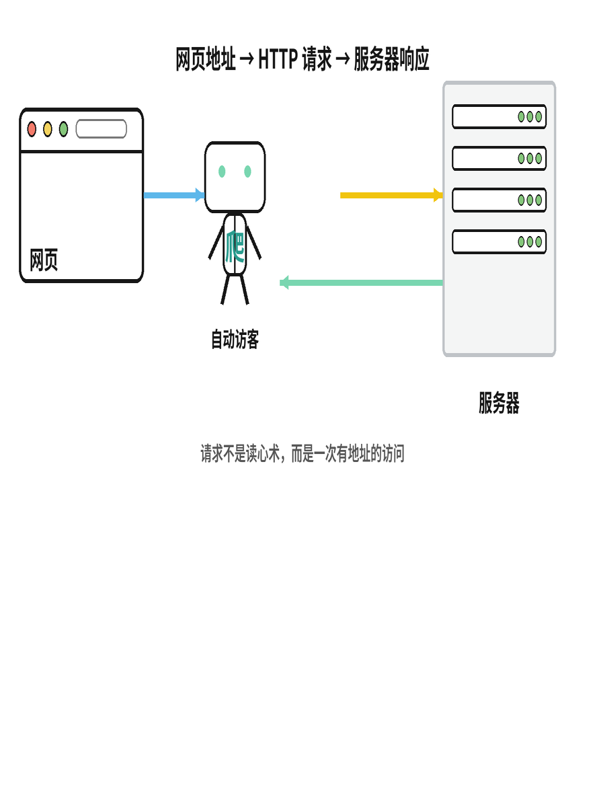

图解：“request”这张示意图用于解释“爬虫不是“读心术””的关键关系；阅读时可结合本节的步骤、边界与结论逐项核对。

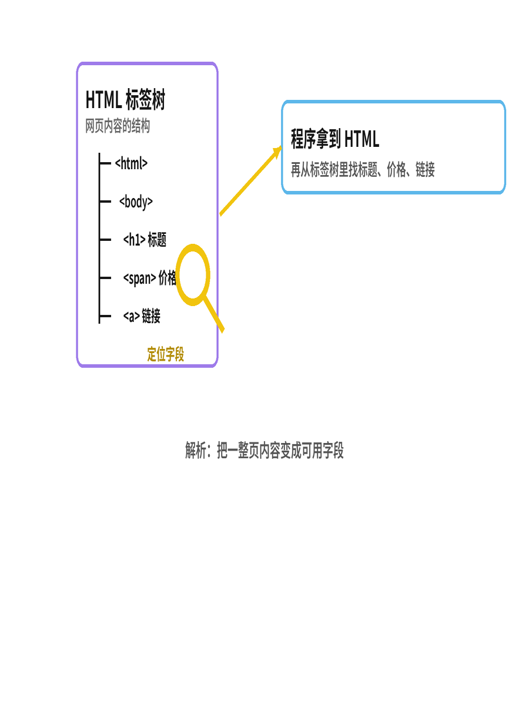

图解：“parse”这张示意图用于解释“爬虫不是“读心术””的关键关系；阅读时可结合本节的步骤、边界与结论逐项核对。

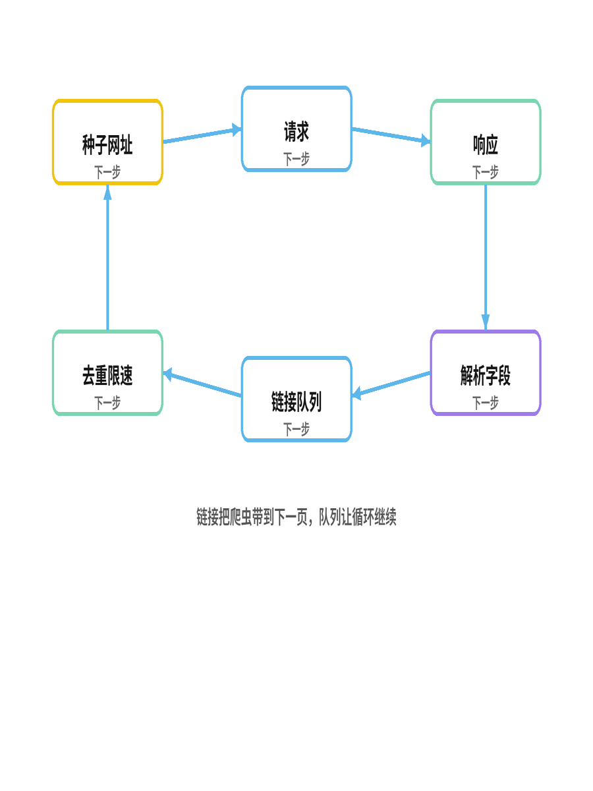

图解：“loop”这张示意图用于解释“爬虫不是“读心术””的关键关系；阅读时可结合本节的步骤、边界与结论逐项核对。

## 三种轻量工具

Python 先学这三种库

urllib 是 Python 自带的标准库，适合简单请求。Requests 把 HTTP 写法变得更顺手。

Beautiful Soup 专门帮助你在 HTML 里定位和提取内容。

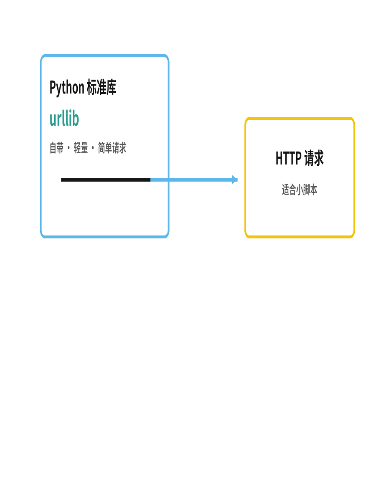

图解：“urllib”这张示意图用于解释“三种轻量工具”的关键关系；阅读时可结合本节的步骤、边界与结论逐项核对。

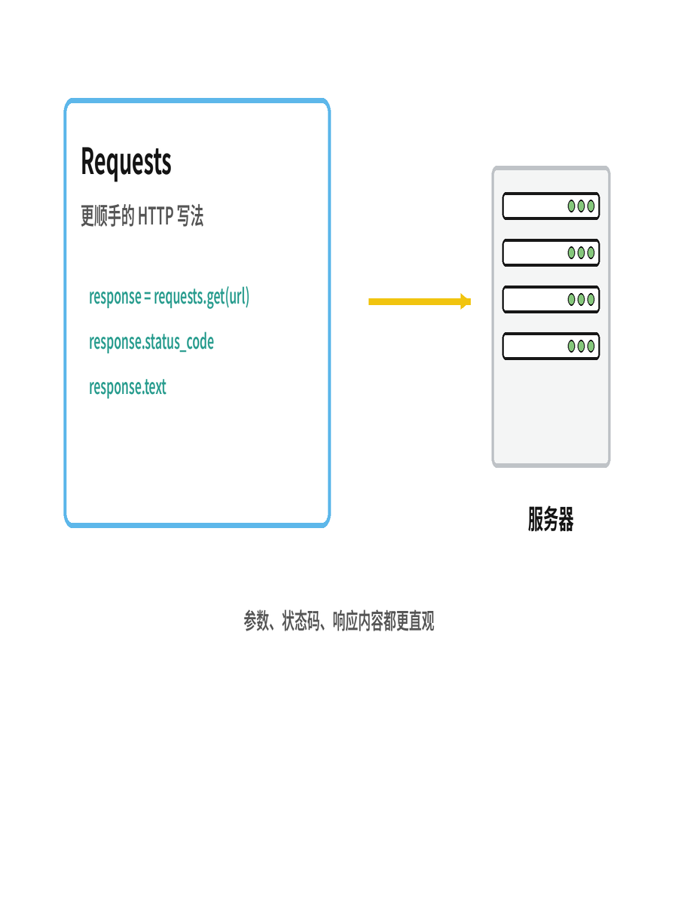

图解：“requests”这张示意图用于解释“三种轻量工具”的关键关系；阅读时可结合本节的步骤、边界与结论逐项核对。

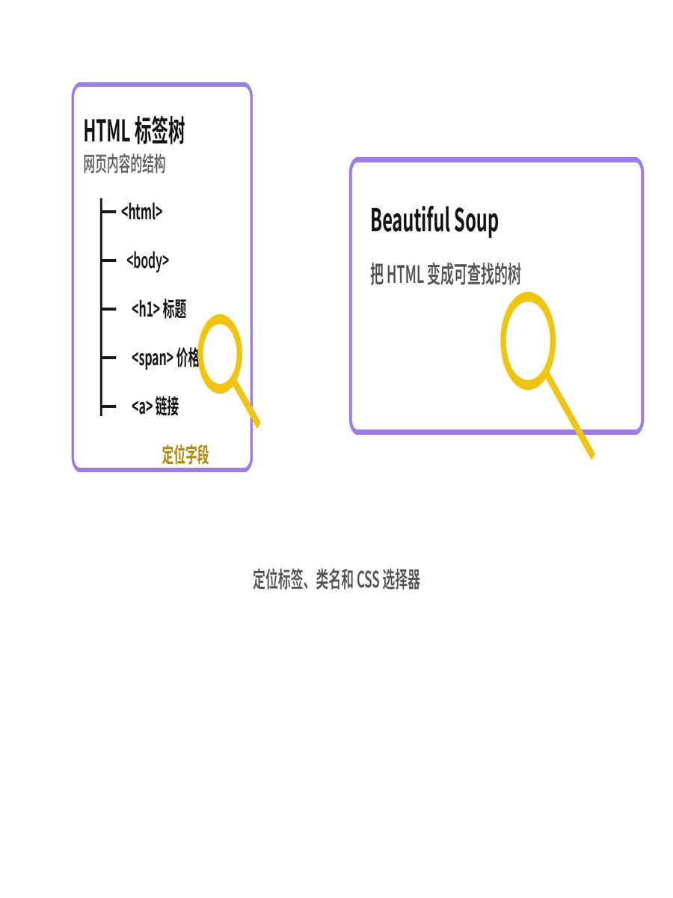

图解：“bs4”这张示意图用于解释“三种轻量工具”的关键关系；阅读时可结合本节的步骤、边界与结论逐项核对。

## 页面一复杂，工具就升级

复杂页面怎么选库？

如果要抓很多页，Scrapy 会把调度、下载、解析和保存组织成流水线。如果页面必须执行 JavaScript，Selenium 会驱动真实浏览器。

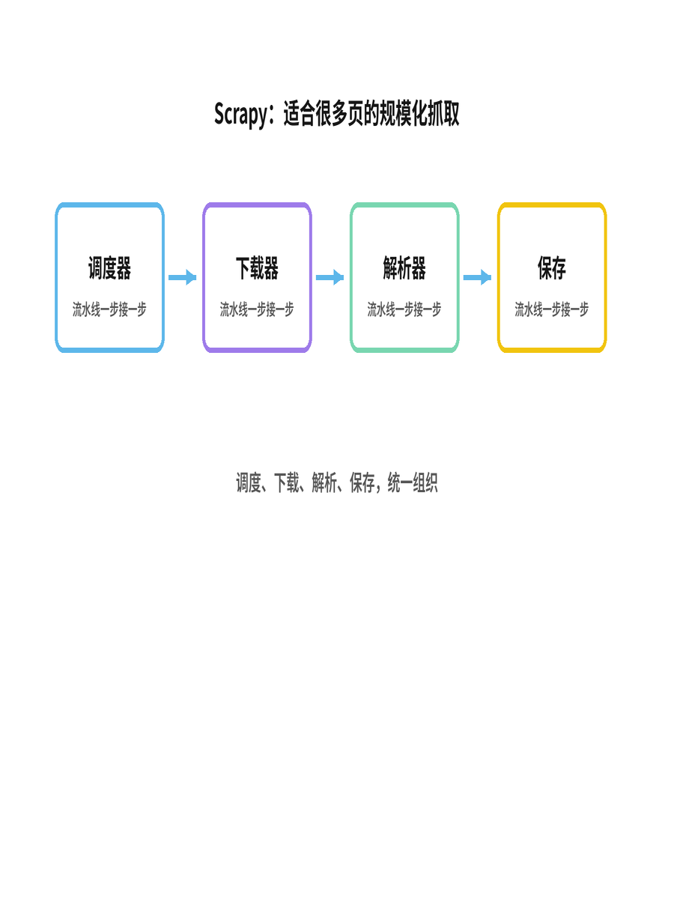

图解：“scrapy”这张示意图用于解释“页面一复杂，工具就升级”的关键关系；阅读时可结合本节的步骤、边界与结论逐项核对。

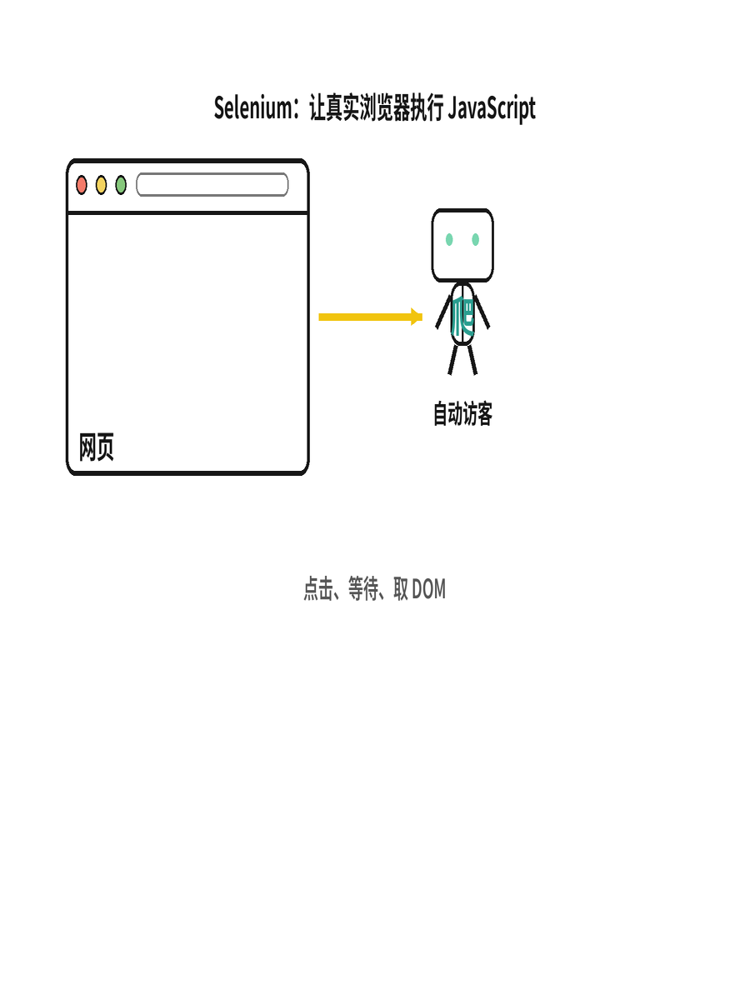

图解：“selenium”这张示意图用于解释“页面一复杂，工具就升级”的关键关系；阅读时可结合本节的步骤、边界与结论逐项核对。

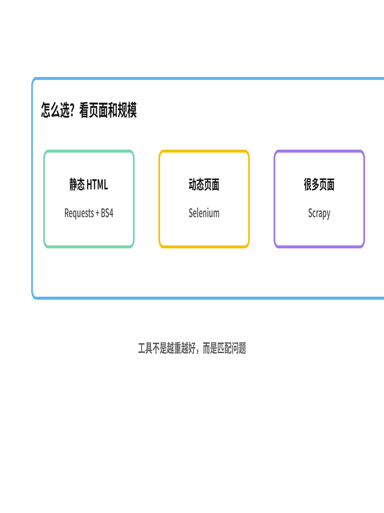

图解：“compare”这张示意图用于解释“页面一复杂，工具就升级”的关键关系；阅读时可结合本节的步骤、边界与结论逐项核对。

## 最后记住三件事

爬虫的边界与选择

能访问不代表可以随便抓。先看 robots.txt，再控制频率和超时，只取真正需要的数据。

把爬虫看成有礼貌的自动访客。

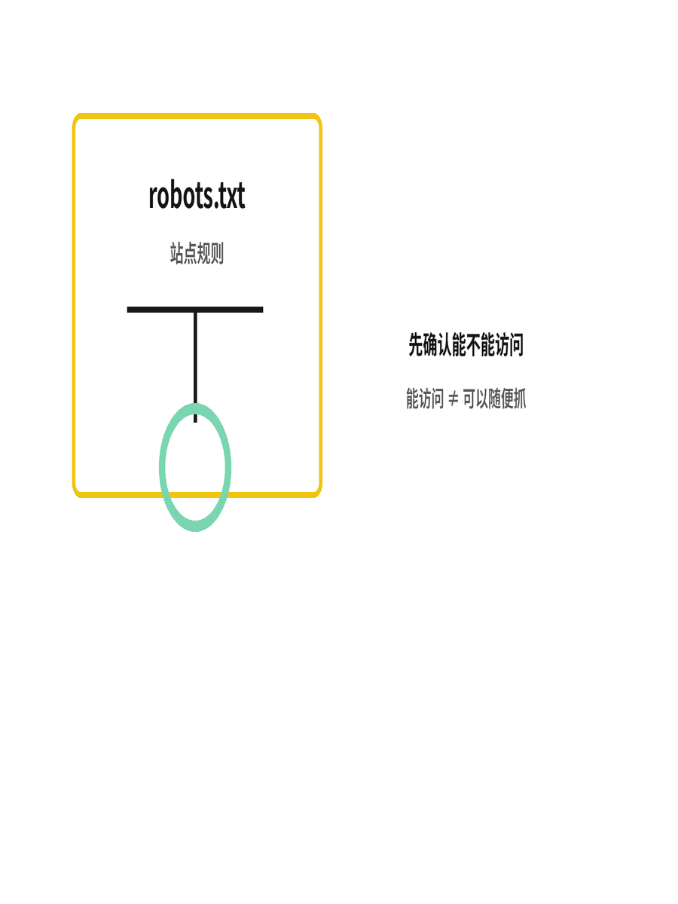

图解：“ethics”这张示意图用于解释“最后记住三件事”的关键关系；阅读时可结合本节的步骤、边界与结论逐项核对。

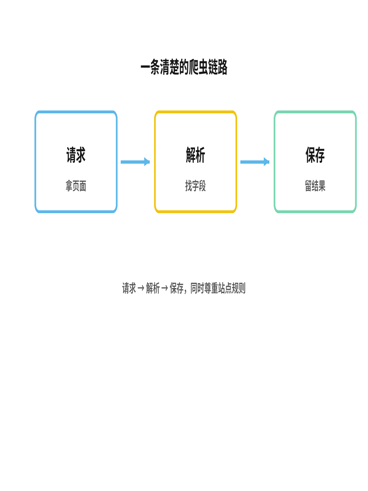

图解：“summary”这张示意图用于解释“最后记住三件事”的关键关系；阅读时可结合本节的步骤、边界与结论逐项核对。

## 小结

把问题拆成目标、约束、证据和验证四部分，通常比直接寻找唯一答案更可靠。先用本文的框架完成一次小范围验证，再根据真实反馈调整下一步。

## 参考资料

以下链接来自原始课程研究笔记；动态信息请以其当前页面为准。

- [https://en.wikipedia.org/wiki/Web_crawler](https://en.wikipedia.org/wiki/Web_crawler)
- [https://developer.mozilla.org/en-US/docs/Web/HTTP/Guides/Overview](https://developer.mozilla.org/en-US/docs/Web/HTTP/Guides/Overview)
- [https://docs.python.org/3.13/library/urllib.request.html](https://docs.python.org/3.13/library/urllib.request.html)
- [https://requests.readthedocs.io/en/latest/user/quickstart/](https://requests.readthedocs.io/en/latest/user/quickstart/)
- [https://beautiful-soup-4.readthedocs.io/en/latest/](https://beautiful-soup-4.readthedocs.io/en/latest/)
- [https://docs.scrapy.org/en/latest/topics/architecture.html](https://docs.scrapy.org/en/latest/topics/architecture.html)
- [https://www.selenium.dev/documentation/webdriver/](https://www.selenium.dev/documentation/webdriver/)
- [https://datatracker.ietf.org/doc/html/rfc9309](https://datatracker.ietf.org/doc/html/rfc9309)
