# 什么是智能体？从聊天到行动

用项目管家的生活化隐喻，拆开智能体的目标、模型、工具、记忆与反馈循环，并说明为什么权限和人工确认同样重要。

## 阅读边界

本文依据原始课程的研究笔记、课程结构和发布文案整理。涉及产品、模型、版本、平台规则、价格或资格等可能变化的信息，实践前应以当前官方资料和实际环境为准。

## 什么是智能体？

它不只生成答案，还会围绕目标把事情推进下去

什么是智能体？可以把它想成一位会自己推进工作的项目管家。你给它一个目标，它不只回复一段文字，还会判断下一步该做什么。

这就是从会聊天，到能把事情办完的变化。

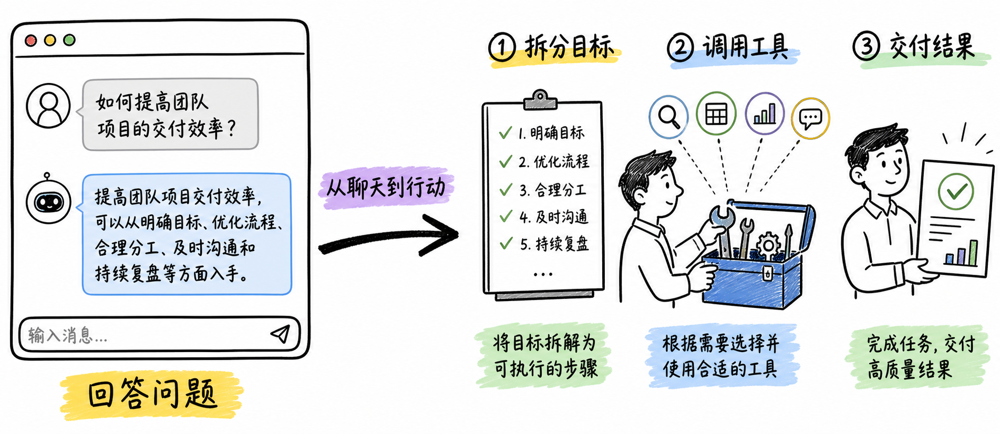

图解：认知变化：从“只会回答”进入“围绕目标把事做完”。画面左侧是对话气泡与问答，右侧是带清单、工具箱和结果交付的项目管家，中央用粗箭头表示从回答到行动。局部标签：`回答问题`、`拆分目标`、`调用工具`、`交付结果`。图示要有动作关系，不是装饰插画。

## 聊天模型和智能体差在哪？

一个偏向即时回答，一个围绕目标持续行动

聊天模型和智能体差在哪？先看普通聊天模型。它接收问题，生成回答，然后等待你的下一次指令。

智能体则从目标出发，主动拆分步骤，选择工具，并把结果带回来。所以工具调用本身不是全部，持续决定下一步才是关键。

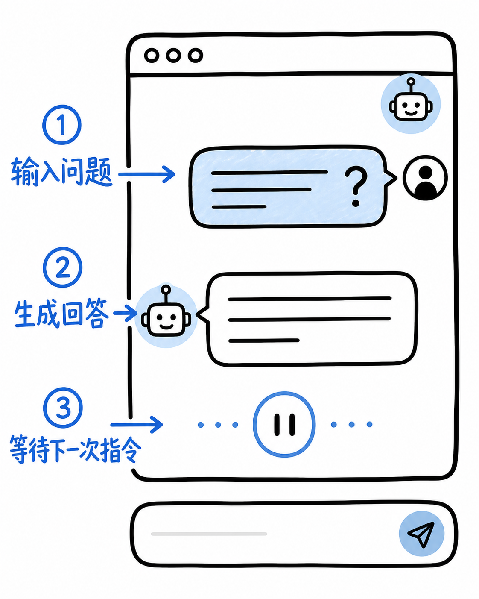

图解：认知变化：展示普通聊天模型收到问题后给出一次性文字回复。局部标签：`输入问题`、`生成回答`、`等待下一次指令`；蓝色表示输入，黑色表示回应。纯白全幅，主体和文字撑满 4:5 槽位。

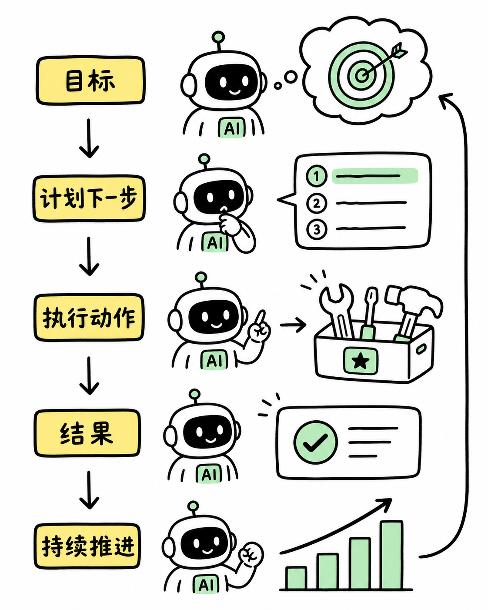

图解：认知变化：展示智能体收到目标后主动拆分步骤、选择工具、返回结果。局部标签：`目标`、`计划下一步`、`执行动作`、`结果`，用黄色高亮“持续推进”。与上一张保持同笔画和字号比例。

## 智能体怎样一步步完成任务？

感知、计划、行动，再根据结果继续判断

智能体怎样一步步完成任务？第一步是感知目标和环境。第二步是把大目标拆成几个可执行的小步骤。

第三步是调用合适的工具，把计划变成真实动作。拿到结果以后，它还要回头检查，决定是否需要调整计划。

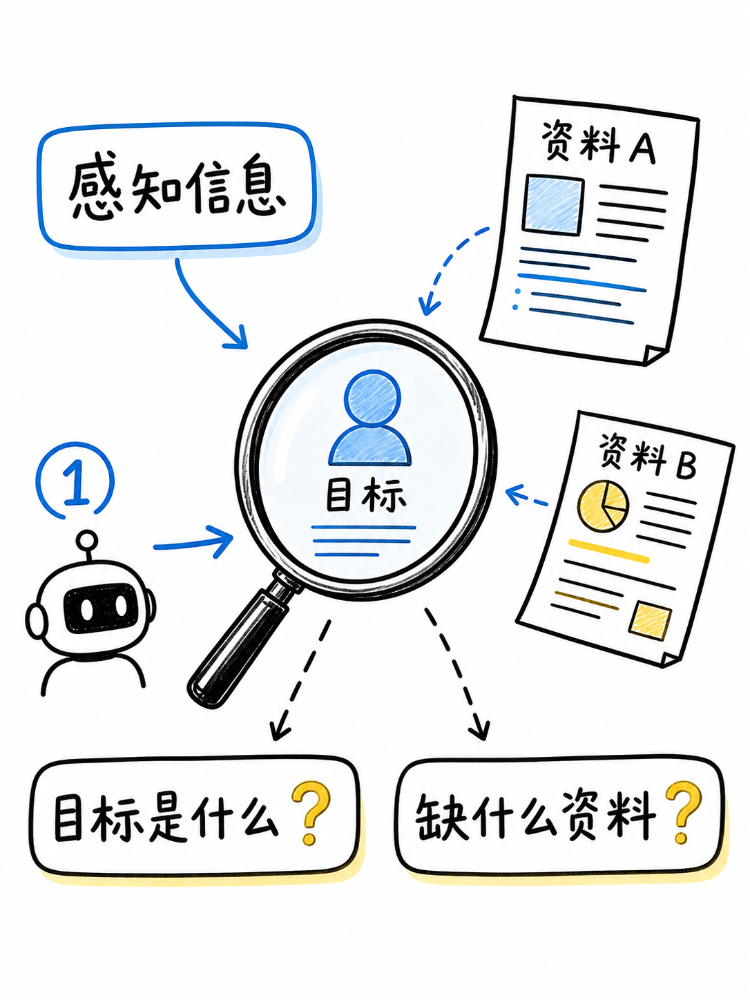

图解：认知变化：循环的第一步是看懂目标与环境。画面是放大镜、用户目标和外部资料，标签：`感知信息`、`目标是什么？`、`缺什么资料？`。

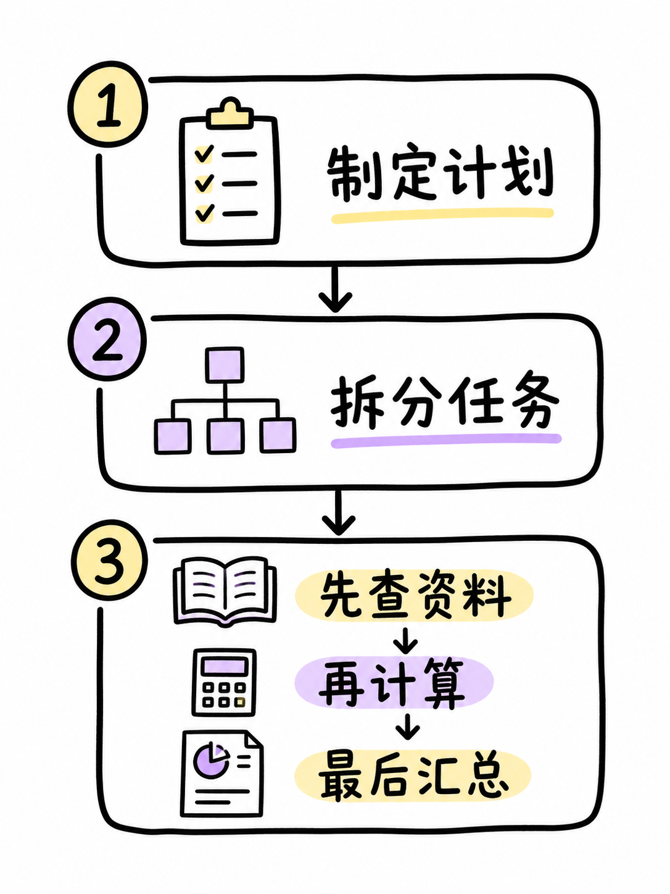

图解：认知变化：把大目标拆成可执行的小步骤。画面是便签式路线：`先查资料` → `再计算` → `最后汇总`，标签：`制定计划`、`拆分任务`。

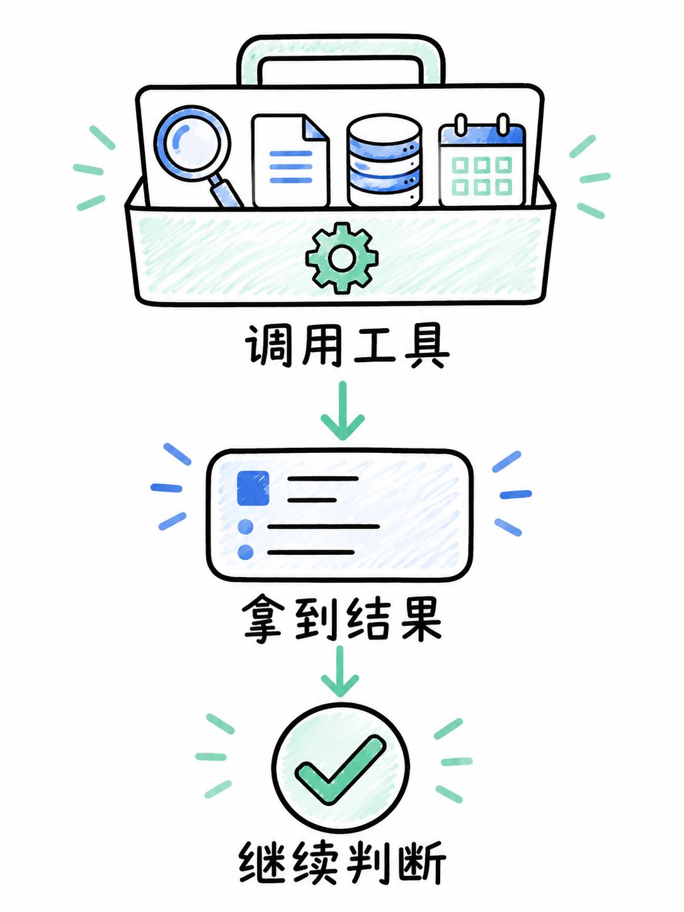

图解：认知变化：通过工具执行并把结果带回循环。画面是工具箱、搜索、数据库、日历等抽象工具插口，标签：`调用工具`、`拿到结果`、`继续判断`。

## 工具越多，为什么边界越重要？

外部连接带来能力，也带来权限、错误和风险

工具越多，为什么边界越重要？因为工具把模型接到了真实世界。搜索、文件和数据库，让它能取得模型原本没有的上下文。

但每一次写入、发送或删除，也都可能产生真实影响。因此可靠的智能体要有权限分级、护栏，以及高风险动作前的人工确认。

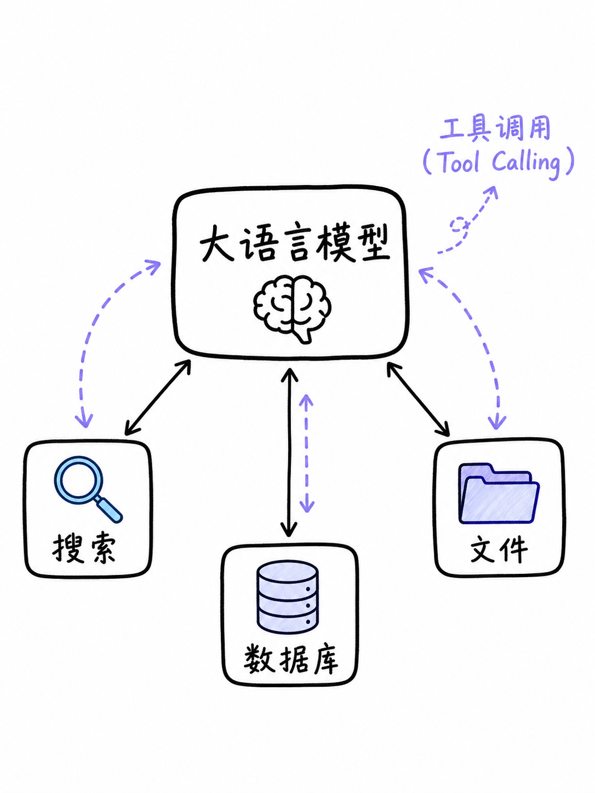

图解：认知变化：工具把模型连接到真实世界。画面是一个中央“大语言模型”节点连接 `搜索`、`文件`、`数据库` 三个工具，标签：`工具调用`、`外部环境`。

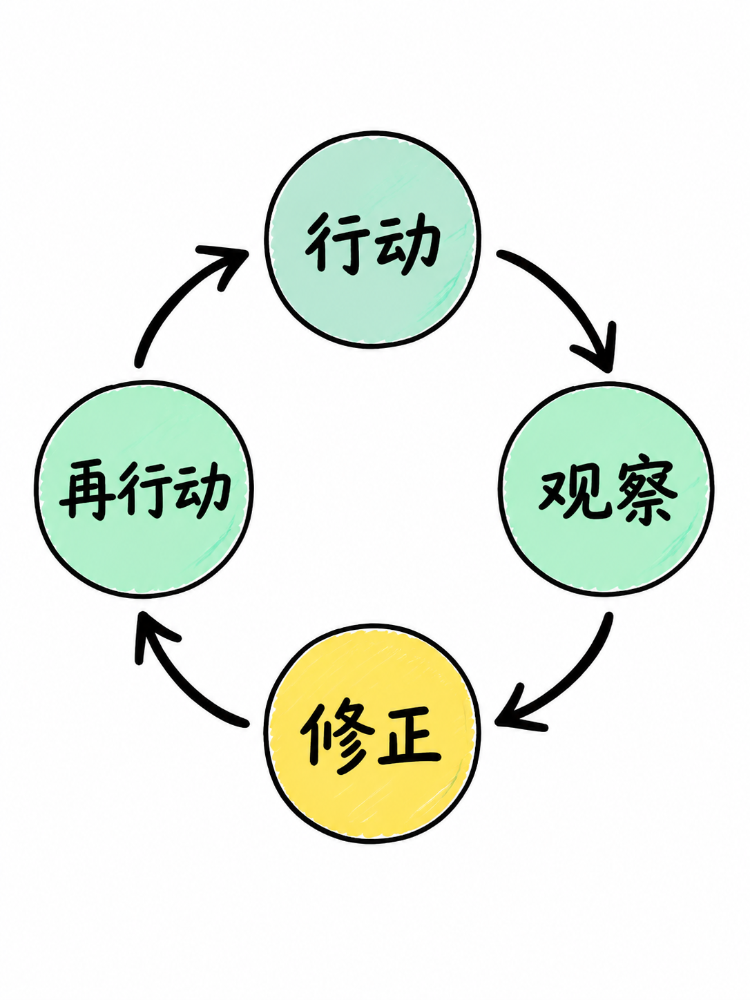

图解：认知变化：智能体不是只做一步，而是循环观察结果再决定下一步。画面是环形箭头：`行动` → `观察` → `修正` → `再行动`，绿色表示完成，黄色表示需要修正。

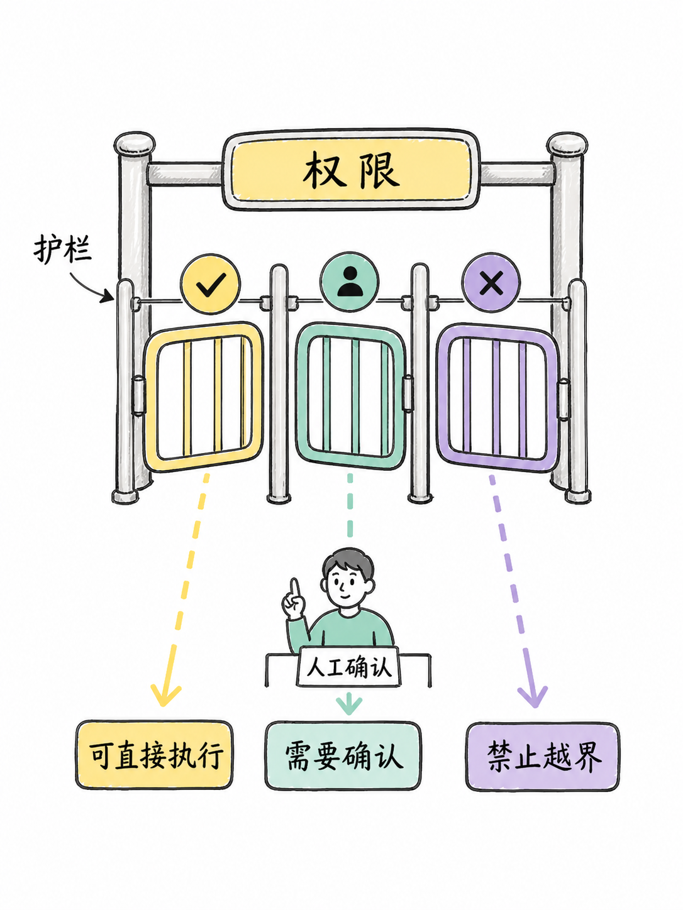

图解：认知变化：工具越强，边界越重要。画面是权限闸门和三档动作：`可直接执行`、`需要确认`、`禁止越界`，标签：`护栏`、`权限`、`人工确认`。

## 记忆和反馈，怎样让智能体更可靠？

保存有用上下文，接收结果反馈，把偏差拉回目标

记忆和反馈，怎样让智能体更可靠？先说记忆。记忆可以保存当前上下文、历史偏好和已经得到的任务结果。

反馈则告诉系统，刚才的结果离目标还有多远。遇到偏差，它可以修订下一步；遇到高风险决定，仍然应该把控制权交还给人。

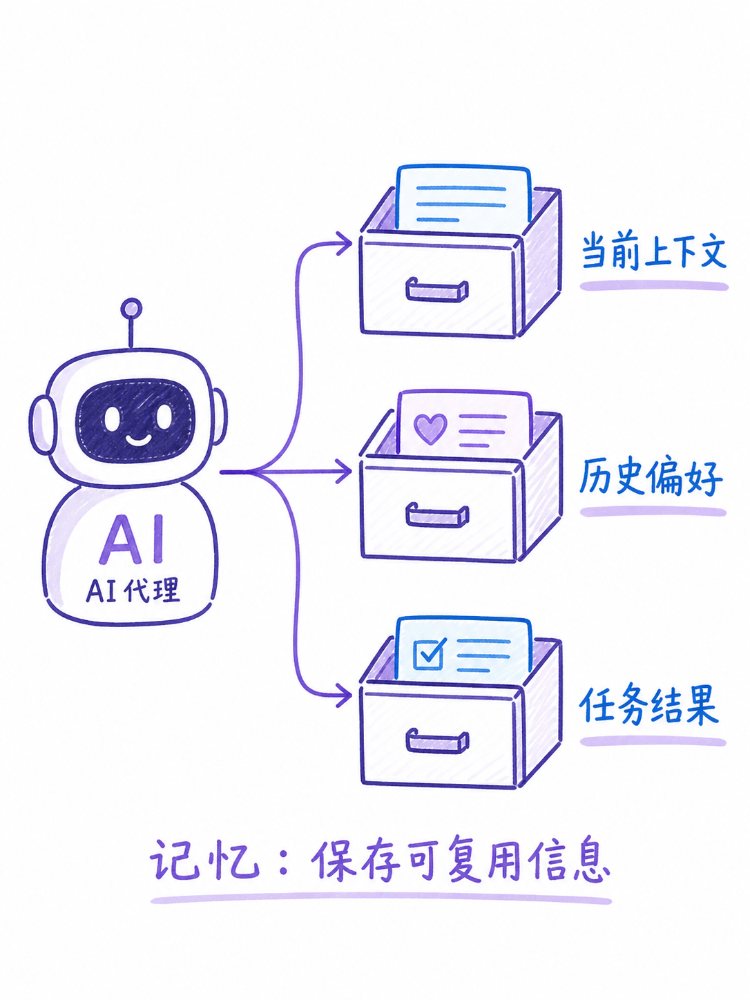

图解：认知变化：记忆保存任务所需的上下文，而不是把模型重新训练一遍。画面用抽屉分成 `当前上下文`、`历史偏好`、`任务结果`，标签：`记忆`、`保存可复用信息`。

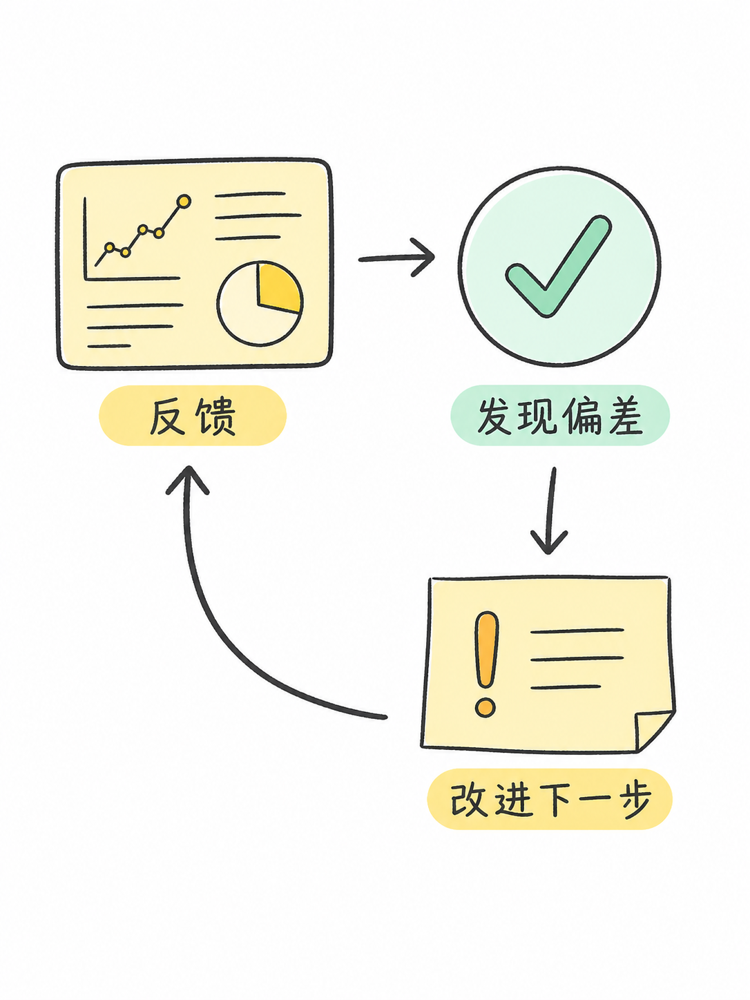

图解：认知变化：反馈让下一次计划更贴近目标。画面是结果打分、错误标记和修订箭头，标签：`反馈`、`发现偏差`、`改进下一步`。

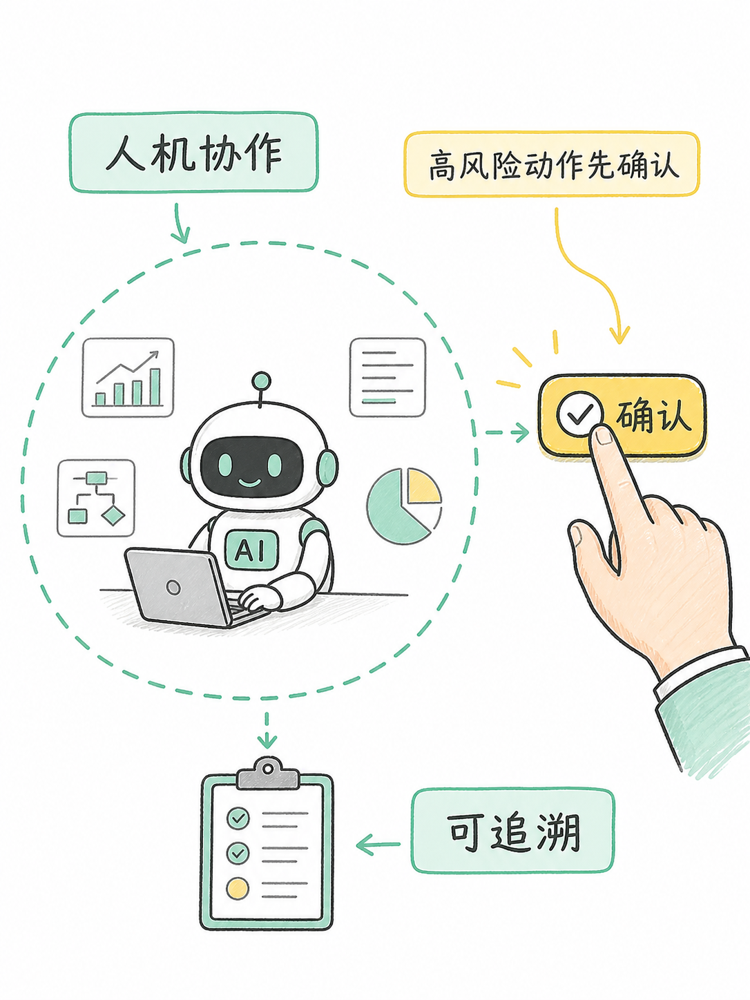

图解：认知变化：可靠系统保留人的决策位置。画面是人手按下确认按钮，智能体在边界内执行，标签：`人机协作`、`高风险动作先确认`、`可追溯`。

## 一句话判断：什么才算智能体？

有目标，会规划，能用工具，还会根据结果修正

什么才算智能体？记住四个问题：它有没有明确目标？它会不会自己规划，能不能调用工具，把动作带到外部世界？

它能不能观察结果、修正下一步，并在边界内完成交付？四点连成闭环，才接近我们今天所说的智能体。

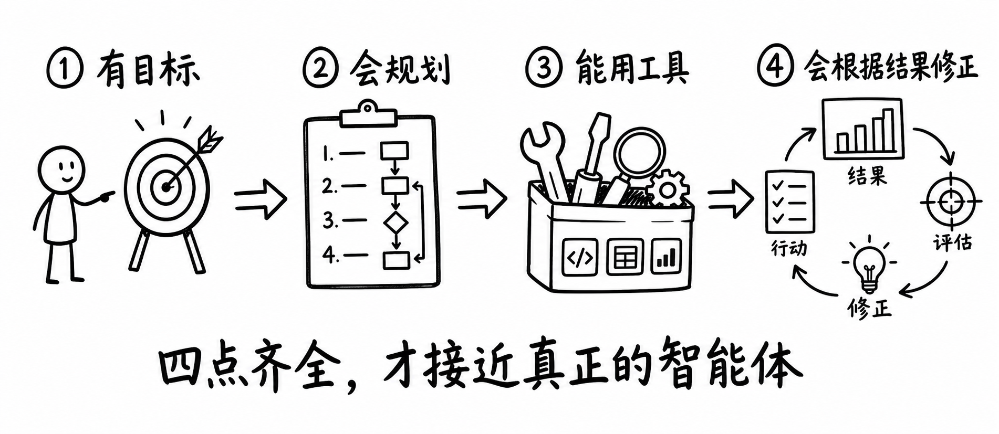

图解：认知变化：把定义压缩成四个判断问题。画面中央是四段递进关系：`有目标` → `会规划` → `能用工具` → `会根据结果修正`，底部结论：`四点齐全，才接近真正的智能体`。留出清晰截屏阅读空间。

## 小结

把问题拆成目标、约束、证据和验证四部分，通常比直接寻找唯一答案更可靠。先用本文的框架完成一次小范围验证，再根据真实反馈调整下一步。

## 参考资料

以下链接来自原始课程研究笔记；动态信息请以其当前页面为准。

- [https://openai.com/business/guides-and-resources/a-practical-guide-to-building-ai-agents/](https://openai.com/business/guides-and-resources/a-practical-guide-to-building-ai-agents/)
- [https://www.anthropic.com/engineering/building-effective-agents](https://www.anthropic.com/engineering/building-effective-agents)
- [https://cloud.google.com/discover/what-are-ai-agents?hl=en](https://cloud.google.com/discover/what-are-ai-agents?hl=en)
