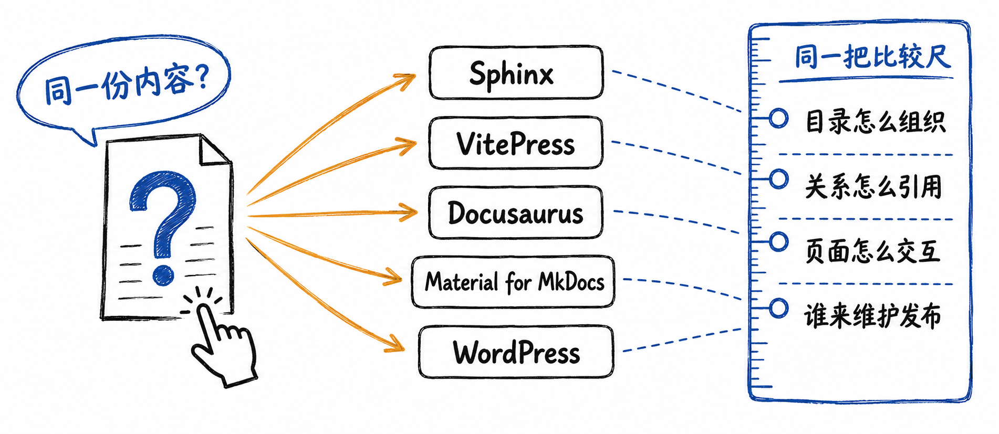
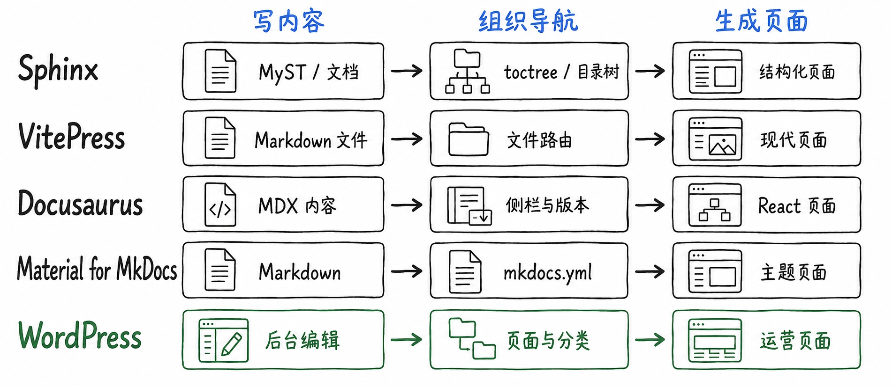
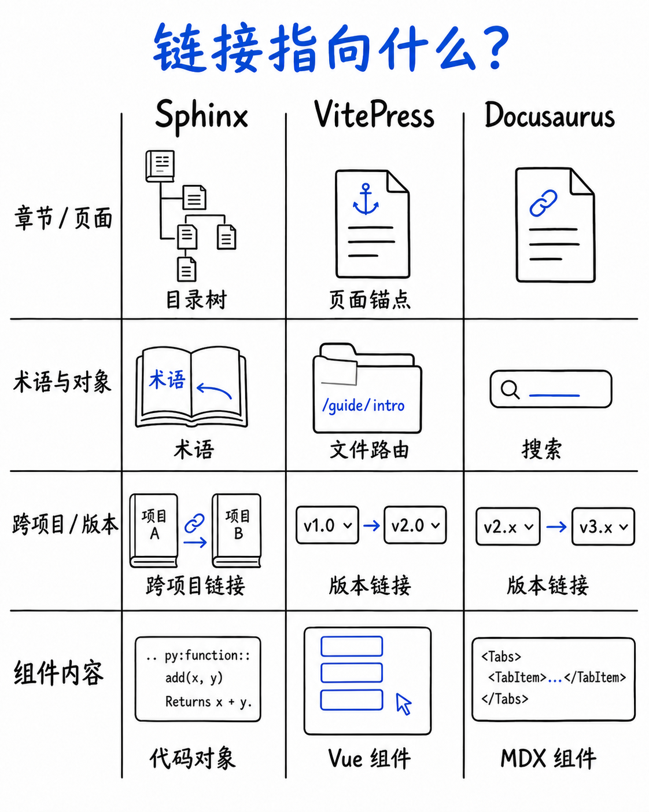
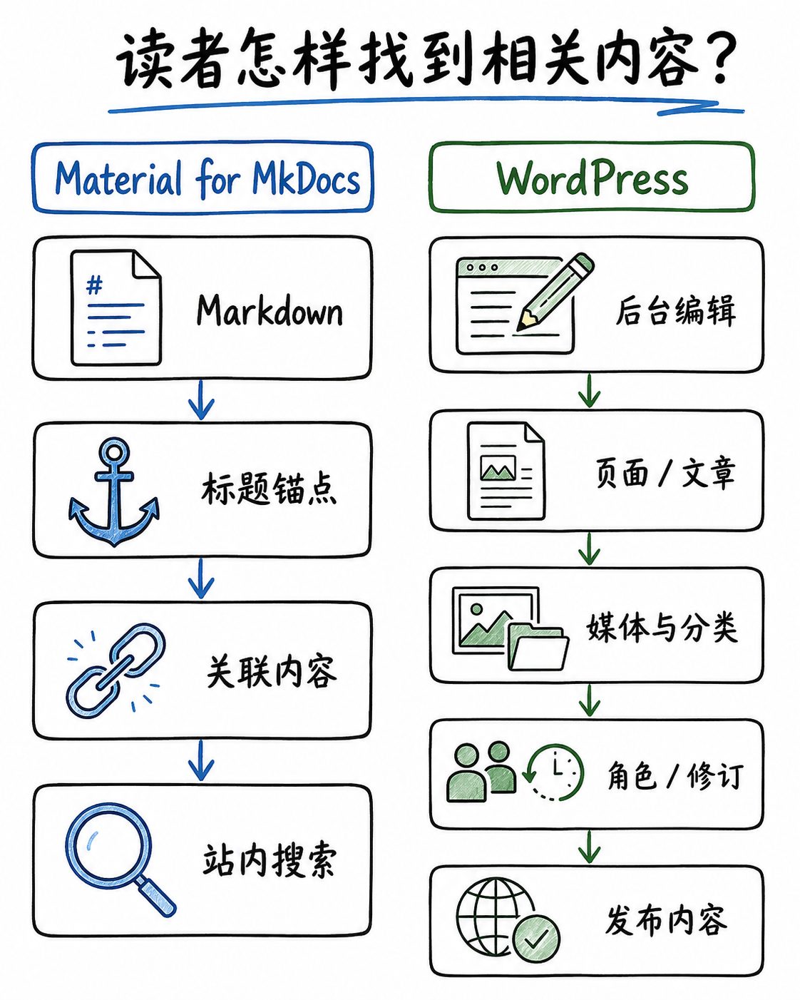
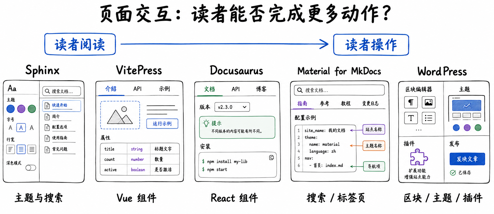
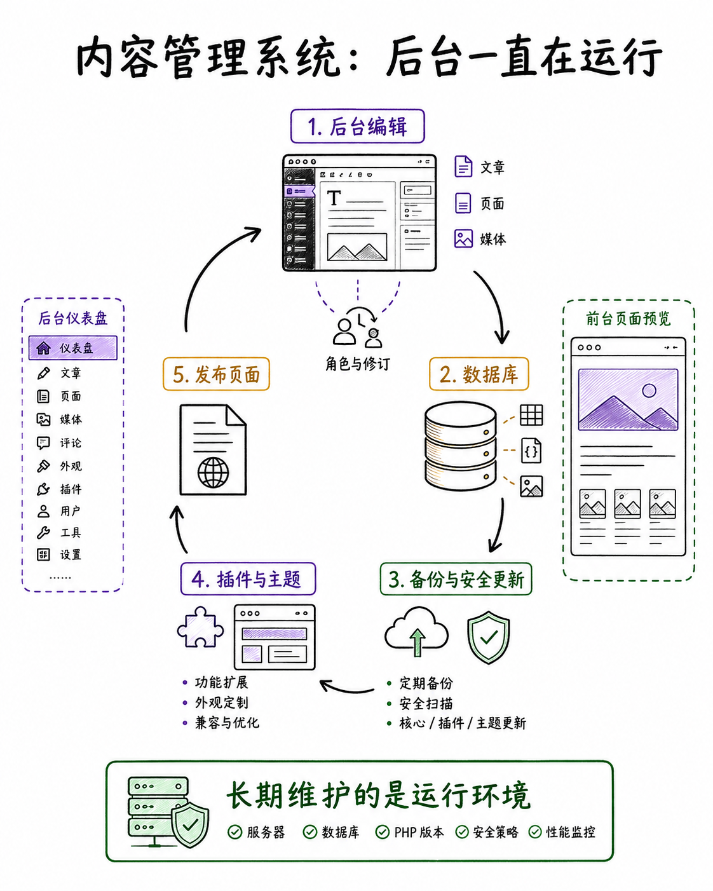
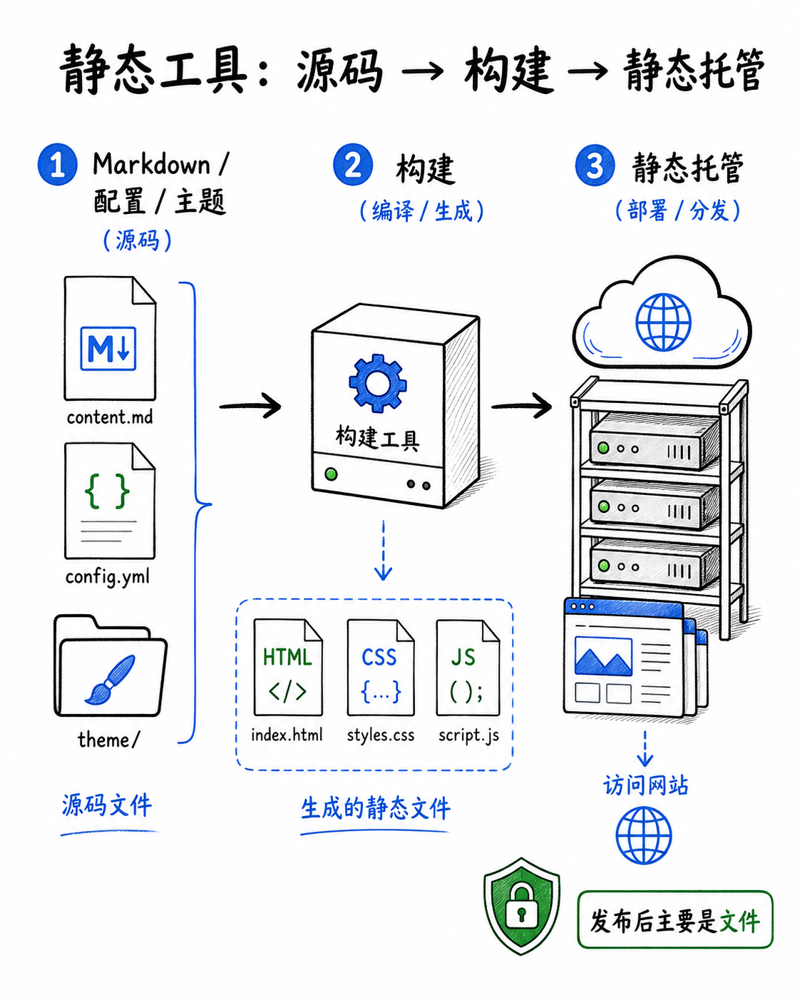
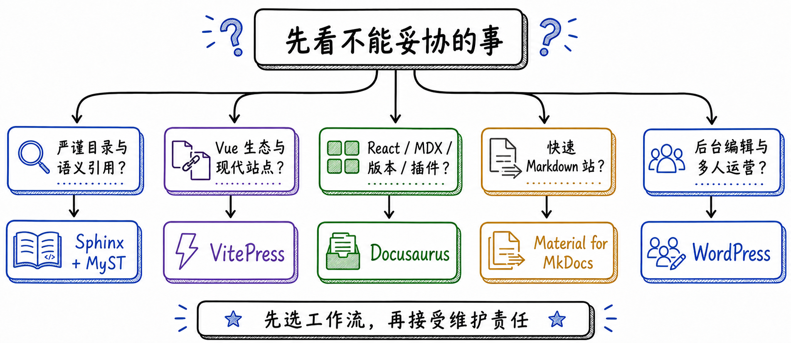

# Sphinx等文档工具怎么选？

文档工具选择的关键不是主题外观，而是内容组织、引用与语义、交互需求、发布方式和长期维护责任。读者体验应建立在可维护的内容源之上。

这张图补充本节的关键关系；应结合项目实际负载、权限边界与运行环境验证，而不是脱离条件套用结论。

这张图补充本节的关键关系；应结合项目实际负载、权限边界与运行环境验证，而不是脱离条件套用结论。

这张图补充本节的关键关系；应结合项目实际负载、权限边界与运行环境验证，而不是脱离条件套用结论。

这张图补充本节的关键关系；应结合项目实际负载、权限边界与运行环境验证，而不是脱离条件套用结论。

这张图补充本节的关键关系；应结合项目实际负载、权限边界与运行环境验证，而不是脱离条件套用结论。

这张图补充本节的关键关系；应结合项目实际负载、权限边界与运行环境验证，而不是脱离条件套用结论。

这张图补充本节的关键关系；应结合项目实际负载、权限边界与运行环境验证，而不是脱离条件套用结论。

这张图补充本节的关键关系；应结合项目实际负载、权限边界与运行环境验证，而不是脱离条件套用结论。

## 小结

从需求、团队能力、运维成本和可恢复性出发选择方案。先用最小可验证样例确认边界，再扩大到生产环境。

