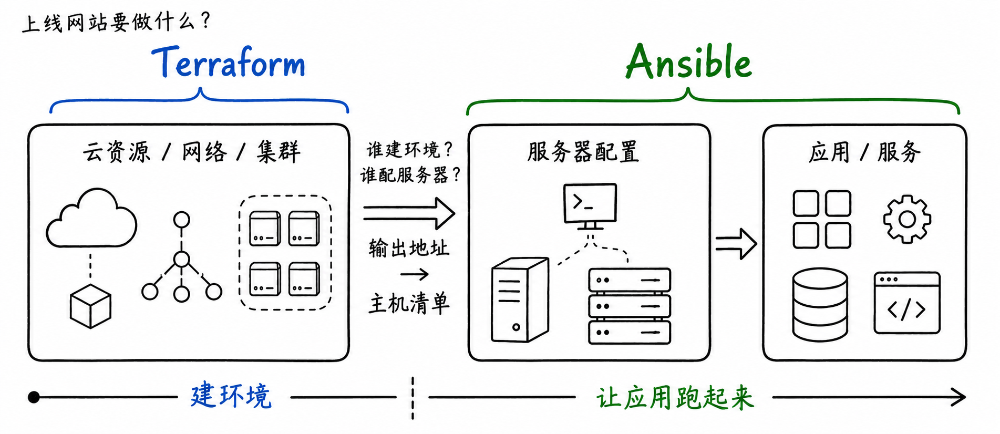
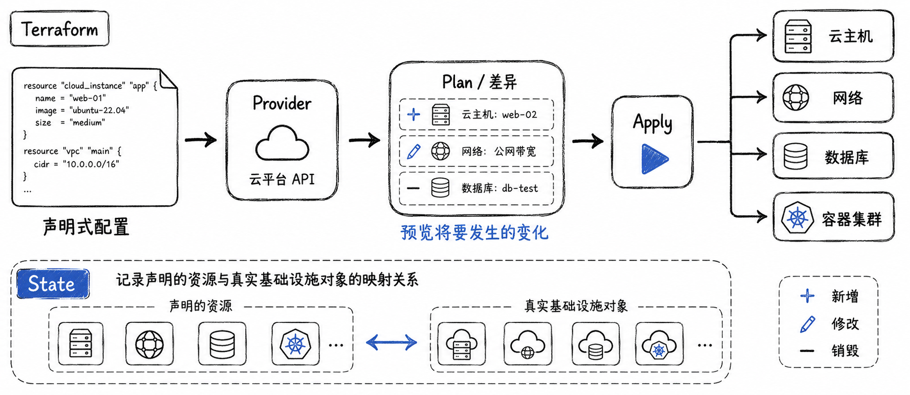
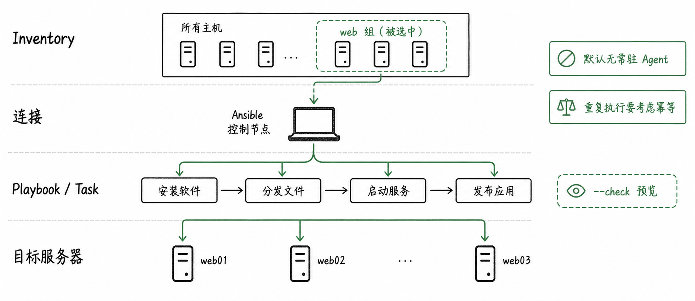
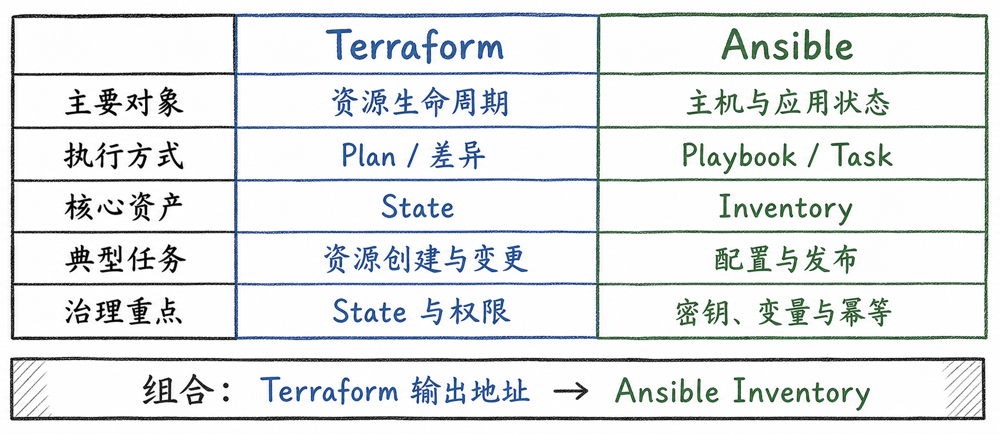
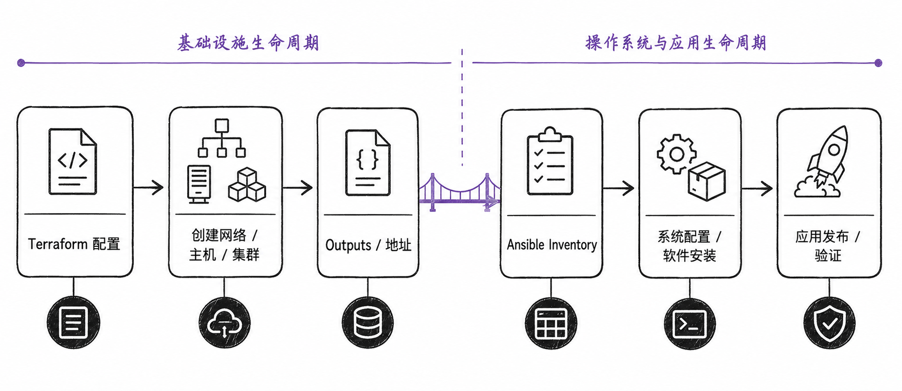
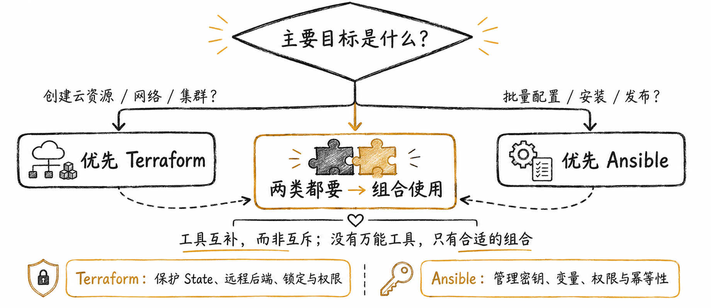

# 基础设施自动化怎么选？

Terraform 用声明式状态管理云资源，Ansible 通过 Playbook 配置主机与发布应用。两者常常组合，而不是互相替代。

这张图补充本节的关键关系；应结合项目实际负载、权限边界与运行环境验证，而不是脱离条件套用结论。

这张图补充本节的关键关系；应结合项目实际负载、权限边界与运行环境验证，而不是脱离条件套用结论。

这张图补充本节的关键关系；应结合项目实际负载、权限边界与运行环境验证，而不是脱离条件套用结论。

这张图补充本节的关键关系；应结合项目实际负载、权限边界与运行环境验证，而不是脱离条件套用结论。

这张图补充本节的关键关系；应结合项目实际负载、权限边界与运行环境验证，而不是脱离条件套用结论。

这张图补充本节的关键关系；应结合项目实际负载、权限边界与运行环境验证，而不是脱离条件套用结论。

## 小结

从需求、团队能力、运维成本和可恢复性出发选择方案。先用最小可验证样例确认边界，再扩大到生产环境。

