# UML：类图和时序图怎么用？

代码越写越多，团队却说不清系统里有什么、怎么连接、先后怎么发生？这个视频从搬家清单、蛋糕模具和点外卖出发，讲清 UML、对象与类，以及类图和时序图分别解决什么问题。

## 阅读边界

本文依据原始课程的研究笔记、课程结构和发布文案整理。涉及产品、模型、版本、平台规则、价格或资格等可能变化的信息，实践前应以当前官方资料和实际环境为准。

## UML 怎么用：类图和时序图

用搬家清单理解 UML：它是什么，也不是什么

有没有试过一群人一起搬家，东西不少，却没人知道先搬什么？软件团队也会遇到类似的混乱：代码越堆越多，却很难马上说清系统里有什么、怎么连、先后怎么走。

UML（统一建模语言）能把系统画成一张大家看得懂的地图；它不是代码，也不规定唯一流程。

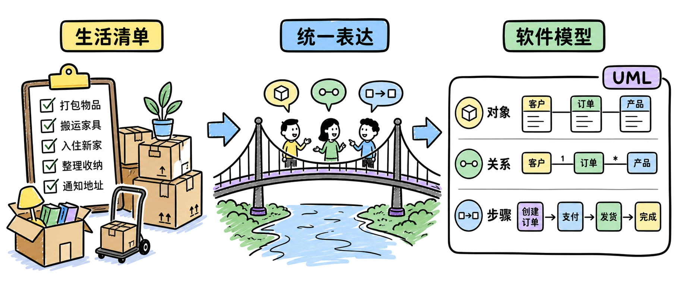

图解：“blueprint hook”这张示意图用于解释“UML 怎么用：类图和时序图”的关键关系；阅读时可结合本节的步骤、边界与结论逐项核对。

## 为什么出现：结束各画各的地图

面向对象方法汇合，形成共同符号

早期的面向对象方法很像几支队伍各画各的地图：想表达的事情差不多，符号却彼此不通。Booch、OMT 和 OOSE 各有一套画法，团队一换人，就得重新解释这些符号。

1996 年 UML 0.9/0.91 公开，1997 年 UML 1.1 被 OMG 采纳。统一符号的目的很简单：让人、工具和复杂系统都能用同一套说法沟通。

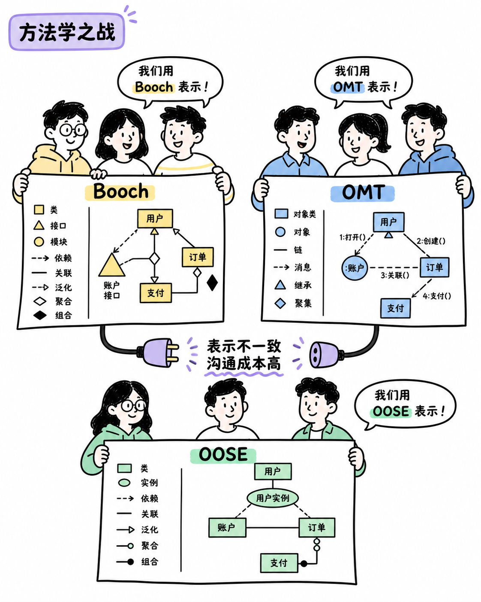

图解：“method wars”这张示意图用于解释“为什么出现：结束各画各的地图”的关键关系；阅读时可结合本节的步骤、边界与结论逐项核对。

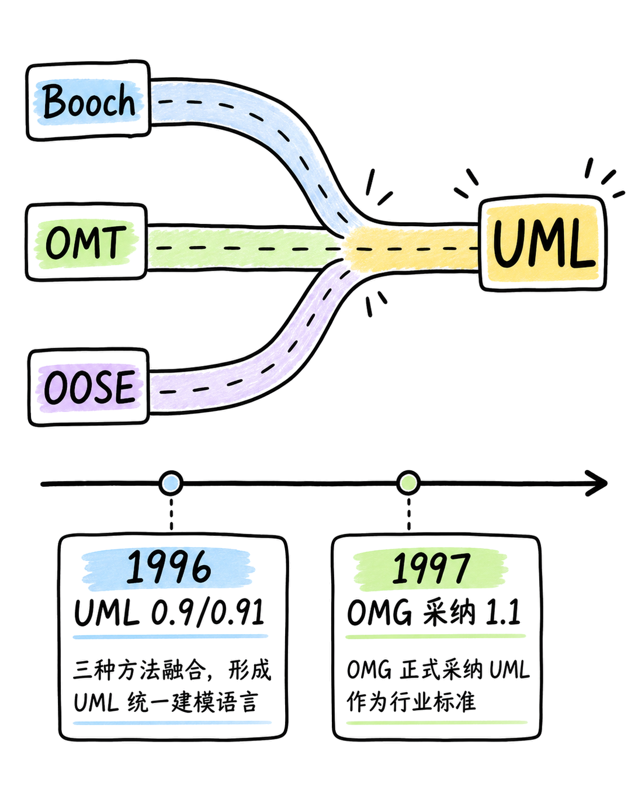

图解：“unification timeline”这张示意图用于解释“为什么出现：结束各画各的地图”的关键关系；阅读时可结合本节的步骤、边界与结论逐项核对。

## 从生活物品到模型：对象、类型、关系

模具、实例、按钮和连线，搭出模型骨架

先分清两个词：一张真实订单是对象，而一类订单共同遵守的规则，就是类或分类器。拿蛋糕来比喻，模具规定共同形状，做出来的每一块蛋糕才是一个具体实例。

订单的状态是属性，确认和取消是操作；关系则继续回答，谁和谁连接，谁临时使用谁。经典 UML 图示可以先按三组来记：结构六种、行为三种、交互四种，一共十三种。

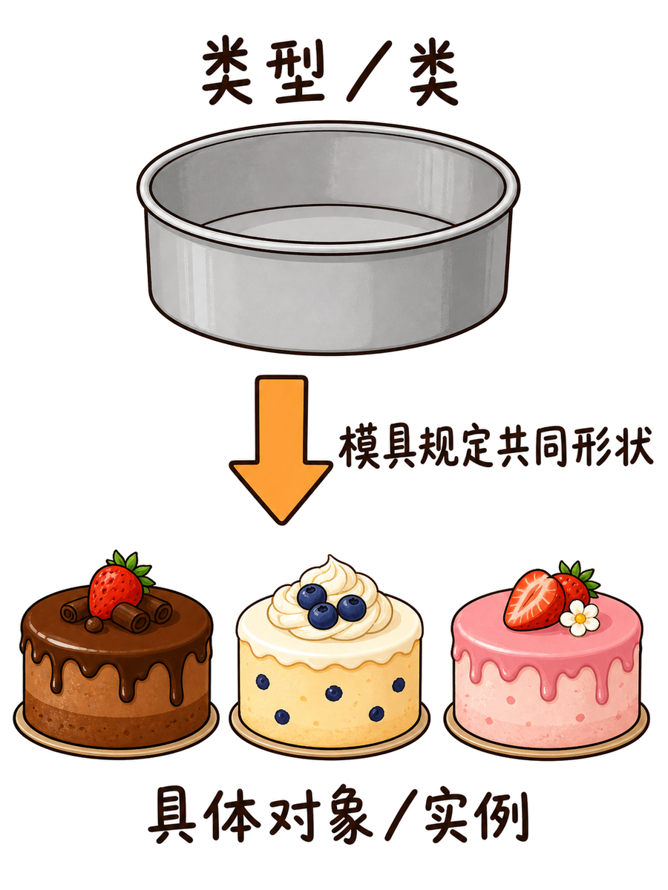

图解：“object classifier”这张示意图用于解释“从生活物品到模型：对象、类型、关系”的关键关系；阅读时可结合本节的步骤、边界与结论逐项核对。

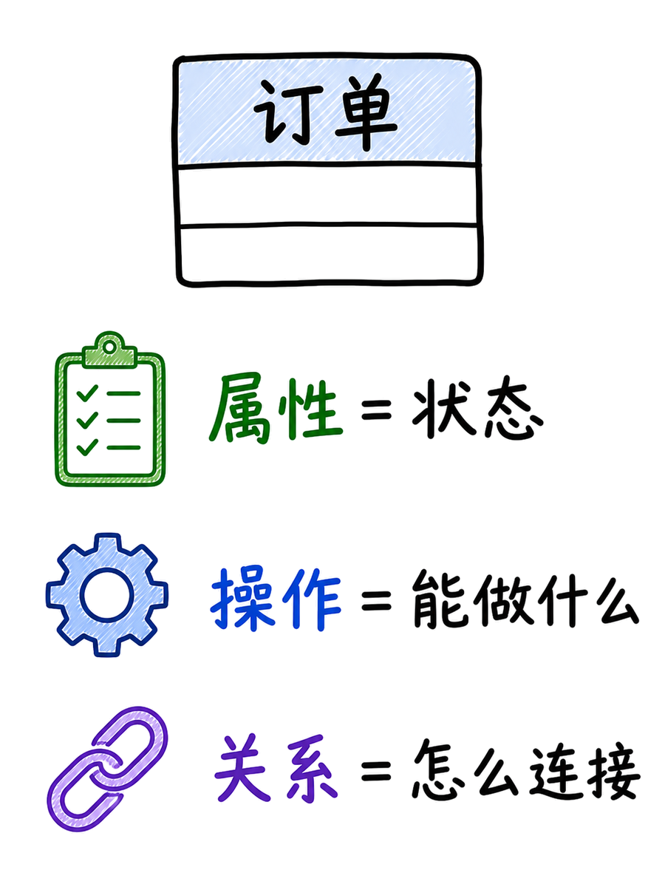

图解：“elements relations”这张示意图用于解释“从生活物品到模型：对象、类型、关系”的关键关系；阅读时可结合本节的步骤、边界与结论逐项核对。

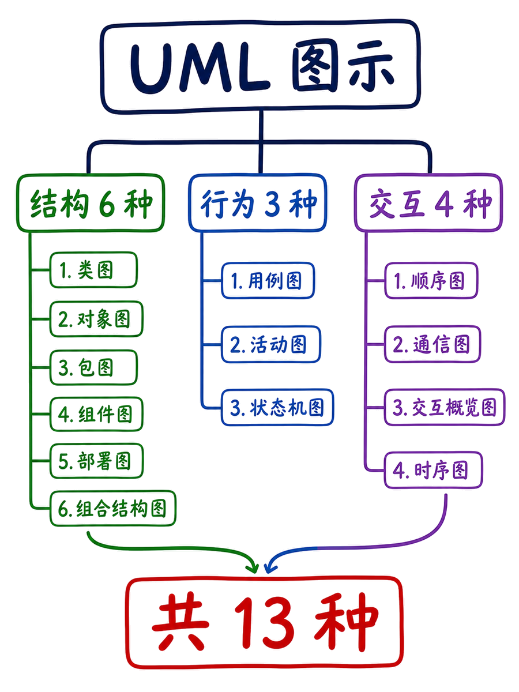

图解：“model views”这张示意图用于解释“从生活物品到模型：对象、类型、关系”的关键关系；阅读时可结合本节的步骤、边界与结论逐项核对。

## 类图：回答系统有什么

像物品模板一样看类名、属性、操作和关系

把类图想成一张物品模板：第一格写它叫什么，中间写它有什么，最后写它能做什么。比如订单的属性是状态，操作可以是确认或取消；这样一看就知道这件事归谁负责。

再看线和符号：实线表示长期关联，虚线箭头表示临时依赖，菱形表示整体与部件，三角形表示继承或实现。所以类图先帮我们看两件事：系统里有哪些东西，它们之间又是怎么连接的。

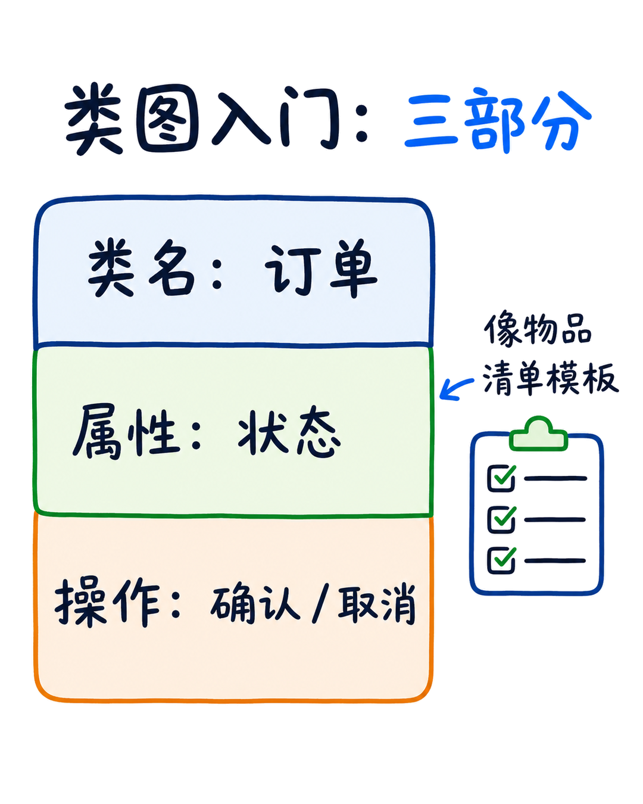

图解：“class box”这张示意图用于解释“类图：回答系统有什么”的关键关系；阅读时可结合本节的步骤、边界与结论逐项核对。

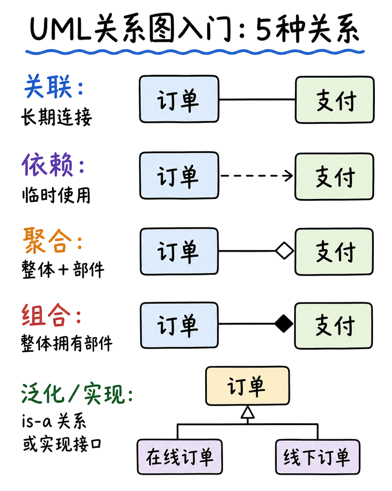

图解：“class relations”这张示意图用于解释“类图：回答系统有什么”的关键关系；阅读时可结合本节的步骤、边界与结论逐项核对。

## 时序图：回答事情怎么发生

像点外卖一样看生命线、消息和时间顺序

时序图可以按点外卖来理解：用户、订单服务和支付服务各站一列，时间从上往下推进。横向箭头表示消息，比如提交订单、创建订单、请求支付；这里最要紧的是先后顺序。

激活条表示谁正在处理，返回箭头表示结果；遇到条件或重试，就用分支和循环框标出来。归根结底，时序图回答的是：在一个具体场景里，谁先通知谁，事情怎样一步步完成。

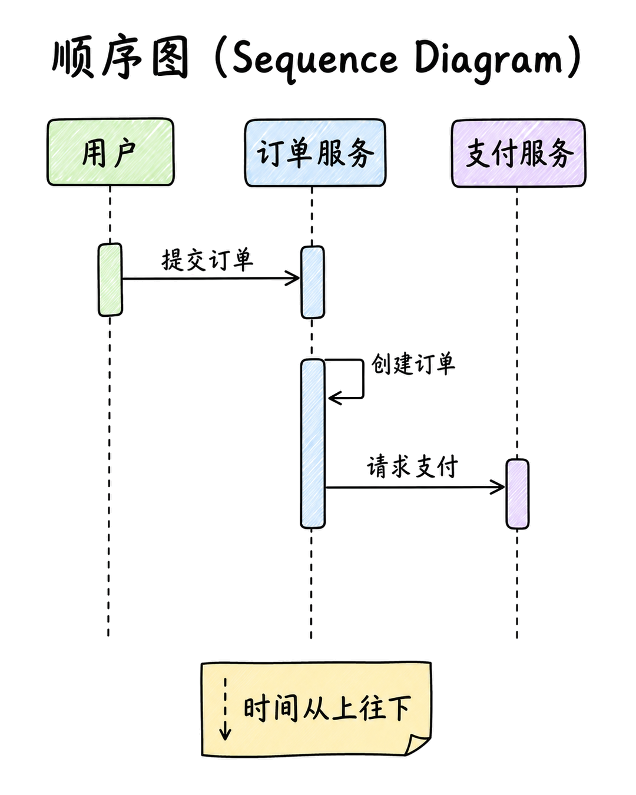

图解：“lifelines messages”这张示意图用于解释“时序图：回答事情怎么发生”的关键关系；阅读时可结合本节的步骤、边界与结论逐项核对。

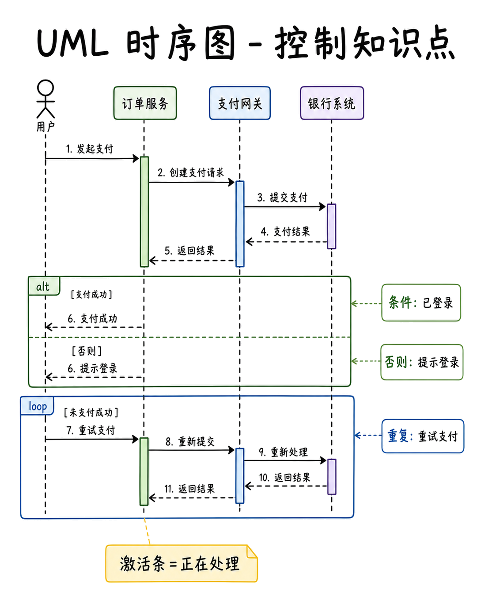

图解：“sequence control”这张示意图用于解释“时序图：回答事情怎么发生”的关键关系；阅读时可结合本节的步骤、边界与结论逐项核对。

## 同一模型，换一个观察角度

结构、行为、交互互相校验，不规定唯一流程

还是这份外卖订单，既可以画出订单里有什么，也可以画出下单时各方怎样配合。结构图、行为图和交互图不是各说各话，它们只是同一个系统的不同切面。

UML 管的是表达方式，不管你采用敏捷迭代、系统工程，还是团队自己的开发流程。

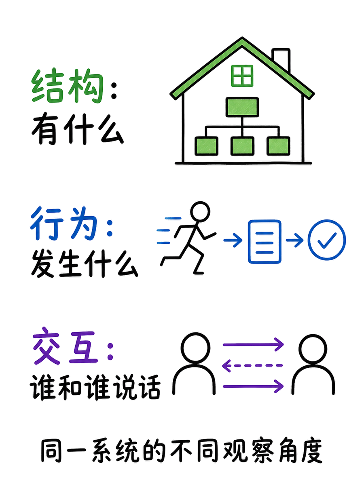

图解：“uml taxonomy”这张示意图用于解释“同一模型，换一个观察角度”的关键关系；阅读时可结合本节的步骤、边界与结论逐项核对。

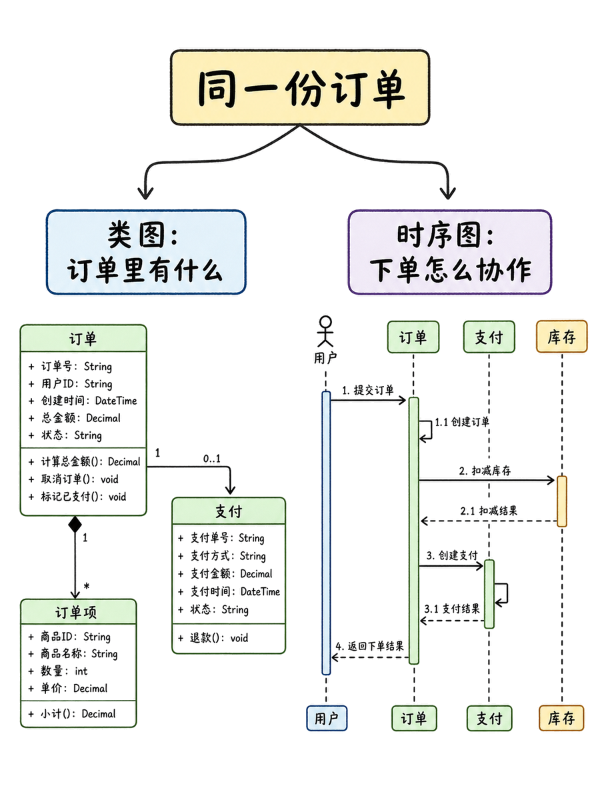

图解：“same model slices”这张示意图用于解释“同一模型，换一个观察角度”的关键关系；阅读时可结合本节的步骤、边界与结论逐项核对。

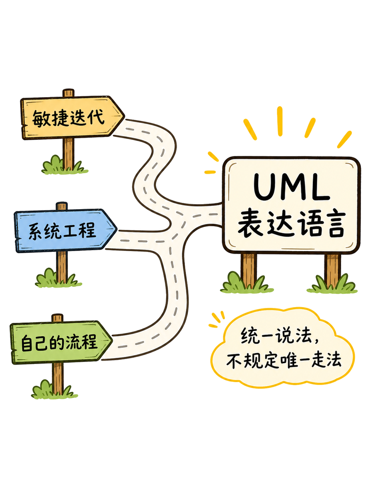

图解：“method independent”这张示意图用于解释“同一模型，换一个观察角度”的关键关系；阅读时可结合本节的步骤、边界与结论逐项核对。

## 三句口诀：有什么、怎么连、怎么动

类图看结构，时序图看协作，关系把两者接上

最后记住三个问题：系统里有什么，谁和谁连接，事情按什么顺序发生？看到类图，先看系统里有什么；看到时序图，再看各方怎么协作；关系负责把两边连起来。

先把想法对齐，再开始写代码。UML 的价值，就是让团队先把意思说清楚。

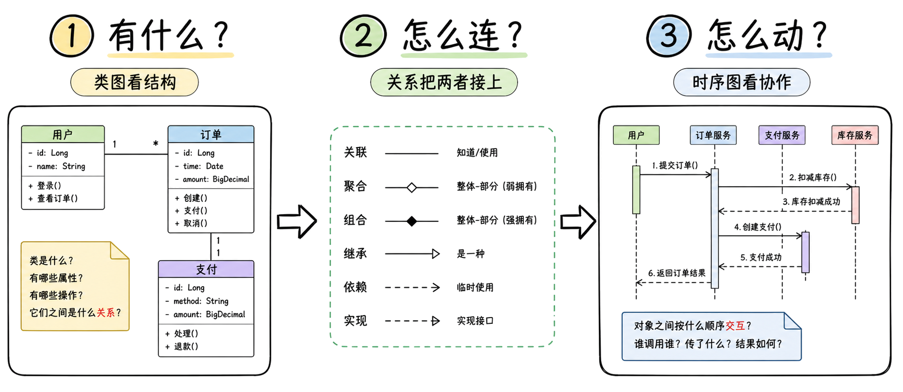

图解：“takeaway”这张示意图用于解释“三句口诀：有什么、怎么连、怎么动”的关键关系；阅读时可结合本节的步骤、边界与结论逐项核对。

## 小结

把问题拆成目标、约束、证据和验证四部分，通常比直接寻找唯一答案更可靠。先用本文的框架完成一次小范围验证，再根据真实反馈调整下一步。

## 参考资料

以下链接来自原始课程研究笔记；动态信息请以其当前页面为准。

- [https://www.omg.org/UML/what-is-uml.htm](https://www.omg.org/UML/what-is-uml.htm)
- [https://www.omg.org/uml/why-uml-is-important.htm](https://www.omg.org/uml/why-uml-is-important.htm)
- [https://www.omg.org/spec/UML/](https://www.omg.org/spec/UML/)
- [https://www.omg.org/spec/UML/2.5.1/PDF](https://www.omg.org/spec/UML/2.5.1/PDF)
