# 密钥管理：四种方案怎么选？

密钥管理要区分两条问题：Git 中怎样安全保存配置，运行时怎样按身份获取、轮换和撤销密钥。不同方案的控制边界不同。

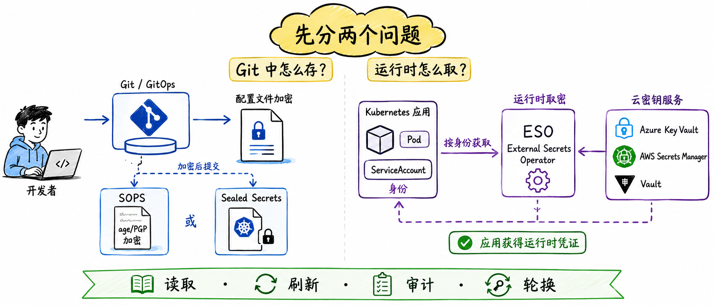

这张图补充本节的关键关系；应结合项目实际负载、权限边界与运行环境验证，而不是脱离条件套用结论。

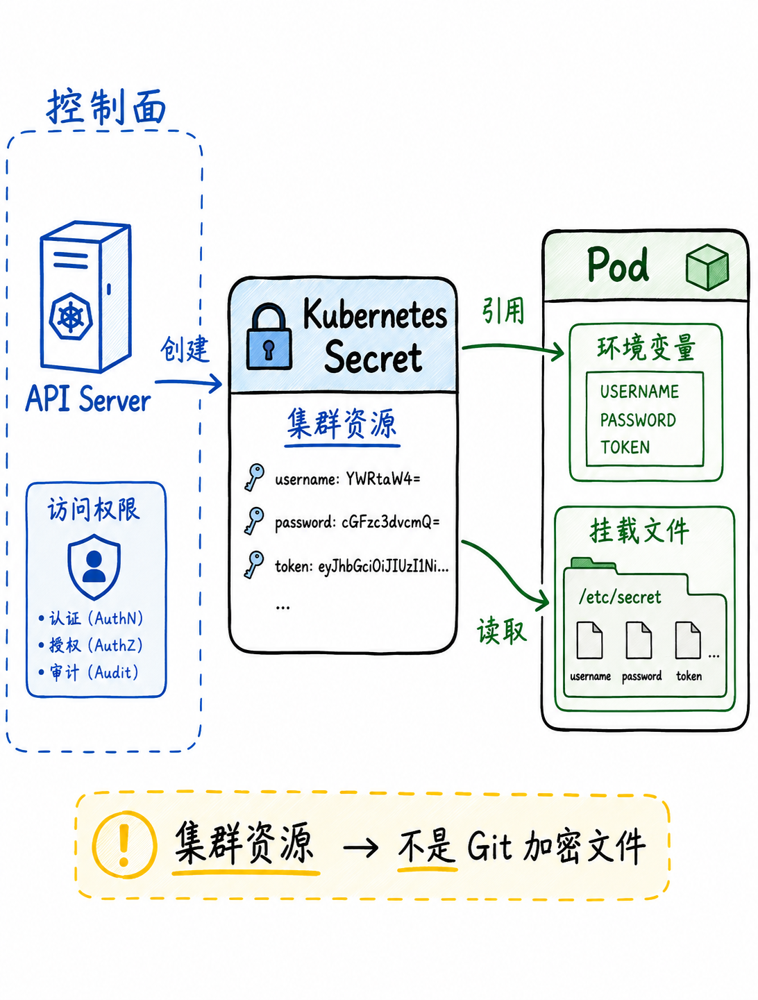

这张图补充本节的关键关系；应结合项目实际负载、权限边界与运行环境验证，而不是脱离条件套用结论。

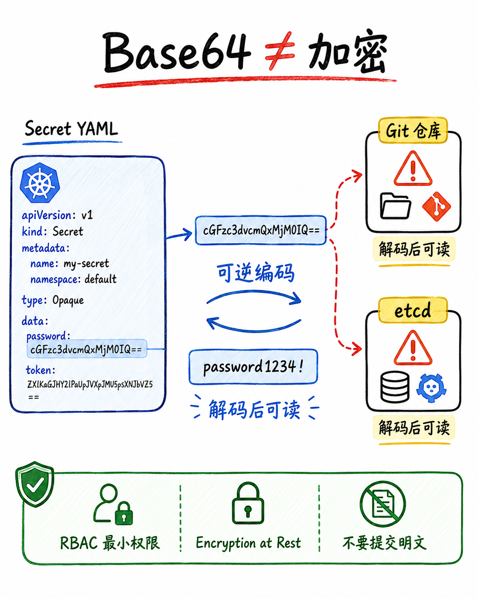

这张图补充本节的关键关系；应结合项目实际负载、权限边界与运行环境验证，而不是脱离条件套用结论。

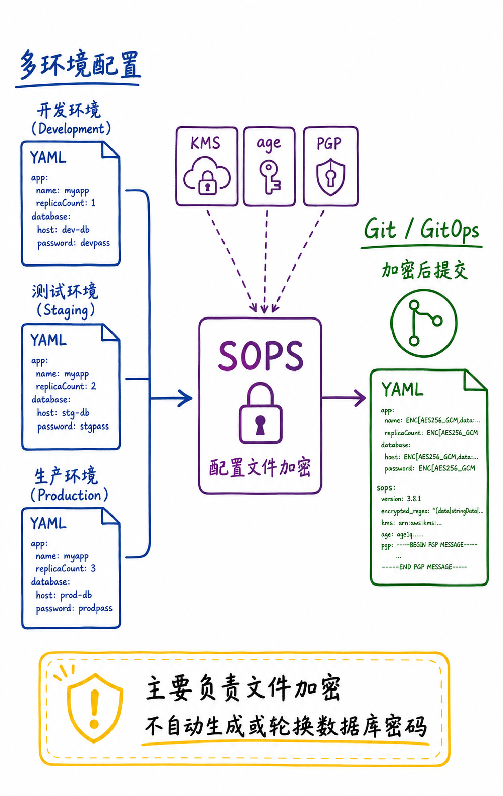

这张图补充本节的关键关系；应结合项目实际负载、权限边界与运行环境验证，而不是脱离条件套用结论。

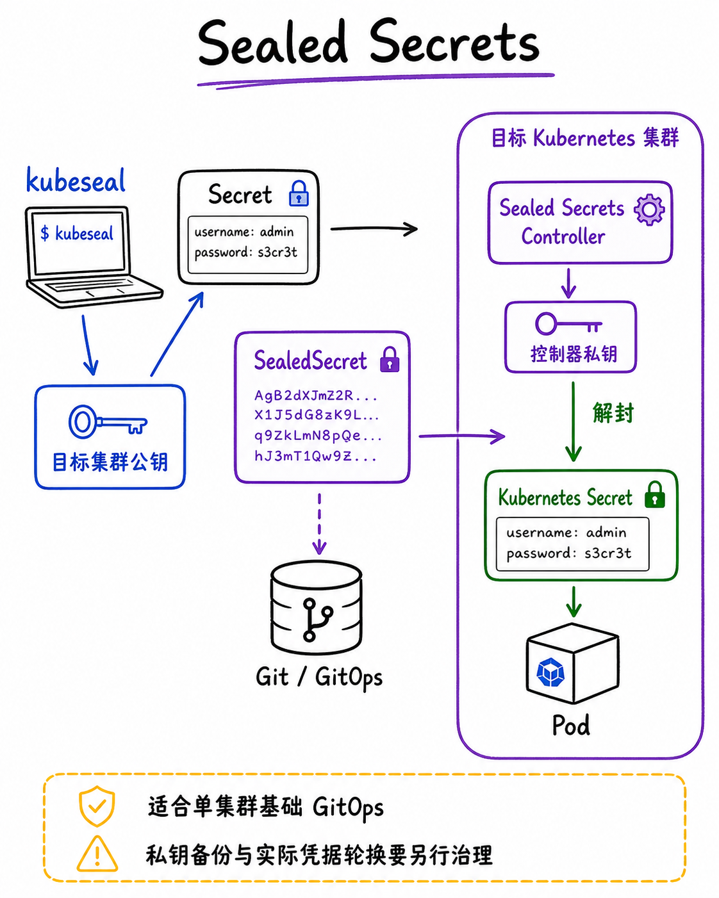

这张图补充本节的关键关系；应结合项目实际负载、权限边界与运行环境验证，而不是脱离条件套用结论。

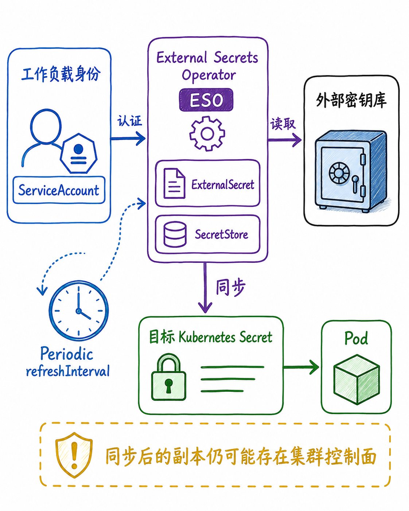

这张图补充本节的关键关系；应结合项目实际负载、权限边界与运行环境验证，而不是脱离条件套用结论。

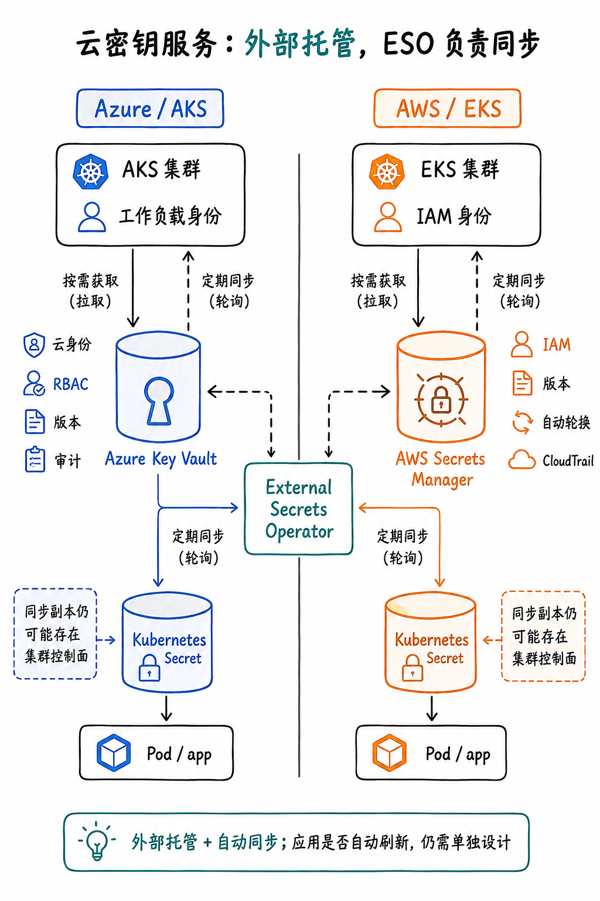

这张图补充本节的关键关系；应结合项目实际负载、权限边界与运行环境验证，而不是脱离条件套用结论。

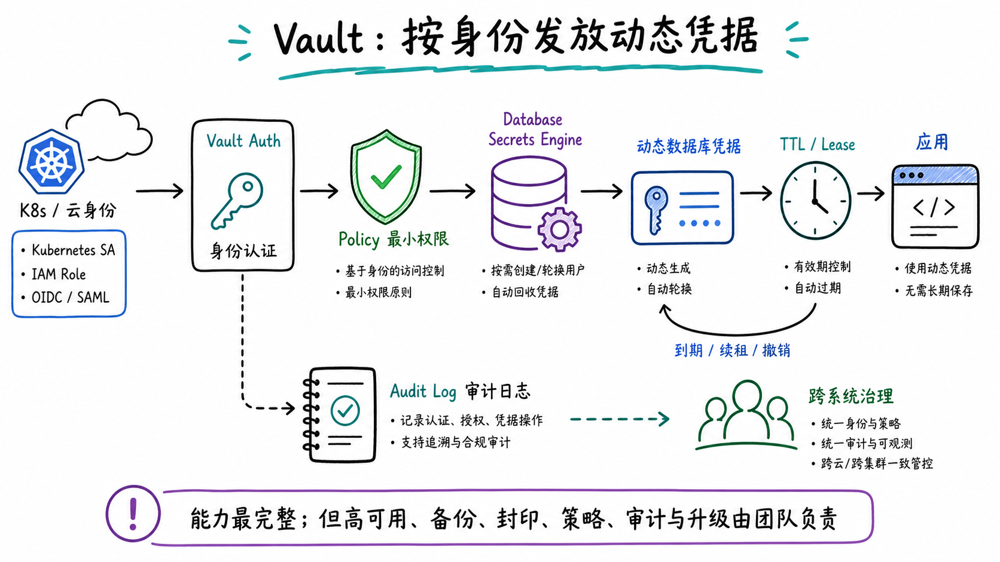

这张图补充本节的关键关系；应结合项目实际负载、权限边界与运行环境验证，而不是脱离条件套用结论。

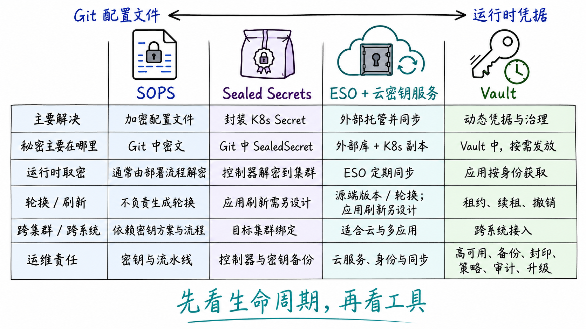

这张图补充本节的关键关系；应结合项目实际负载、权限边界与运行环境验证，而不是脱离条件套用结论。

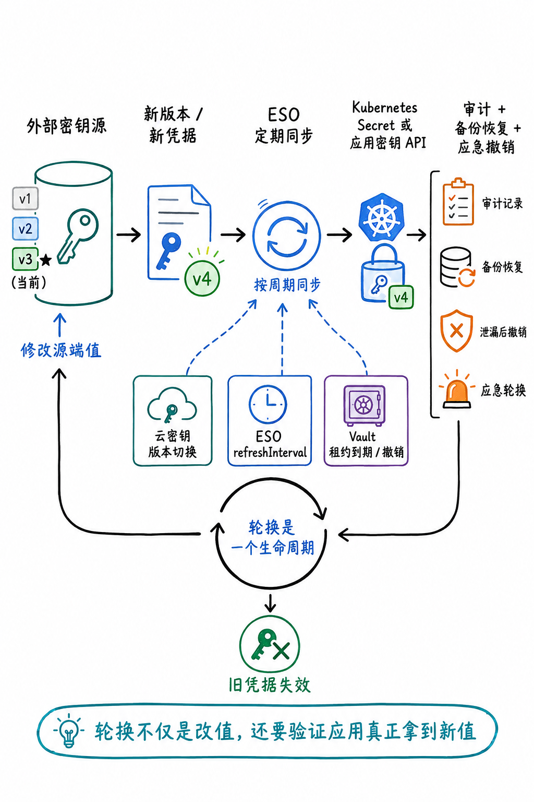

这张图补充本节的关键关系；应结合项目实际负载、权限边界与运行环境验证，而不是脱离条件套用结论。

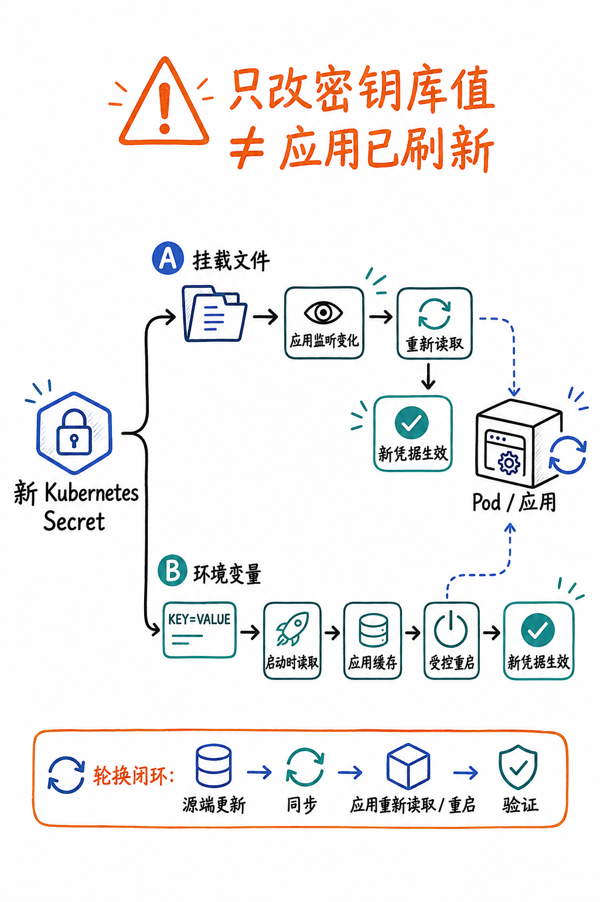

这张图补充本节的关键关系；应结合项目实际负载、权限边界与运行环境验证，而不是脱离条件套用结论。

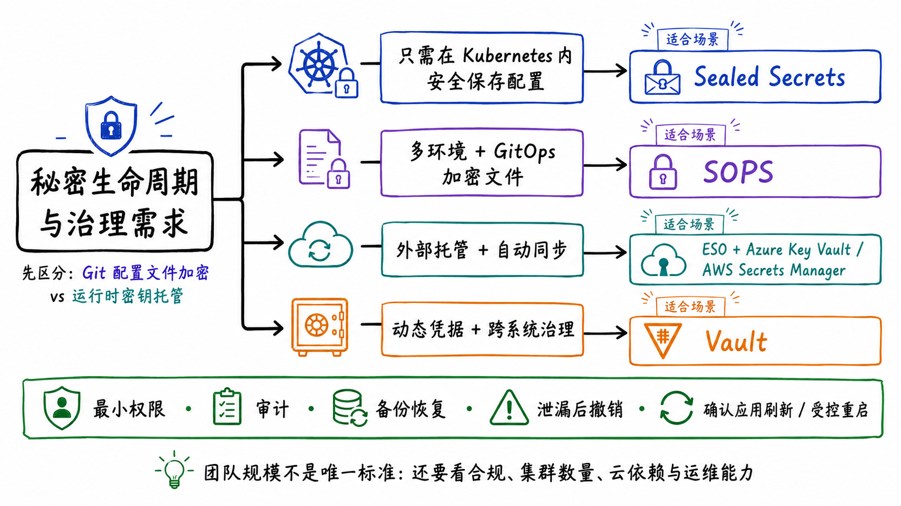

这张图补充本节的关键关系；应结合项目实际负载、权限边界与运行环境验证，而不是脱离条件套用结论。

## 小结

从需求、团队能力、运维成本和可恢复性出发选择方案。先用最小可验证样例确认边界，再扩大到生产环境。

