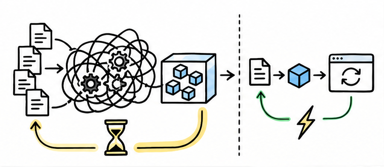
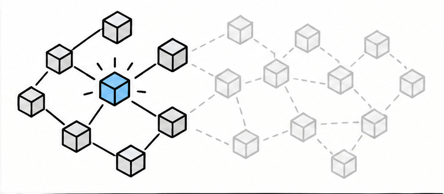
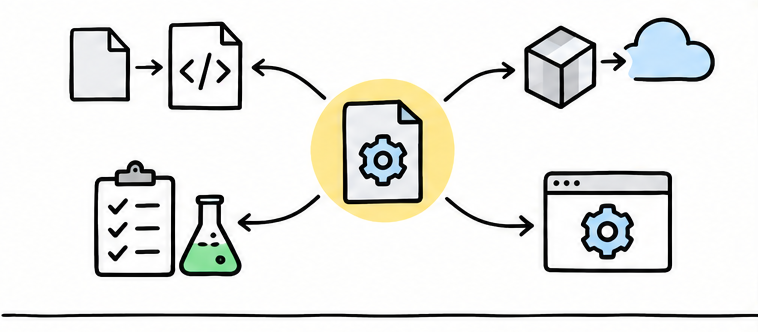
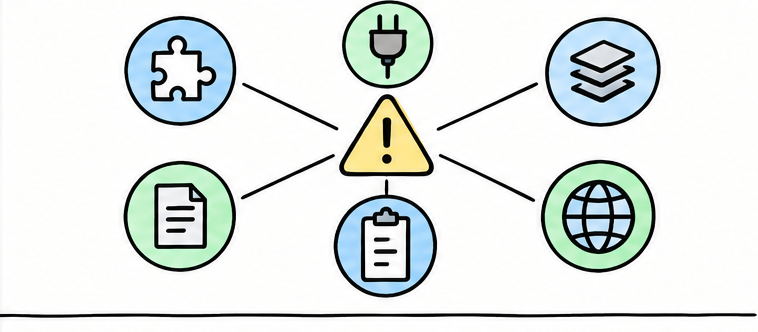
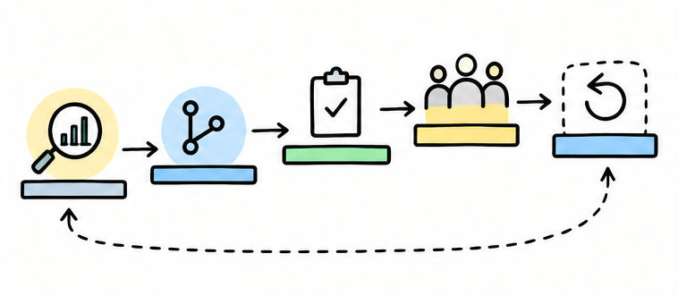
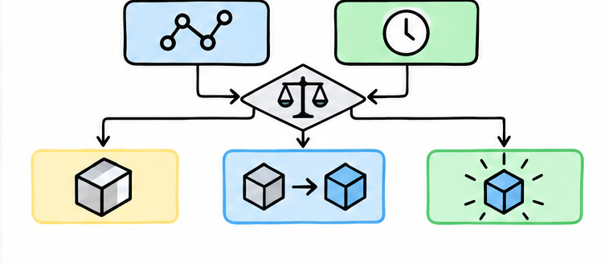

# Vite 更快，老项目为何还不敢迁移？

> 对应短视频主题：Vite 更快，老项目为何还不敢迁移？  
> 资料核验与更新：2026-09-12

从开发反馈机制到隐形构建契约，讲清 Vite 的优势与老项目迁移的真实风险。

## 阅读边界

本文依据原始课程的研究笔记、课程结构和发布文案整理。涉及产品、模型、版本、平台规则、价格或资格等可能变化的信息，实践前应以当前官方资料和实际环境为准。
原始研究记录标注的时间为：2026-08-26。
该课程原始包被归为“仅保留源资料”；本文只根据现有文字材料整理，不把它表述为已完成的视频成片。
原始课程结构只覆盖 2 个核心主题；为保证完整性，本文另外补入研究笔记中的迁移与验证边界。
本页配图为依据正文新绘的 AI 辅助教学示意图；它们并非原始课程包内的素材，也不代表原始成片画面。

## Vite 真正改写的，是反馈路径

速度优势首先发生在开发启动和改完代码之后。

先纠正一个说法：Vite 并没有让 Webpack 失效，它改变的是新项目对开发反馈速度的预期。Webpack 在开发启动时，通常先从入口分析依赖图，并生成可执行的开发打包结果；项目越大，前置工作往往越重。

Vite 把依赖和源码分开处理：不常变化的依赖先做预打包，业务源码则通过浏览器原生的 ESM，也就是 ES 模块，按请求即时提供。修改文件时，它利用 HMR，也就是热模块替换，只重新处理受影响的模块，所以启动和改完代码后的等待通常更短。

但生产环境仍然需要打包；Vite 解决的是反馈路径，不是把所有构建工作凭空消灭。

## 老项目迁移的，是一份隐形契约

构建配置早已连接源码、测试、部署和线上运行。

老项目真正害怕的，不是学习一份新的配置文件，而是原来的构建系统早已变成一份隐形契约。Webpack 的 loader，也就是文件转换器，可能承担旧版 JavaScript、样式、模板和特殊资源的处理。

插件还可能接管环境变量、HTML 注入、产物命名、公共路径，甚至微前端的模块联邦。换到 Vite 后，源代码要遵循 ESM 语义，环境变量改为 import.meta.env，动态资源、后端模板和浏览器兼容目标也可能需要重写。

只要其中一项没有被盘点，开发服务器能启动，也不代表测试、部署和线上行为已经等价。所以老项目不敢迁移，往往不是保守，而是在等一条可验证、可回滚的迁移路线。

## 迁移前，先把隐形契约列出来

不要把原有配置当成一份可以逐行翻译的脚本。先把每个 loader、插件和构建钩子实际承担的责任列清：它处理了什么源码或资源、在开发期还是构建期生效、产物由谁消费、失败后如何发现。

然后重点核对几类高风险接口：环境变量从何处注入、公共路径和资源 URL 如何计算、后端模板如何读取构建 manifest、测试工具和浏览器兼容目标是否仍然一致。对于模块联邦、服务端渲染、多页面构建或自定义发布产物，还要把运行时共享模块和部署脚本单独作为验证项。

Vite 的插件接口与 Rollup/Rolldown 生态有关联，但开发服务器和生产构建并不是同一个执行阶段。某个插件能够安装，并不等于它在原来的生命周期位置上行为相同；迁移时应以真实产物和真实页面行为为准。

## 一条更稳的迁移顺序

第一步是建立基线：记录当前项目的启动时间、热更新、生产构建、产物体积、关键页面和自动化测试结果。没有基线，所谓“更快”或“没有回归”都无法判断。

第二步是在隔离分支或最小入口上试迁，不要一开始改动所有 loader、模板和部署配置。先让一个页面或一个独立包通过开发、测试和生产构建三条路径，再逐步扩大范围。

第三步是为回滚保留出口：旧构建链在新链经过真实流量或完整验收前继续可用。迁移的目标不是尽快删掉 Webpack，而是确认新的反馈速度和维护成本确实值得交换已有的稳定性。

## 别只比较“启动快不快”

Vite 的优势通常首先体现在开发反馈路径；生产构建速度、产物体积和线上运行性能仍要结合实际项目测量。Webpack 也有持久化缓存、loader、插件和模块联邦等能力，深度定制项目继续使用它可能完全合理。

因此更好的问题不是“谁已经过时”，而是“当前项目的主要等待和维护成本在哪里”。新项目可以优先采用更短的反馈链路；老项目则应在风险清单、验证证据和回滚方案都齐全后再迁移。

## 小结

把问题拆成目标、约束、证据和验证四部分，通常比直接寻找唯一答案更可靠。先用本文的框架完成一次小范围验证，再根据真实反馈调整下一步。

## 参考资料

> 📌 **查阅提示**：点击下方超链接可直接复制对应网址，粘贴至手机或电脑浏览器中即可查阅官方完整技术文档与规范。

- [【Vite 官方指南】为什么选择 Vite？下一代前端构建工具的思考](https://vite.dev/guide/why.html)  
  *说明：尤雨溪与 Vite 团队详述基于原生 ES 模块（ESM）与 esbuild 达成毫秒级开发启动的机制。*
- [【Vite 官方指南】依赖预构建（Dependency Pre-bundling）深度解析](https://vite.dev/guide/dep-pre-bundling.html)  
  *说明：解析 Vite 如何利用 Go 语言编写的 esbuild 将 CommonJS 模块快速转换为标准 ESM。*
- [【Vite 官方指南】从 Webpack 到 Vite 的工程化平滑迁移手册](https://vite.dev/guide/migration)  
  *说明：官方指导如何迁移环境变量、静态资源别名与特定 Webpack 插件的等价方案。*
- [【Webpack 官方概念】Webpack 加载器（Loaders）与插件（Plugins）工作机理](https://webpack.js.org/concepts/loaders/)  
  *说明：Webpack 静态模块打包器的 AST 分析树与全量依赖图编译构建核心哲学。*
- [【Webpack 官方进阶】模块联邦（Module Federation）与微前端架构](https://webpack.js.org/concepts/module-federation/)  
  *说明：Webpack 5 最核心的企业级杀手特性：多个独立构建的应用间动态共享运行时代码。*
