# 大模型推理服务怎么选？vLLM、Ollama 与 TGI 深度横评

> 对应短视频主题：vLLM、Ollama、TGI 怎么选？  
> 资料核验与更新：2026-09-12

大模型本身只是一堆离散的矩阵权重参数，而推理服务框架负责将这些模型权重加载进显卡内存（VRAM）、管理连续批处理并发调度，并对外提供高吞吐、低延迟的流式 HTTP/gRPC 接口。选型切忌脱离实际硬件条件盲目比拼极限吞吐，必须在本地离线体验、生产 GPU 高并发与平台已有资产之间做好权衡。

## 阅读边界

本文依据原始课程的研究笔记、课程结构和发布文案整理。涉及产品、模型、版本、平台规则、价格或资格等可能变化的信息，实践前应以当前官方资料和实际环境为准。

## 模型与推理引擎的职责分工

训练过程赋予了大模型语义推理与世界知识；而推理引擎则负责把模型转化为工业级在线服务。上线一个大模型推理服务，必须解决四大技术关卡：大参数权重的快速加载与切片、GPU 显存中的键值缓存（KV Cache）高效利用、多请求并发批处理调度，以及首字极速响应与流式文本输出。

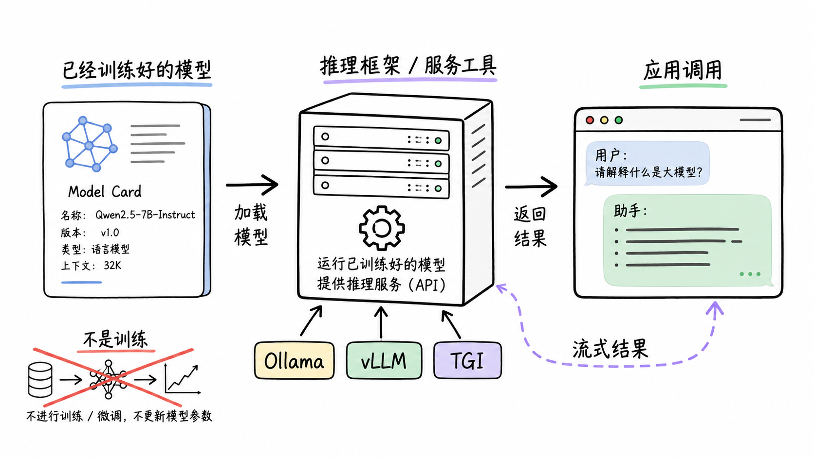

图解：职责分工：模型权重赋予认知能力，推理引擎负责调度计算并交付稳定接口。

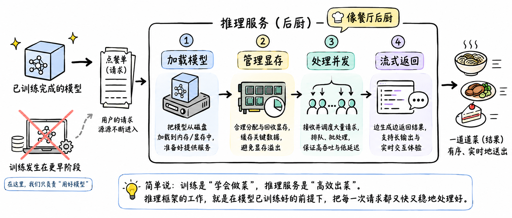

图解：推理服务四大核心链路：权重加载、显存分页管理、连续动态批处理与流式输出。

## 三大推理框架的核心定位与特性

Ollama 基于 llama.cpp 开发，主打极简的一键式下载、量化与本地跨平台运行，是个人电脑与离线测试的最优选；vLLM 凭借划时代的 PagedAttention 分页内存管理与连续批处理技术，极大减少了显存碎片，成为生产级高吞吐 GPU 服务的工业标杆；TGI（Text Generation Inference）由 Hugging Face 打造，深度集成其模型生态，具备成熟的生产监控与张量并行能力。

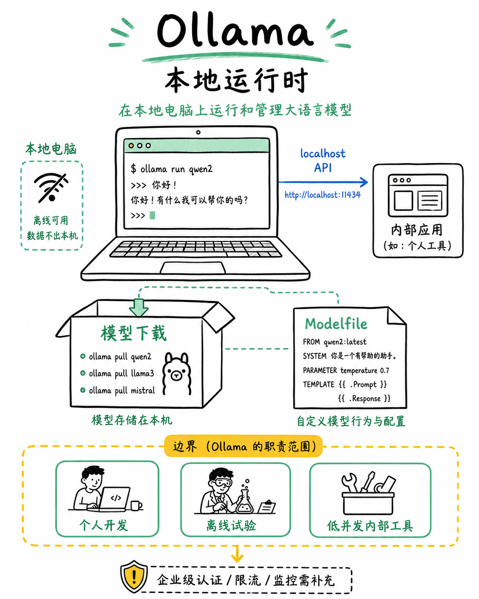

图解：Ollama 本地易用性：命令行一键 pull/run 模型，CPU/GPU 自动分层与多模型灵活切换。

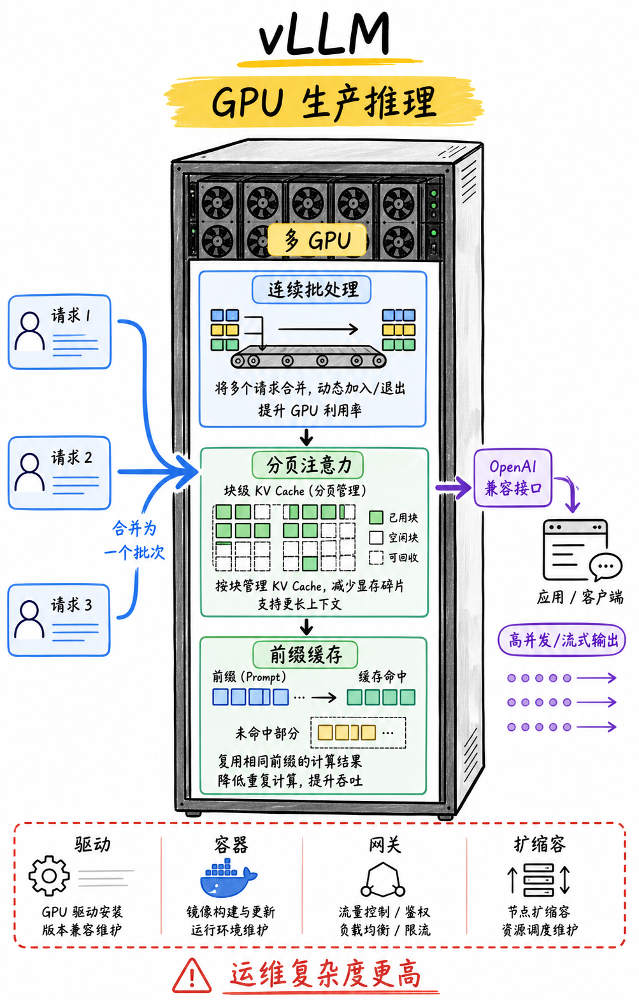

图解：vLLM 生产级引擎：利用 PagedAttention 彻底解决显存浪费，释放极致在线并发吞吐。

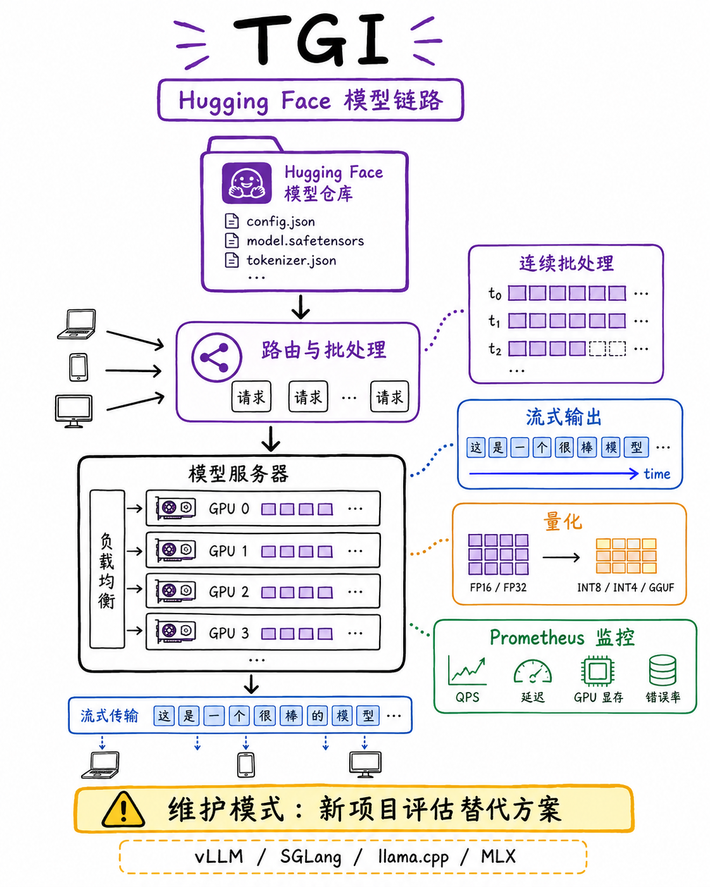

图解：Hugging Face TGI：针对主流开源架构深度优化，开箱即用的企业级合规与监控指标。

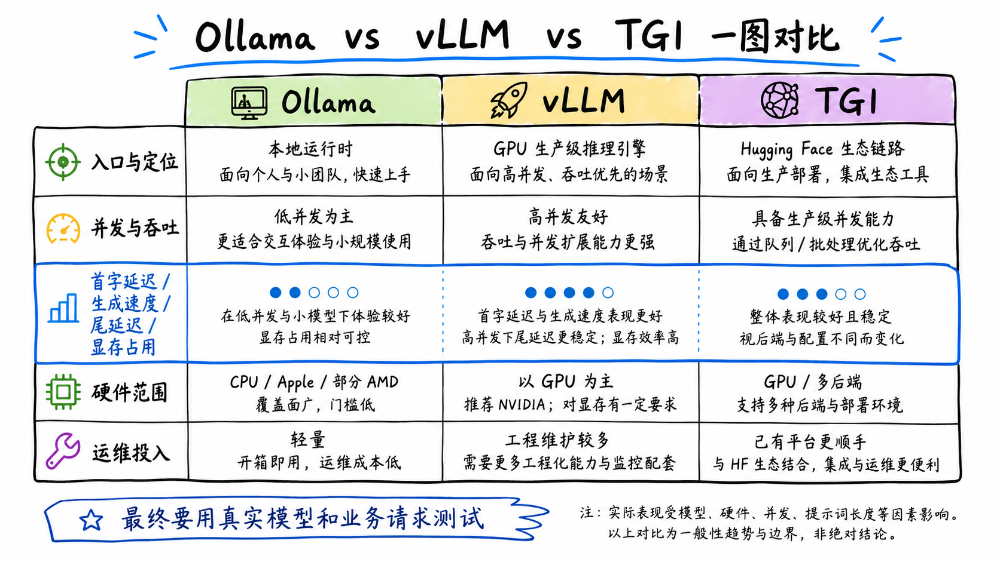

图解：vLLM、Ollama 与 TGI 核心维度对比：安装门槛、硬件适配、量化支持与并发性能。

## 三大典型业务场景的精准落地

在本地开发、个人知识库、边缘嵌入式设备或低并发内部办公场景下，Ollama 几乎免维护的优势无可匹敌；对于面向大量用户的高并发在线 Web 应用、长文档对话或多卡分布式服务，必须选 vLLM 以压榨昂贵的 GPU 算力；如果团队已有 Hugging Face 深度基础设施和工作流，TGI 则是最为顺畅的选择。

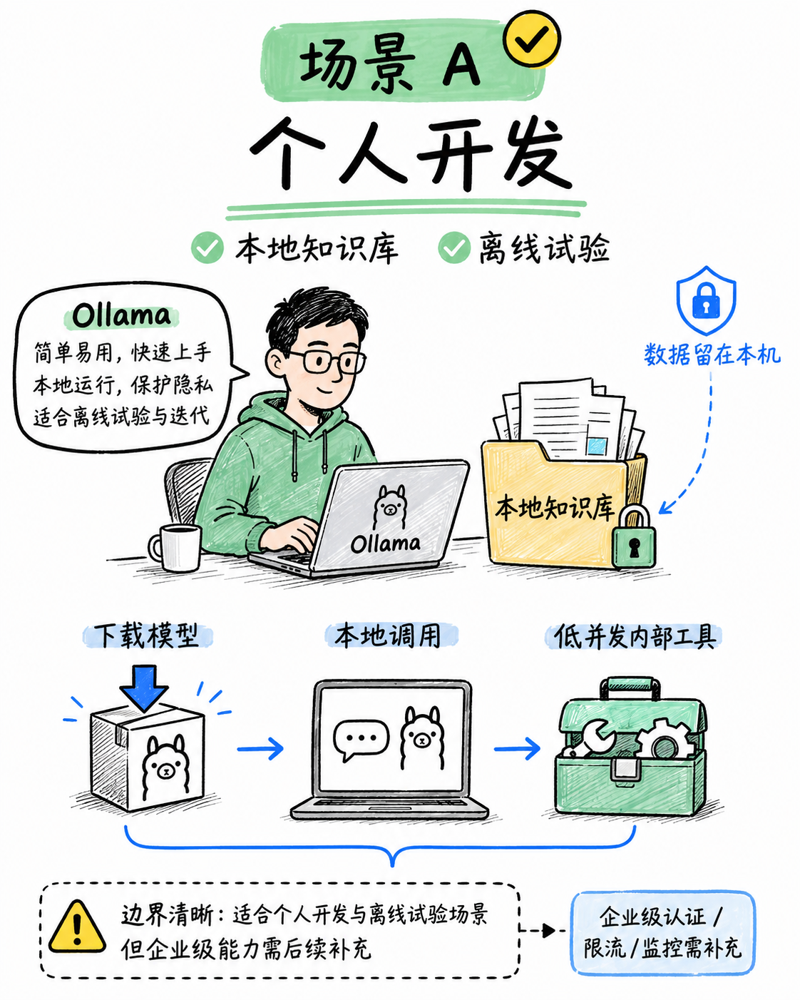

图解：Ollama 落地场景：本地开发者环境、离线桌面软件、边缘私有计算与快速 Demo 验证。

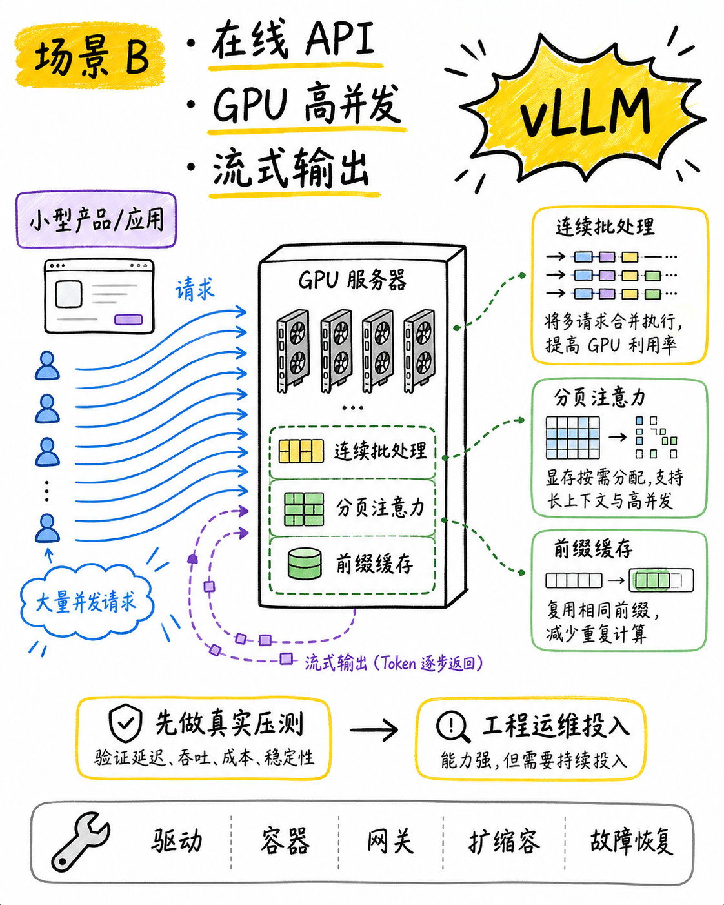

图解：vLLM 落地场景：高并发在线 SaaS、企业级统一 API 网关与大规模模型集群部署。

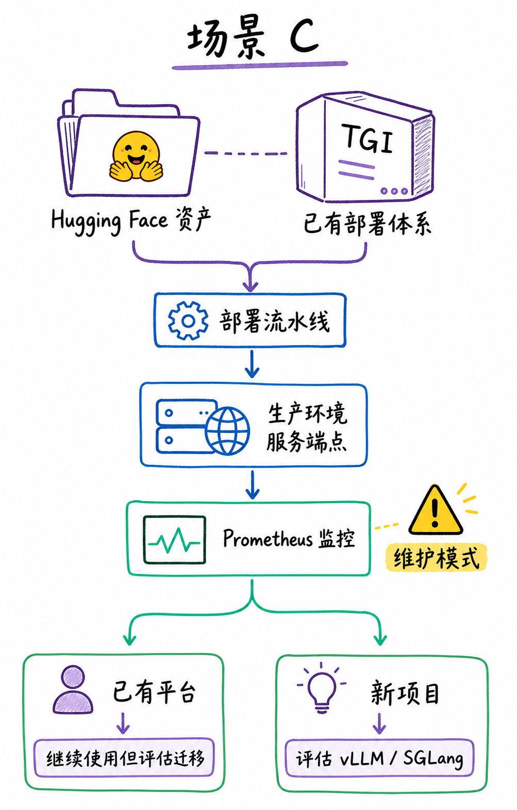

图解：TGI 落地场景：深度依赖 Hugging Face 平台体系与企业私有化模型仓库的无缝集成。

## 生产环境性能评测与选型总结

进行推理框架性能压测时，千万不要只看平均延迟，必须综合考察首字返回时间（TTFT，影响人机交互响应感）、每秒生成 Token 速度（TPS）、并发饱和下的吞吐量以及长周期运行时的显存碎片回收表现，根据实际业务预算选择最合理的架构。

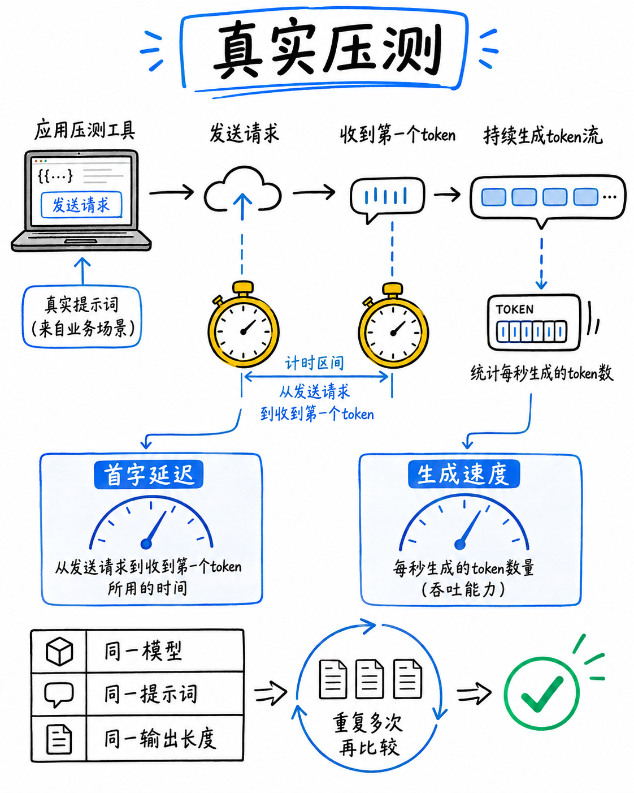

图解：推理关键指标：首字耗时（TTFT）、解码吞吐（Tokens/s）与多用户并发尾延迟。

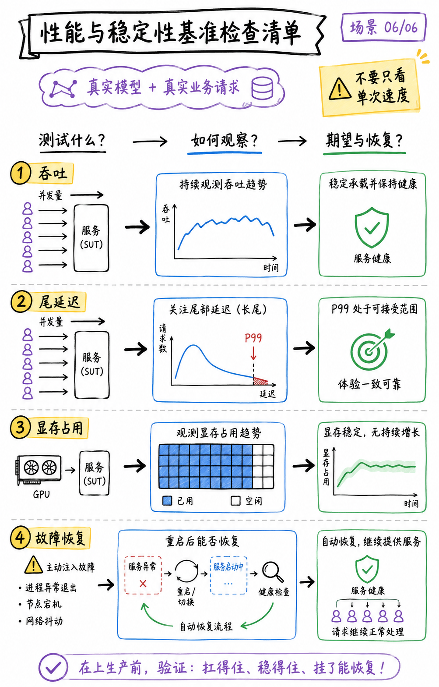

图解：生产可靠性核查：长周期运行显存泄露防护、请求队列排队超时与服务异常恢复。

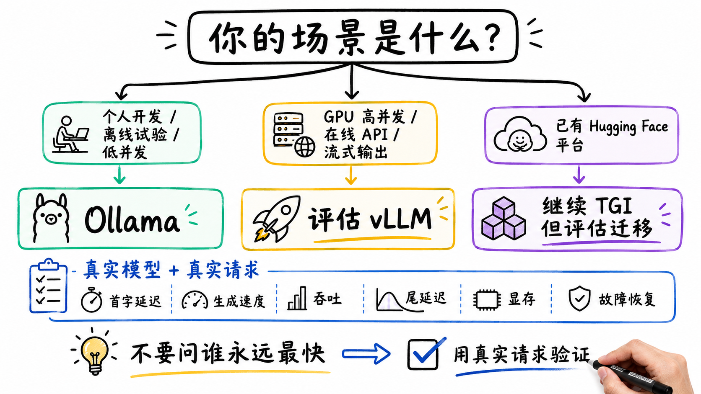

图解：大模型推理框架选型决策树：从本地便捷试验到生产高性能 GPU 集群的梯度演进。

## 小结

本地开发体验选 Ollama；高并发 GPU 在线生产服务选 vLLM；深度绑定 Hugging Face 生态选 TGI。先用 Ollama 跑通业务逻辑，再用 vLLM 支撑规模化流量。

## 参考资料

以下链接来自官方权威技术文档与行业规范；动态规则请以其当前页面为准。

- [vLLM Project Documentation](https://docs.vllm.ai/)
- [Ollama Documentation](https://github.com/ollama/ollama)
- [Text Generation Inference (TGI)](https://huggingface.co/docs/text-generation-inference)
