# 个人小程序虚拟支付接入：5 项先验核查与合规避坑

> 对应短视频主题：个人小程序虚拟支付，先查哪5项？  
> 资料核验与更新：2026-09-12

先查资质，再写代码。在微信小程序生态中，虚拟支付资格绝不等于所有商品形态、平台终端与结算能力都天然开放，个人、个体工商户与企业主体的政策权限存在巨大鸿沟。如果提前不核对规则，极易陷入代码写完却被审核永久封禁的被动局面。

## 阅读边界

本文依据原始课程的研究笔记、课程结构和发布文案整理。涉及产品、模型、版本、平台规则、价格或资格等可能变化的信息，实践前应以当前官方资料和实际环境为准。

## 开工前必须核查的 5 项先决条件

在投入前端和后端代码编写前，开发者必须依次核对五大硬性门槛：主体类型与认证状态、所选服务类目是否允许虚拟销售、小程序 ICP 备案进展、微信后台虚拟支付功能开通权限，以及各手机系统终端（特别是 iOS 与 Android）的政策支持情况。

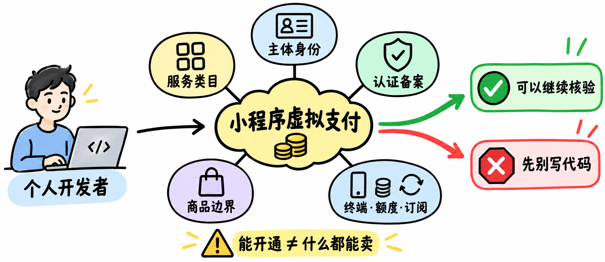

图解：虚拟支付五项前置核查：主体资质、类目准入、ICP 备案、后台能力开通与跨端合规。

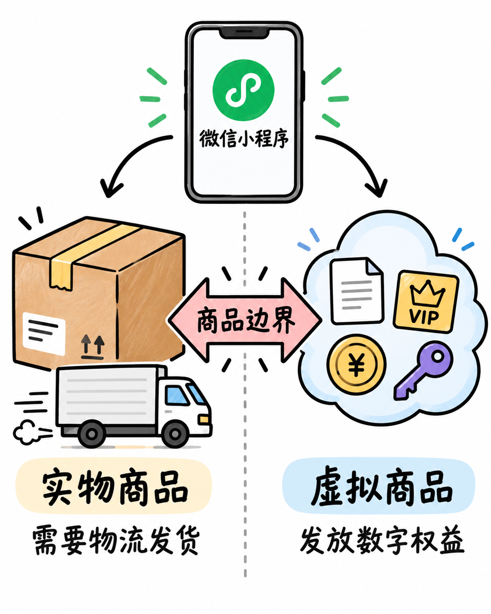

图解：平台红线认知：严格区分实体电商购物与数字内容虚拟付费，不可盲目套用。

## 虚拟商品范畴与主体资质断层

虚拟支付主要涵盖付费文章解锁、会员订阅权限、软件功能点数与虚拟代币等非实物交付形态。企业主体拥有最完整的服务类目与大额交易额度；个体工商户能享受较低的财税成本但依然属于非个人主体；个人开发者主体受限最多，仅在极少数指定特定类目中开放有限试水，且严禁超范围违规经营。

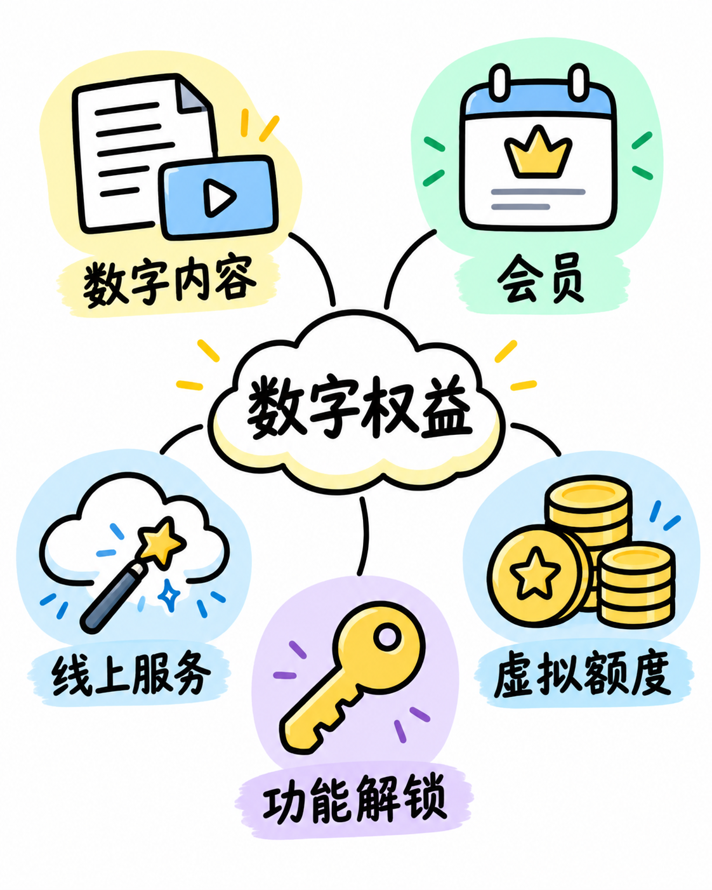

图解：典型虚拟商品形态：数字课程阅读、功能试用升级、会员订阅与虚拟充值点数。

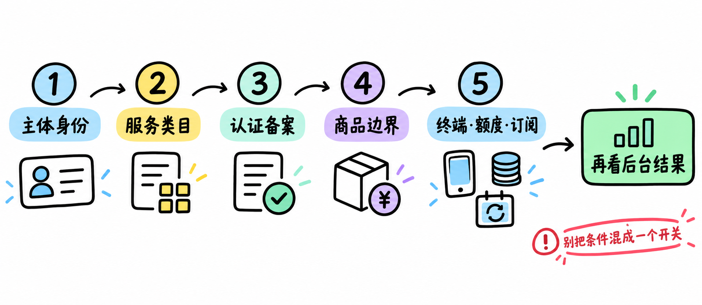

图解：公众平台后台核对：核查认证年审有效期、备案通过标识与虚拟支付签约入口。

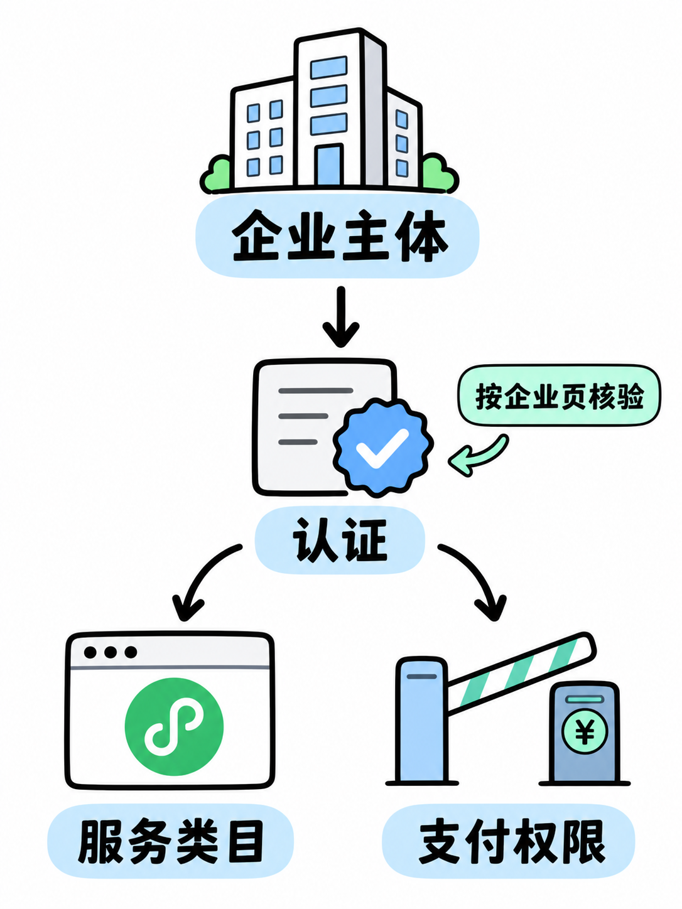

图解：企业主体能力：具备标准商户号结算体系，支持多样化交易场景与较高风控限额。

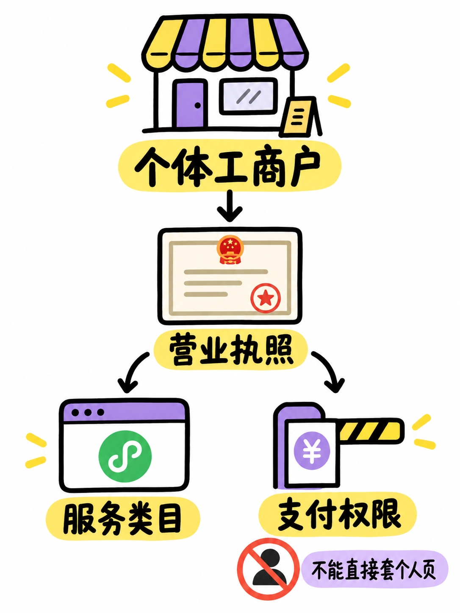

图解：个体工商户方案：低成本获取商业支付资质，适合个人向独立商业化转型过渡。

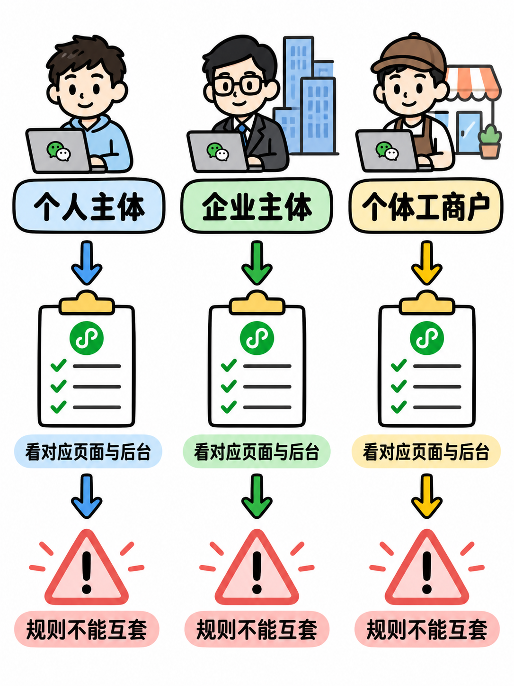

图解：三大主体权限断层：个人主体、个体工商户与企业在虚拟支付能力上的严格隔离。

## 合规模式与严禁越界的违规红线

微信小程序官方为虚拟支付提供了专有技术协议（如道具直购或代币扣减），开发者必须严格接入官方接口。任何试图绕开官方通道引导用户点击外链、跳转第三方 H5、通过客服对话框发送二维码转账或引导私下转账的行为，均属于严重的违规绕行行为，将直接招致封禁封号惩罚。

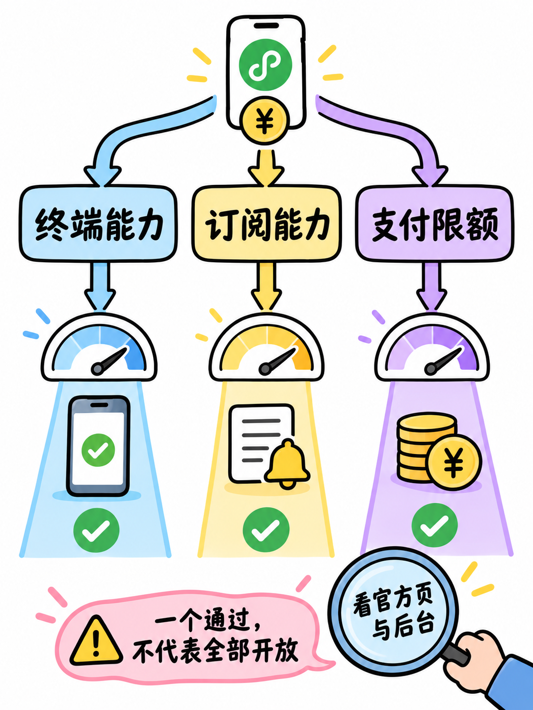

图解：官方支付模式架构：规范区分道具直购接口与账户代币充值两套技术能力。

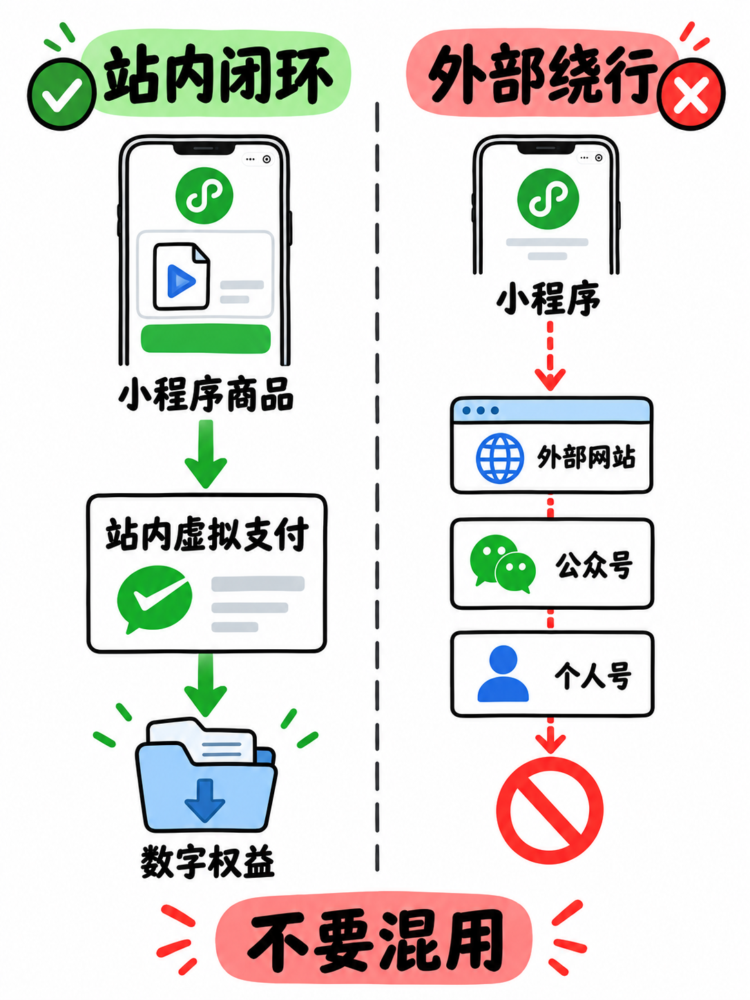

图解：严禁违规绕行：不得利用客服消息、二维码图片或外部链接诱导私下交易。

## 服务端安全履约与上线决策树

虚拟支付涉及到真实资金流转，服务端必须实现完整的防重放验证、微信官方签名验签以及事务级库存扣减发货流程。对于个人开发者而言，如果受限于类目无法开通虚拟支付，应优先考虑通过微信流量主广告变现，待业务模式跑通后再升级为个体工商户主体完成商业化闭环。

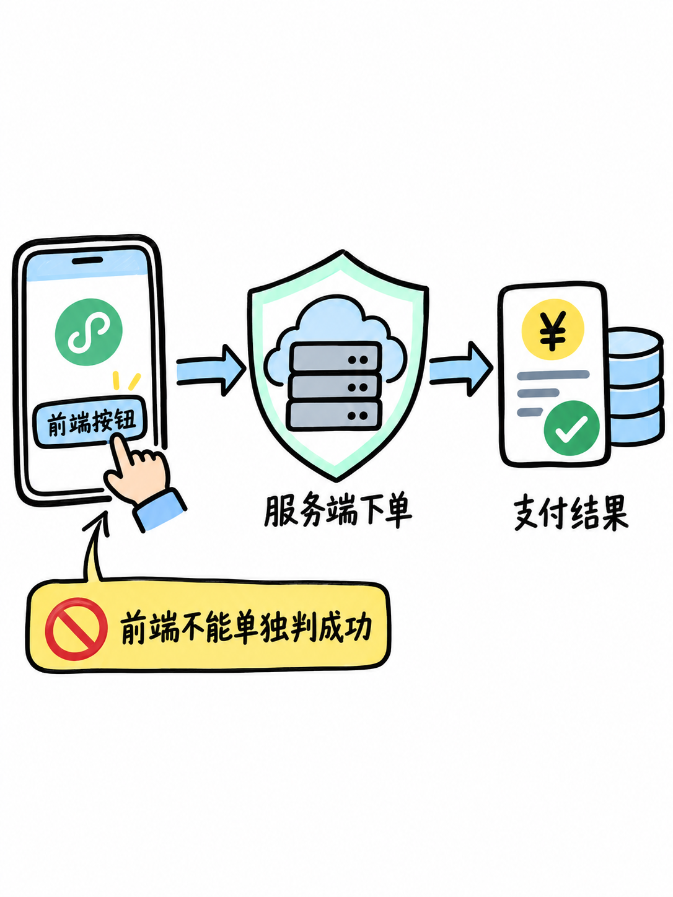

图解：服务端履约安全：异步支付回调验签、幂等性订单处理与安全发货状态机。

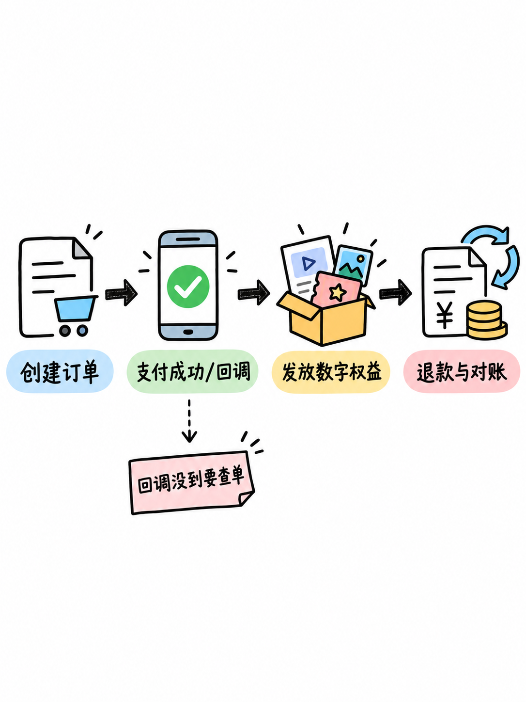

图解：订单完整生命周期：创建预支付订单、前端调用收银台、支付成功回调与权益发放。

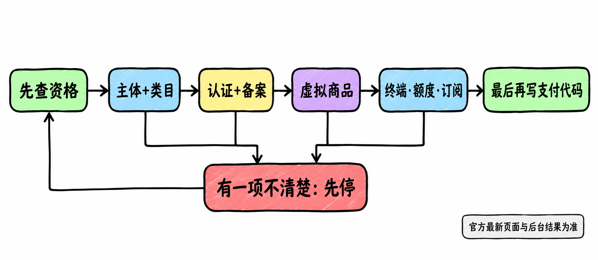

图解：个人小程序商业变现决策树：先验资格核验、合规广告变现与主体阶梯升级指南。

## 小结

虚拟支付先查主体与类目，绝不可事后补票；严禁使用外部二维码或跳转外链绕开微信支付；个人主体若资格受限，先做免费加流量主广告，验证市场后再注册个体户升级资质。

## 参考资料

以下链接来自官方权威技术文档与行业规范；动态规则请以其当前页面为准。

- [微信小程序虚拟支付接入指南](https://developers.weixin.qq.com/miniprogram/dev/platform-capabilities/industry/virtual-payment.html)
- [微信小程序运营规范（虚拟支付章节）](https://developers.weixin.qq.com/miniprogram/product/)
- [微信公众平台服务类目资质要求](https://developers.weixin.qq.com/miniprogram/product/material/)
