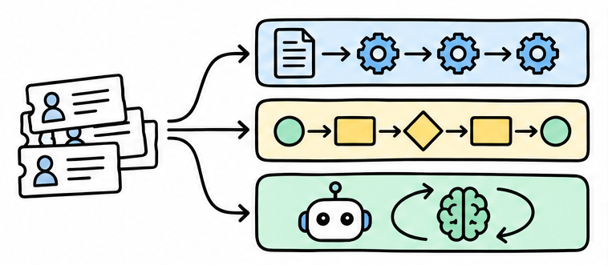
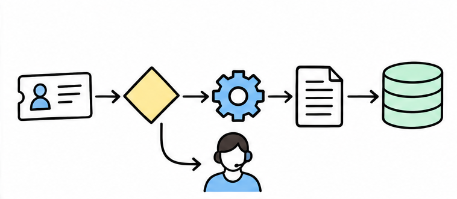
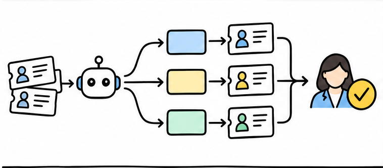
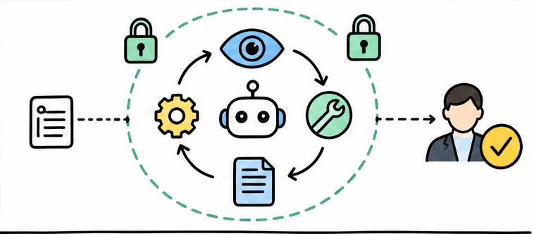
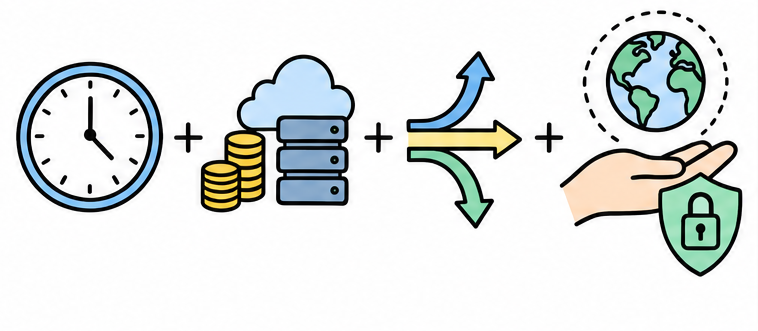
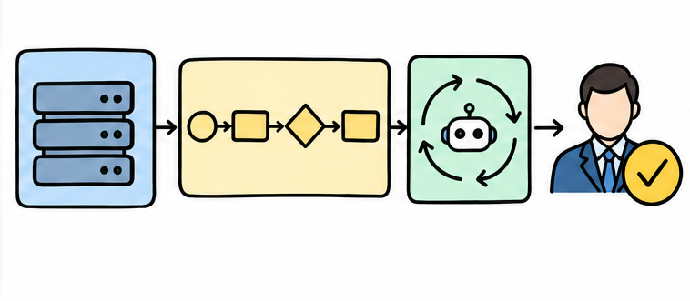

# Workflow、Agent 与传统编程，本质区别是什么？

> 对应短视频主题：Workflow、Agent 与传统编程，本质区别是什么？  
> 资料核验与更新：2026-09-12

用一批客户工单讲清三种自动化方式：谁决定下一步、各自适合什么任务，以及为什么现实系统常采用确定性外壳加有限自治。

## 阅读边界

本文依据原始课程的研究笔记、课程结构和发布文案整理。涉及产品、模型、版本、平台规则、价格或资格等可能变化的信息，实践前应以当前官方资料和实际环境为准。
原始研究记录标注的时间为：2026-08-26。
该课程原始包被归为“仅保留源资料”；本文只根据现有文字材料整理，不把它表述为已完成的视频成片。
本页配图为依据正文新绘的 AI 辅助教学示意图；它们并非原始课程包内的素材，也不代表原始成片画面。

## 同一批工单，差别在谁决定下一步

密码重置、退款、模糊投诉和疑似欺诈，交给三种自动化方式。

想象客服系统收到一批工单：有人要重置密码，有人申请退款，还有人只写了一句，我非常失望。传统编程的做法，是由开发者提前写好条件、分支和接口调用；系统只沿这些明确路径执行。

Workflow，也就是工作流，会把分类、查订单、生成回复和提交审批排成预先设计好的路线。Agent，也就是智能体，则拿到目标、可用工具和安全边界，再根据当前工单动态决定下一步。

所以是否调用大语言模型，并不是分界；真正的分界，是下一步主要由代码预先决定，还是由模型在运行中选择。

## 传统编程：人提前写完执行路径

规则稳定时，明确分支通常最可靠。

先看最稳定的密码重置工单：系统读取账号、身份验证结果和账户是否锁定。开发者可以把规则写成明确条件：身份通过就继续，验证失败就转人工，账户冻结就禁止修改。

条件满足后，程序按固定顺序调用重置接口、发送通知，再把结果写回工单。这种路径容易测试、追踪和复现；只要规则稳定，通常也更快、更便宜。

它的弱点也很直接：遇到我很失望这种模糊表达，所有含义和例外都要由人继续写成更多分支。

## Workflow：路线固定，节点可以变聪明

模型处理模糊信息，代码继续掌握整体流程。

工单种类变多后，团队常把固定步骤组织成 Workflow，也就是工作流。其中一个节点可以调用大语言模型，也就是能理解和生成文字的模型，用来识别意图、抽取订单号或总结投诉。

但分类之后走退款流程、密码流程还是投诉流程，通常仍由预先写好的分支决定。换句话说，模型可以让某个节点更会处理模糊信息，却没有接管整个流程的下一步。

这种结构便于重试、监控和逐步替换节点，适合主路径稳定、局部判断较模糊的任务。

## Agent 的本质，是一个受控行动循环

模型每次只选择下一步，工具结果再成为新的观察。

以那条模糊投诉为例，Agent 先观察工单内容、客户历史和当前订单状态。它可能先选择查询订单，再检索退款政策；这个工具调用，就是让模型通过受限接口读取信息或执行动作。

工具返回结果后，信息会进入下一轮观察，模型再决定生成解释、追问客户，还是把工单交给退款专员。这种观察、选择、行动、再观察的循环，是 Agent 比固定工作流更灵活的原因。

但灵活不等于无限权限；大额退款、修改账号和疑似欺诈，仍要受最大轮次、权限和人工审批约束。Agent 真正增加的不是一个聊天框，而是模型在这些边界内选择行动的能力。

## 灵活不是免费：Agent 有四笔成本

更多模型调用和工具循环，也带来更多不确定性。

Agent 的灵活性并不是免费的，也不意味着它应该接管所有工单。每多一轮模型判断和工具调用，就会增加等待时间、计算费用和外部服务成本。

相似工单还可能走出不同路径，因此测试不能只问答案对不对，还要检查工具选择和停止条件。如果工单里夹带诱导文字，或者模型误解政策，过大的写入权限就可能把判断错误变成真实操作。

所以密码重置和订单状态查询这类规则稳定的任务，通常没有必要为了智能而强行使用 Agent。

## 现实答案：确定性外壳，有限自治内核

把三种方式放在各自最擅长的位置。

更可靠的工单系统，往往不是三选一，而是把三种方式组合起来。传统程序负责批量导入、去重、权限校验和结果落库，因为这些步骤必须稳定。

Workflow 负责分类后的标准处理链、失败重试和固定审批，让主流程始终可见。Agent 只处理难以穷举的投诉理解和工具选择；任何高风险写操作都先进入人工批准，并留下完整记录。

最后记住这个选择规则：能把步骤写清，就用程序或 Workflow；只有下一步确实需要根据新信息调整，才引入受控 Agent。

## 小结

把问题拆成目标、约束、证据和验证四部分，通常比直接寻找唯一答案更可靠。先用本文的框架完成一次小范围验证，再根据真实反馈调整下一步。

## 参考资料

> 📌 **查阅提示**：点击下方超链接可直接复制对应网址，粘贴至手机或电脑浏览器中即可查阅官方完整技术文档与规范。

- [【OpenAI 官方指南】Agents SDK 智能体定义、执行与工具编排](https://openai.github.io/openai-agents-python/agents/)  
  *说明：OpenAI 官方 Python 框架关于确定性代码流程与大模型推理节点调度的结合实践。*
- [【OpenAI 官方文档】Agent 工具调用（Tool Calling）与状态持久化](https://openai.github.io/openai-agents-python/tools/)  
  *说明：如何安全将 Python 函数暴露给模型调用，并验证输出类型与返回约束。*
- [【Anthropic 官方研究】构建值得信赖的可靠智能体系统（Trustworthy Agents）](https://www.anthropic.com/research/trustworthy-agents)  
  *说明：深度探讨为什么必须用确定性工作流约束 Agent 的自治边界，避免幻觉与失控。*
- [【LangChain 官方指南】LangGraph 循环图流与有状态多 Agent 编排](https://langchain-ai.github.io/langgraph/)  
  *说明：将复杂业务逻辑抽象为状态机有向图（Graph），实现断点调试与人工回退。*
