# XML 与 JSON：数据交换格式的历史与现状

用白板图解 XML、JSON、YAML 与 Protobuf 的历史动因、核心机制和当代工程边界。

## 阅读边界

本文依据原始课程的研究笔记、课程结构和发布文案整理。涉及产品、模型、版本、平台规则、价格或资格等可能变化的信息，实践前应以当前官方资料和实际环境为准。
原始研究记录标注的时间为：2026-08-30（Asia/Shanghai）。

## 数据交换格式，为什么一直在变？

XML · JSON · YAML · Protobuf：不是潮流，而是约束

当一份数据要跨程序、跨语言、跨网络移动时，格式就不再只是写法问题。人希望它能读懂，机器希望它稳定，网络希望它足够紧凑，系统还要允许未来继续演进。

XML、JSON、YAML 和 Protobuf，分别把这组矛盾中的不同约束推到了前台。理解它们的关键，不是背谁更新，而是先问数据要被谁读、怎样传和怎样升级。

图解：An educational hand-drawn whiteboard infographic, clean solid pure white background, sketchy black marker doodle outlines, pastel yellow, sky blue, mint green and soft purple highlighter accents, friendly textbook illustration aesthetic. Output exactly 1840x800, 2.35:1 ultra-widescreen. Draw one large central data packet crossing a bridge between a human notebook and a server, with four directional forces around it labeled in accurate simplified Chinese: “人类可读”, “机器稳定”, “体积效率”, “长期演进”. Along the bridge, place four large accurate labels “XML”, “JSON”, “YAML”, “Protobuf” as four different signposts, connected by clean arrows to the central title “数据交换格式”. Make the composition dense and panoramic, with no reserved title or subtitle band, no people, no logos, no watermark, no dark background, no random text, no cropped objects.

## XML：把文档结构带上 Web

从 SGML 与 W3C，到元素、属性、命名空间和企业契约

XML 的故事可以从 SGML 和 Web 时代的文档互操作需求讲起。1998 年 XML 1.0 成为 W3C Recommendation，它把可扩展的文档标记裁剪成更适合 Web 的规则。

元素、属性和嵌套树让结构显式可见，而命名空间、DTD 或 XSD 可以继续承担名称隔离与验证任务。SOAP 和 WSDL 这样的企业 Web 服务规范使用 XML 技术构建契约，但这不意味着每份 XML 都必须属于 SOAP 体系。

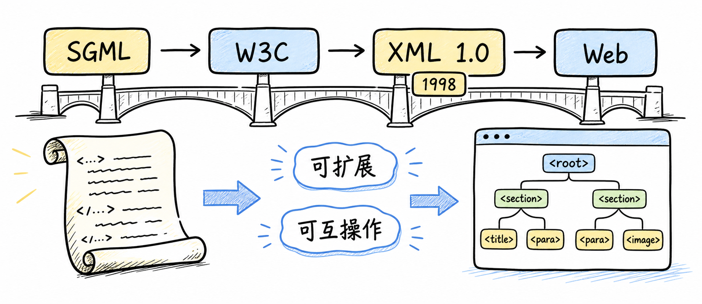

图解：Hand-drawn whiteboard history panorama on a pure white background, black marker outlines with restrained pastel yellow and sky blue highlights. Output exactly 1840x800, 2.35:1. Show a left-to-right bridge timeline labeled exactly “SGML” → “W3C” → “XML 1.0” → “Web”, with the year “1998” clearly beside XML 1.0. Add two chalk callouts “可扩展” and “可互操作”. Draw the old document scroll on the left transforming into a clean tree-shaped web document on the right; no portraits, no logos, no dark background, no extra history claims, no tiny text, no watermark.

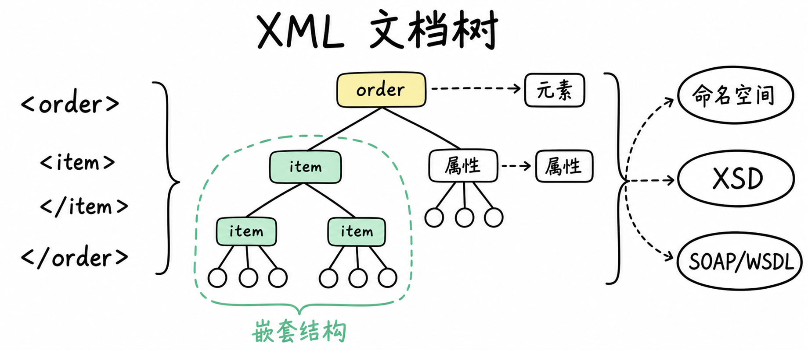

图解：Clean whiteboard educational diagram, pure white opaque background, black hand-drawn marker lines, pastel yellow highlight for the root and mint green for valid nesting. Output exactly 1840x800, 2.35:1 ultra-widescreen. Fill the panorama with a large XML document tree titled exactly “XML 文档树”; show readable code lines “”, “”, “”, “” beside a branching tree. Label two branches accurately “元素” and “属性”, add “嵌套结构”, and connect the tree to three small ecosystem labels “命名空间”, “XSD”, and “SOAP/WSDL” without implying every XML document uses all three. Keep code large and legible, no blackboard frame, no people, no logo, no invented XML logo, no cropped brackets, no random text.

## JSON：轻量文本，不等于完整语义

对象、数组与 Web API：语法变轻，协议责任仍在

当 Web 应用需要频繁在浏览器和服务器之间交换对象时，XML 的显式标记显得相对沉重。JSON 借鉴 JavaScript 对象语法，用对象、数组和少量标点表达同样的结构，因此更贴近 Web API 的数据交换。

但 JSON 标准主要定义合法文本的语法，并不替业务规定字段含义、必填规则或版本语义。需要稳定互操作时，可以把 JSON Schema 放在语法之上，明确验证规则和共享的数据约束。

图解：A single comparison card in a clean whiteboard hand-drawn textbook style, pure white background, black marker outline, pastel yellow and sky blue accents. Output exactly 1080x1350, 4:5 portrait. Large header “XML”, beneath it a readable code window with “” and “Lin”, arrows pointing to labels “显式标签”, “元素”, “属性”, and a bottom note “可读但较长”. Make the card full and substantial with large typography, no people, no logos, no dark background, no watermark, no clipped angle brackets or malformed code.

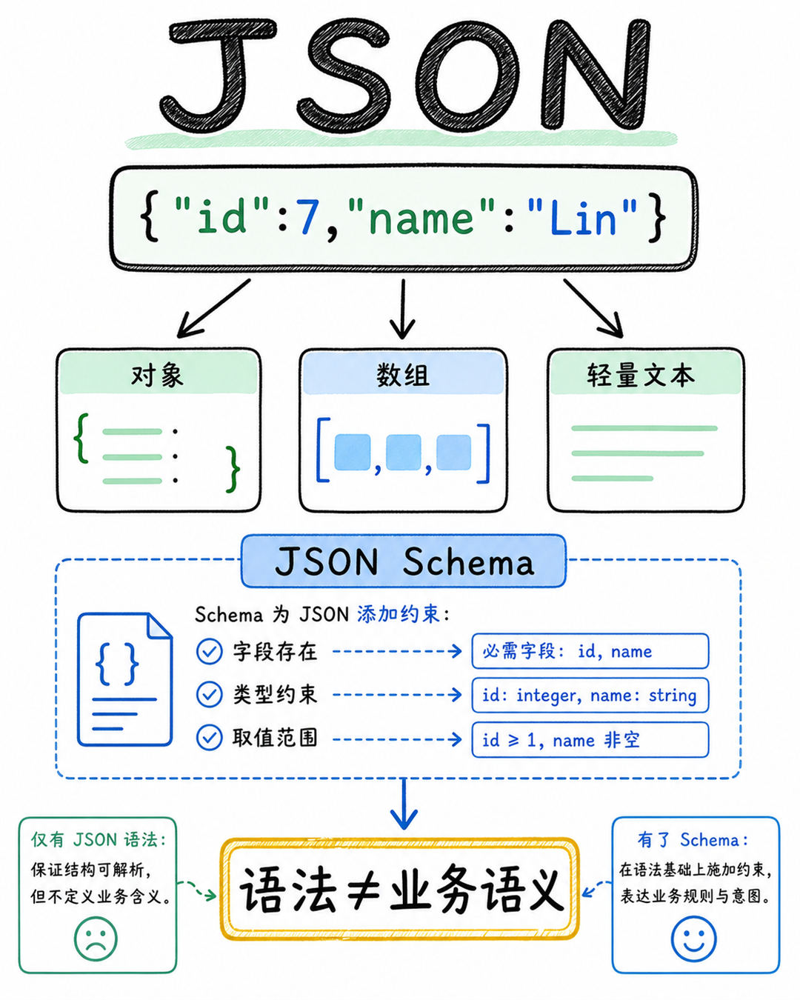

图解：A matching right-side comparison card, pure white background, sketchy black marker outlines, pastel mint green and sky blue highlights. Output exactly 1080x1350, 4:5 portrait. Large header “JSON”, show a clean readable object code block “{\"id\":7,\"name\":\"Lin\"}” with arrows to labels “对象”, “数组”, “轻量文本”. Add a clear yellow boundary stamp “语法≠业务语义” and a small validation layer labeled “JSON Schema”, showing that schema can add constraints while JSON syntax alone does not define application meaning. No people, no logos, no dark background, no random text, no malformed quotation marks.

## YAML：让结构化数据更适合人来维护

缩进、注释、锚点与 schema：可读性背后的解析边界

YAML 把重点从机器最短表示，转向人类能否快速阅读、编辑和复用配置。它用缩进、注释、多行标量以及锚点和别名减少符号噪声，YAML 1.2 也规定了与 JSON 的官方语法子集关系。

所以 Kubernetes、CI/CD 等配置生态常见 YAML，但缩进、隐式类型、标签和解析器差异也必须被治理。正确的做法不是把 YAML 当成更好看的 JSON，而是明确版本和 schema，并在加载后验证结果。

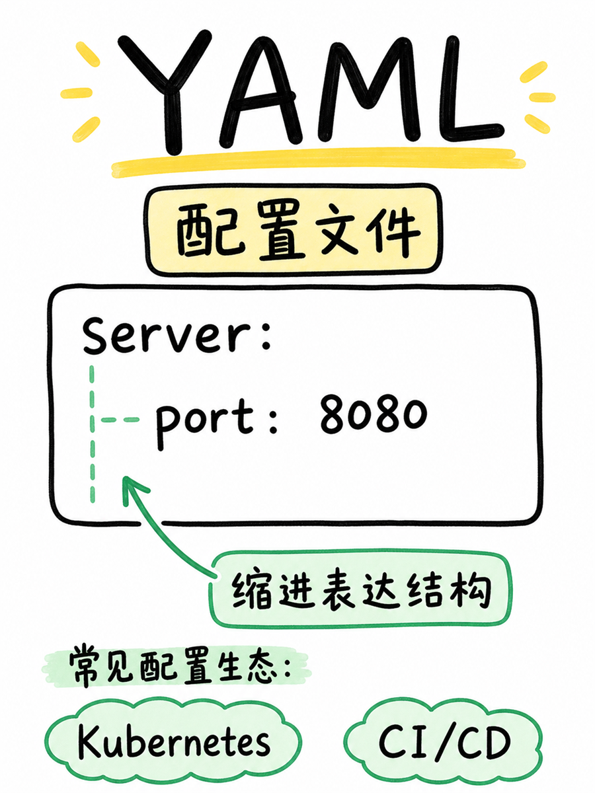

图解：Educational hand-drawn whiteboard card, pure white background, black marker lines, pastel yellow and mint green accents. Output exactly 900x1200, 3:4 portrait. Show a large YAML configuration page titled “YAML”, with clear lines “server:”, two-space indentation, “port: 8080”, and a small arrow note “缩进表达结构”. Add two contextual tags “Kubernetes” and “CI/CD” as examples of configuration ecosystems, not as logos or claims that YAML belongs only to them. Make the configuration look easy for a human to scan and edit, with no people, no logos, no dark background, no extra punctuation, no clipped lines, no watermark.

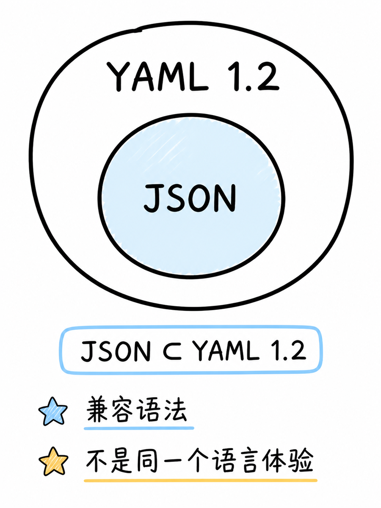

图解：Clean whiteboard set diagram on a pure white background, black hand-drawn outlines and pastel sky blue/yellow accents. Output exactly 900x1200, 3:4 portrait. Draw a large outer rounded region labeled “YAML 1.2” containing a clearly smaller inner region labeled “JSON”, with the exact relation text “JSON ⊂ YAML 1.2”. Add two precise notes “兼容语法” and “不是同一个语言体验”. Keep the set relation visually unambiguous, no people, no logos, no dark background, no random text, no cropped symbols.

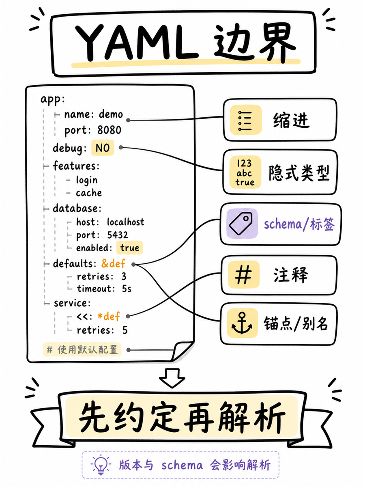

图解：Hand-drawn whiteboard caution card, solid pure white background, black marker outlines, restrained pastel yellow warning highlights and soft purple for schema. Output exactly 900x1200, 3:4 portrait. Show a tidy indented YAML tree with large callouts “缩进”, “隐式类型”, “schema/标签”, “注释”, and “锚点/别名”, joined by clean arrows to a bottom rule “先约定再解析”. Add the header “YAML 边界” and a tiny note “版本与 schema 会影响解析”. Do not show the unqualified claim “NO 变 false”. Friendly textbook look, no alarmist imagery, no people, no logos, no dark background, no tiny text, no watermark.

## Protobuf：用 schema换取线上效率

.proto → protoc → 生成代码 → 字段编号与兼容演进

当服务间通信更在意紧凑传输、解析速度和跨语言接口时，纯文本就不一定是最合适的线上表示。Protobuf 先用 .proto 描述 typed message，再由 protoc 生成多语言代码，让应用围绕同一份 schema 读写消息。

字段编号会进入 wire format，新字段可以在兼容规则下加入，因此它适合稳定演进的服务间协议。代价是线上二进制不适合直接人工阅读，完整解释通常依赖对应的 .proto 文件，gRPC 只是常见搭配而不是 Protobuf 本身。

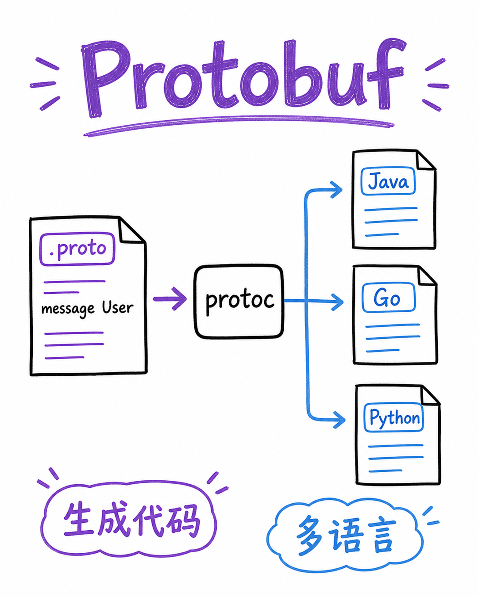

图解：Whiteboard comparison card, pure white background, sketchy black marker outlines, pastel purple and sky blue accents. Output exactly 1080x1350, 4:5 portrait. Draw a clear pipeline from a schema sheet labeled “.proto” containing “message User” to a compiler box labeled “protoc”, then to three generated code sheets labeled “Java”, “Go”, “Python”. Add the large header “Protobuf” and the notes “生成代码” and “多语言”. No people, no logos, no dark background, no random source code, no cropped arrows, no watermark.

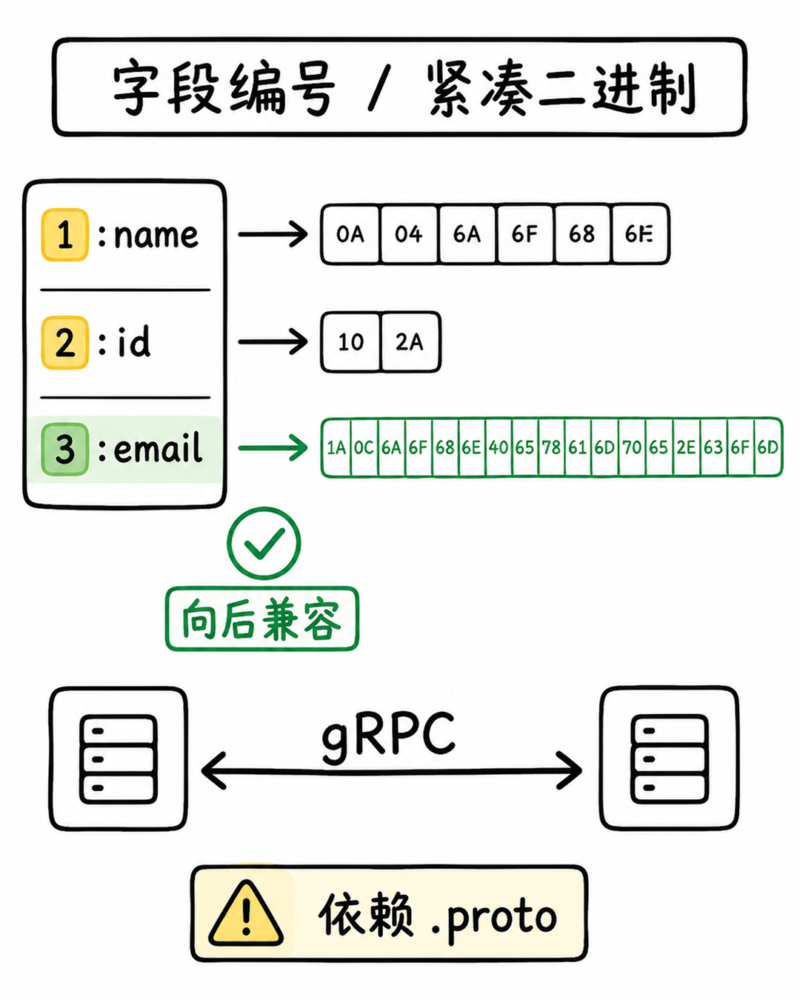

图解：Matching hand-drawn whiteboard card, solid pure white background, black marker outlines, mint green for compatible evolution and pastel yellow for field numbers. Output exactly 1080x1350, 4:5 portrait. Show a schema column with exact labels “1:name” and “2:id” feeding into compact byte blocks, then a new field “3:email” entering with a green check and the note “向后兼容”. Add a small service-to-service arrow labeled “gRPC” and a readable caution “依赖 .proto”; header “字段编号 / 紧凑二进制”. Do not state any universal percentage or benchmark. No people, no logos, no dark background, no malformed numbers, no watermark.

## 今天的现状：四条路线并存

文档交换、Web API、配置维护、服务间传输，各有自己的边界

把四种格式放回工程现场，就会看到 XML 更像文档和复杂契约路线，JSON 更像开放 Web 数据交换路线。YAML 把可维护性放在配置前台，Protobuf 则把 schema、代码生成和紧凑编码放在服务间通信前台。

这不是一条从旧到新的直线，而是人类可读、Web 交换、强 schema 和高吞吐等约束轴上的不同落点。因此格式的现状不是谁淘汰谁，而是谁在什么边界内最合适。

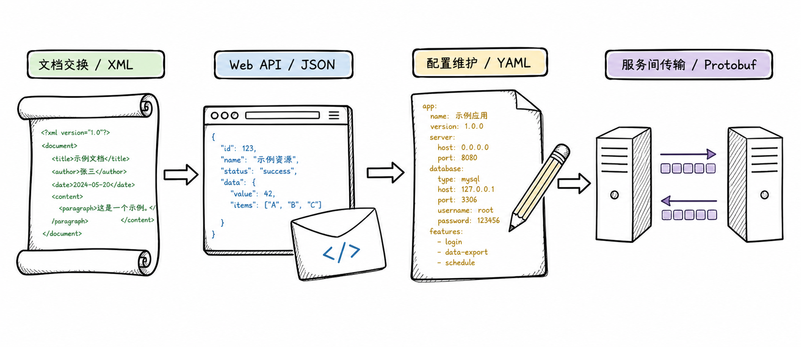

图解：Panoramic hand-drawn whiteboard sequence, pure white background, black marker outlines, one muted accent per semantic role. Output exactly 1840x800, 2.35:1. Draw four connected workstations in one left-to-right flow: a document exchange scroll labeled “文档交换 / XML”, a browser and API envelope labeled “Web API / JSON”, a human-edited configuration file labeled “配置维护 / YAML”, and two servers exchanging compact packets labeled “服务间传输 / Protobuf”. Use arrows to show coexistence, not replacement. No people, no brand logos, no dark background, no random ranking, no cropped labels.

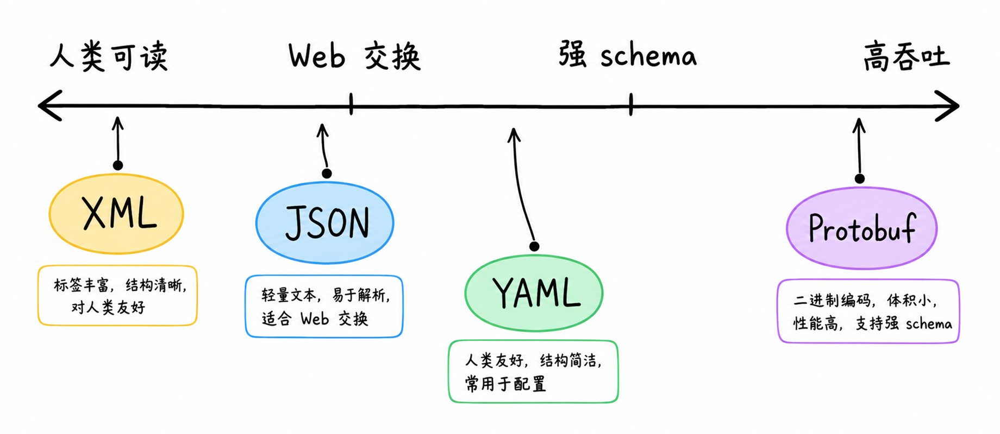

图解：Clean whiteboard continuum-axis infographic, pure white opaque background, black marker axis and fine arrows, pastel yellow, sky blue, mint green and soft purple semantic accents. Output exactly 1840x800, 2.35:1. Draw a large horizontal axis with four accurate endpoint labels “人类可读”, “Web 交换”, “强 schema”, “高吞吐”; place four large named nodes “XML”, “JSON”, “YAML”, “Protobuf” at meaningful distinct positions with short notes. Make it clear this is a constraint map, not a quality ranking. No people, no logos, no dark background, no tiny text, no watermark.

图解：Panoramic final synthesis before the closing card, clean pure white background, black hand-drawn lines, restrained four pastel accents. Output exactly 1840x800, 2.35:1. Place a central node “数据交换” with four non-overlapping paths to “XML”, “JSON”, “YAML”, and “Protobuf”; each path ends at a different context symbol: document, browser API, configuration file, server packet. Add the large exact statement “不是线性淘汰” and a smaller exact statement “按边界共存”. No people, no logos, no dark background, no arbitrary performance numbers, no watermark.

## 选格式先问四件事

谁来读？怎么传？要不要 schema？如何演进？

如果核心是文档结构、命名空间和复杂企业契约，可以优先评估 XML 及其验证生态。如果核心是公网接口、浏览器通信和轻量文本交换，JSON 往往是自然起点，但重要语义要配套 schema 或协议。

如果核心是人来维护的配置，YAML 提供可读性；如果核心是内部 RPC 和稳定 schema，Protobuf 更值得进入候选。最后记住四个问题：谁来读、怎么传、要不要 schema、如何演进，格式选择就会从潮流判断变成工程判断。

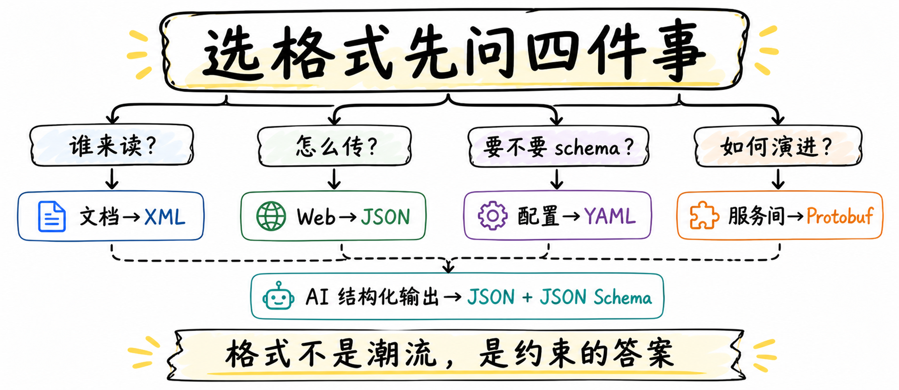

图解：Independent closing whiteboard panorama, clean solid pure white background, black sketchy marker outlines, pastel yellow highlight for the final rule and four restrained semantic accents. Output exactly 1840x800, 2.35:1 ultra-widescreen. Large central title “选格式先问四件事”, arranged as four clean question branches: “谁来读？”, “怎么传？”, “要不要 schema？”, “如何演进？”. Under them place four concise mappings “文档→XML”, “Web→JSON”, “配置→YAML”, “服务间→Protobuf”, plus a smaller optional extension “AI 结构化输出→JSON + JSON Schema”. End with the exact takeaway “格式不是潮流，是约束的答案”. Full, readable panoramic composition, no people, no logos, no dark background, no random text, no watermark, no cropped arrows.

## 小结

把问题拆成目标、约束、证据和验证四部分，通常比直接寻找唯一答案更可靠。先用本文的框架完成一次小范围验证，再根据真实反馈调整下一步。

## 参考资料

以下链接来自原始课程研究笔记；动态信息请以其当前页面为准。

- [English Wikipedia: XML](https://en.wikipedia.org/wiki/XML)
- [English Wikipedia: JSON](https://en.wikipedia.org/wiki/JSON)
- [English Wikipedia: YAML](https://en.wikipedia.org/wiki/YAML)
- [English Wikipedia: Protocol Buffers](https://en.wikipedia.org/wiki/Protocol_Buffers)
- [English Wikipedia: Data exchange](https://en.wikipedia.org/wiki/Data_exchange)
- [W3C XML 1.0 Fifth Edition](https://www.w3.org/TR/xml/)
- [W3C 1998 XML 1.0 Recommendation 公告](https://www.w3.org/Press/1998/XML10-REC)
- [IETF RFC 8259](https://www.rfc-editor.org/info/rfc8259)
- [Ecma-404 JSON 2nd edition](https://ecma-international.org/publications-and-standards/standards/ecma-404/)
- [YAML 1.2.2 Specification](https://yaml.org/spec/1.2.2/)
- [Protocol Buffers Overview](https://protobuf.dev/overview/)
- [Protocol Buffers Programming Guides](https://protobuf.dev/programming-guides/)
- [Protocol Buffers Encoding](https://protobuf.dev/programming-guides/encoding/)
- [W3C SOAP 1.2](https://www.w3.org/TR/soap12/)
- [W3C XML Core / Namespaces](https://www.w3.org/XML/Core/)
- [JSON Schema Specification](https://json-schema.org/specification)
- [YAML 1.2 Specification](https://yaml.org/spec/1.2.0/)
- [Protocol Buffers Editions Overview](https://protobuf.dev/editions/overview/)
