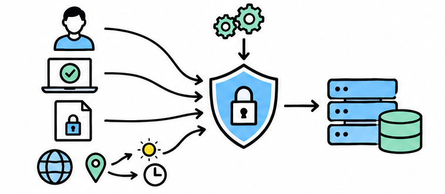
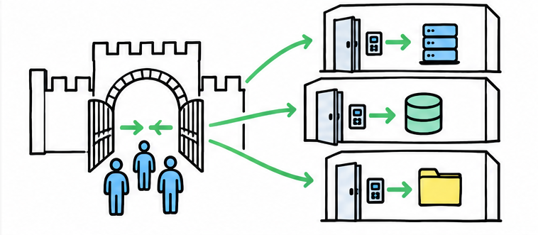
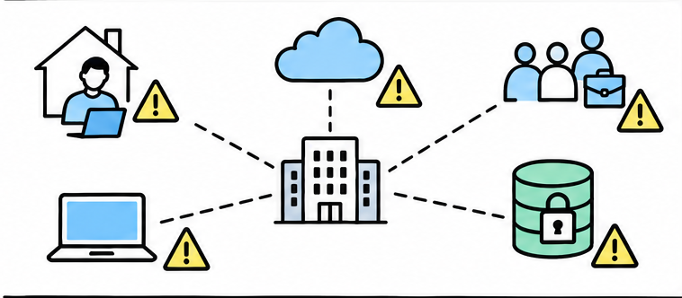
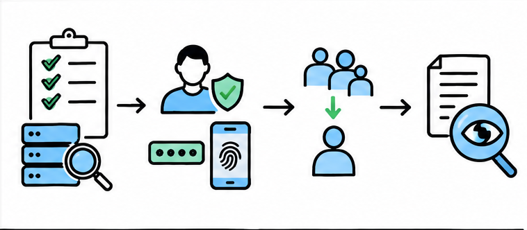
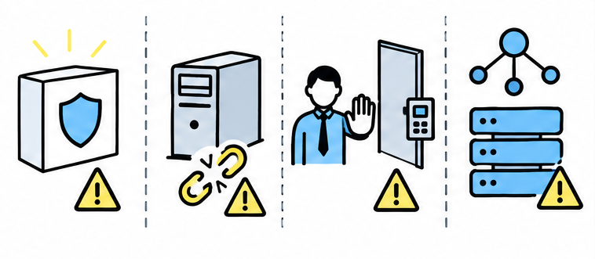
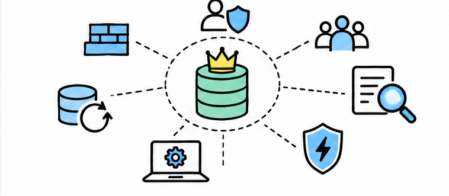

# 零信任架构听起来很玄，普通公司到底有没有必要上？

> 对应短视频主题：零信任架构听起来很玄，普通公司到底有没有必要上？  
> 资料核验与更新：2026-09-12

拆开零信任的真实含义，用访问面、敏感资源和实施成本判断普通公司是否值得做，以及应该从哪里开始。

## 阅读边界

本文依据原始课程的研究笔记、课程结构和发布文案整理。涉及产品、模型、版本、平台规则、价格或资格等可能变化的信息，实践前应以当前官方资料和实际环境为准。
原始研究记录标注的时间为：2026-08-26。
本页配图为依据正文新绘的 AI 辅助教学示意图；它们并非原始课程包内的素材，也不代表原始成片画面。

## 零信任，不是谁都不信

它取消的是网络位置带来的自动信任。

零信任架构，不是默认每个人都有问题，而是不因为账号或设备在公司内网就自动相信。每个访问请求，都要根据明确的身份、设备状态、目标资源和当前环境重新判断。

它把保护中心从一圈网络边界，转向具体的应用、账号和数据。所以零信任是一套架构与运营方法，不是一件买回来就能自动生效的产品。

## 从守大门，到守每个资源

访问决定不再只看你从哪里来。

传统思路像办公楼门禁，进了大门，里面很多房间就默认更容易进入。零信任会把每个重要资源都当成独立房间，访问时分别判断。

最小权限，就是只给完成当前工作所需的最低访问范围和必要时间。身份验证、设备健康、访问策略和日志，共同决定这扇门是否打开。

## 要不要做，别只看公司大小

真正要看的是访问面和一次失陷能影响多远。

普通公司要不要开始，关键不在员工人数，而在访问面和出事后的影响范围。员工经常远程办公，应用大量放在云端，传统的内外网边界已经很模糊。

外包、供应商或个人设备需要接入时，默认信任会让风险扩散得更远。如果少数账号能一次访问大量敏感数据，就更值得优先采用零信任原则。

## 不用推倒重来，先走四步

官方成熟度模型本来就允许分阶段推进。

没有必要一口气重建全部网络，官方成熟度模型本来就支持分阶段推进。第一步是盘点账号、设备、应用和最重要的数据，先知道谁在访问什么。

第二步统一身份登录并启用多因素验证，也就是登录时使用两种以上证明。第三步收紧长期管理员权限，并按业务需要隔开最敏感的系统。

第四步记录访问和设备状态，让异常权限能够被发现并及时撤销。

## 最容易踩的四个坑

安全策略必须同时考虑业务连续性。

最常见的误区，是买了一套安全产品就宣布完成零信任。旧系统如果无法识别现代身份，也不能细分权限，整合成本会明显上升。

新策略一开始可以先记录而不阻断，用小范围试点检查正常业务会不会被误伤。身份平台和策略服务还要有恢复方案，并保留受控、可审计的紧急访问办法。

## 普通公司的务实结论

不追求口号完成度，只降低最真实的风险。

结论是，普通公司未必需要一次建成完整的零信任架构。但只要有云服务、远程访问、第三方接入或敏感数据，就值得开始。

最务实的起点，是先保护最重要的资源，再把身份、最小权限和访问日志逐步铺开。同时别忘了补丁、备份、网络分段和事件响应，因为零信任从来不是全部安全。

## 小结

把问题拆成目标、约束、证据和验证四部分，通常比直接寻找唯一答案更可靠。先用本文的框架完成一次小范围验证，再根据真实反馈调整下一步。

## 参考资料

> 📌 **查阅提示**：点击下方超链接可直接复制对应网址，粘贴至手机或电脑浏览器中即可查阅官方完整技术文档与规范。

- [【维基百科】零信任架构（Zero Trust Architecture）核心哲学](https://en.wikipedia.org/wiki/Zero_trust_architecture)  
  *说明：基于“从不信任，始终验证”原则重构传统基于网络边界的安防模型。*
- [【NIST 官方标准】SP 800-207：零信任网络国家通用标准指南](https://csrc.nist.gov/pubs/sp/800/207/final)  
  *说明：美国国家标准技术研究所系统定义策略决策点（PDP）与策略执行点（PEP）架构。*
- [【CISA 官方模型】零信任成熟度模型 2.0 版（Zero Trust Maturity Model）](https://www.cisa.gov/zero-trust-maturity-model)  
  *说明：美国网络安全局给出的五大支柱（身份、设备、网络、应用、数据）渐进式实施路线图。*
- [【英国 NCSC 权威建议】中小企业零信任实施建议与务实落地指南](https://www.ncsc.gov.uk/collection/zero-trust/demystifying-zero-trust)  
  *说明：英国国家网络安全中心为普通团队提供的非极端、低成本零信任改造落地指南。*
