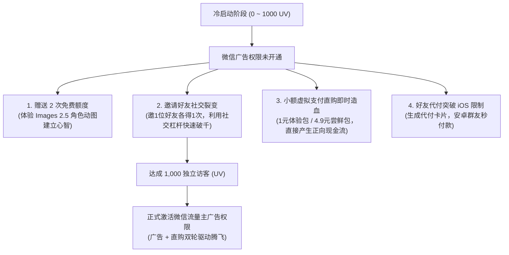

# 商业画布二：AI 动态表情包小程序商业定位与商业闭环设计

作为全栈商业化矩阵中的高频爆款先锋，**AI 动态表情包制作工具** 与前述严肃严谨的“技术文档知识库”形成了极佳的互补生态。知识库重在“高客单价、长尾沉淀、深度信任”，而 AI 表情包则重在“极低使用门槛、极高频社交表达、自发病毒裂变”。

本章采用标准商业模式画布（Business Model Canvas），深度解构基于 **ChatGPT Images 2.5 (gpt-image-2) 角色一致性 16 帧动图引擎** 的商业闭环、价值护城河、成本收益精算模型以及冷启动期破局路径。

---

## 1. 商业模式画布 (Business Model Canvas) 9 大模块精解

```{mermaid}
flowchart TB
    subgraph BMC ["🎯 AI 动态表情包小程序商业模式画布"]
        direction TB
        KP["【8. 重要合作 (Key Partners)】<br>• OpenAI / Codex 设备码 Plus 算力网关 (CLIProxyAPI)<br>• 微信官方流量主广告联盟 (激励视频/Banner)<br>• 动漫/插画 IP 独立画师与自媒体表情博主<br>• 微信虚拟支付 2.0 官方清算结算通道"]
        KA["【7. 关键业务 (Key Activities)】<br>• 16帧动作提示词调优与角色人设对齐<br>• 计算机视觉物理切片、去底与紧凑包络引擎维护<br>• 微信原生小程序端 Canvas 2D 手绘涂鸦板交互调优<br>• 抖音/小红书/公众号短视频种草引流与做同款裂变"]
        KR["【6. 核心资源 (Key Resources)】<br>• 独创 16 帧多尺度主间隙切片与紧凑包络算法 (填充率 96.5%)<br>• ChatGPT Images 2.5 角色一致性 Prompt 资产库<br>• 高可用海外反向代理集群 (CLIProxyAPI)<br>• 微信小程序个人合规暗门配置与审核实战通关经验"]
        VP["【2. 价值主张 (Value Propositions)】<br>⭐ 零绘画门槛：定制专属 16 帧连贯动态表情包 (100ms 黄金微动画)<br>⭐ 随手手绘草图秒变二次元精品动图 (SketchUP / Sketch-to-Image)<br>⭐ 原画级汉字律动，彻底告别僵硬机械贴字<br>⭐ 微信表情包开放平台一键上架规范打包 (<400KB 免压标准)<br>⭐ 微信聊天内即做、即发、即转藏的沉浸式极速体验"]
        CR["【4. 客户关系 (Customer Relationships)】<br>• 每日免费试用配额建立高粘性日常心智<br>• 等待期拟物 tqdm 进度与折叠 Canvas 彩蛋提升好感与留存<br>• 创作者共创微信交流社群与私域沉淀<br>• 专属在线客服通道与反馈直通"]
        CH["【3. 渠道通路 (Channels)】<br>• 微信好友/群聊斗图自然裂变 (核心转化主渠道，K-Factor > 1)<br>• 小程序内'做同款'与'好友代付'裂变闭环<br>• 小红书/抖音图文教程与短视频引流<br>• 微信搜一搜长尾关键词自然搜索排名"]
        CS["【1. 客户细分 (Customer Segments)】<br>① 微信深度社交用户 (日常情侣互动/朋友斗图/追求个性化表达)<br>② 独立画师与表情包创作者 (极大提升制作与上架微信开放平台效率)<br>③ 职场打工人 (幽默自嘲/摸鱼/战术汇报的趣味沟通)<br>④ 萌宠/二次元爱好者 (将爱宠自拍或原创人设立绘转化为专属动图)"]
        COST["【9. 成本结构 (Cost Structure)】<br>• 海外反代与 OpenAI 算力 Token 成本 (约 ¥0.15~0.25/次)<br>• 国内备案云服务器与静态带宽费用 (¥50~100/月)<br>• 域名解析与 SSL 证书维护成本"]
        REV["【5. 收入来源 (Revenue Streams)】<br>💰 流量主广告收益 (激励视频解锁次数，eCPM ¥80~150)<br>💰 虚拟支付道具直购 (AI 生图算力包: 1元体验/4.9元3次/12.9元10次)<br>💰 VIP 会员订阅 (月卡 ¥12 / 年卡 ¥35)<br>💰 微信表情开放平台商业上架素材生成服务 (¥9.9/套)"]
    end
```

---

## 2. 商业画布关键模块深度解构

### 2.1 价值主张 (Value Proposition)：为什么用户离不开我们？
1. **打破“静态切片”与“僵硬贴字”的行业现状**：
   - 市面上 95% 的小程序只是粗暴地将固定模板（熊猫头/蘑菇头）加几行 TTF 字体，年轻人早已审美疲劳；
   - 本项目通过 **ChatGPT Images 2.5 16 帧分镜动画**，提供如同逐帧手绘的原画级流畅动图（飞吻、战斗出击、打工人摸鱼、呆萌比心），文字自然融入画面并随节奏弹性放大；
2. **独创在线草图细化 (Sketch-to-Image / SketchUP)**：
   - 即使不会画画的用户，在手机屏幕上用手指画个火柴人或线条猫咪，AI 也能深度理解构图并渲染成完整二次元萌系动图，极大地满足了用户的创作欲；
3. **微信表情开放平台一键上架套件**：
   - 面向创作者提供符合微信平台官方规范的素材包（单图、750×400 横幅、240×240 封面、50×50 图标），直接打通商业变现副业。

---

### 2.2 客户细分与痛点映射 (Customer Segments)

| 用户群体 | 核心场景与诉求 | 传统解决方案的痛点 | 本项目的价值锚点 |
| :--- | :--- | :--- | :--- |
| **年轻情侣与社交达人** | 表达爱意、撒娇、节日祝福 | 网上表情包千篇一律，没有专属感 | 输入专属爱称或手绘两只小猫，秒成独一无二的告白微动画 |
| **职场打工人** | “收到”、“摸鱼中”、“下班啦”自嘲 | 严肃回复显得生硬，普通表情不够幽默 | 具有戏剧性肢体张力的 16 帧趣味表达，职场情商润滑剂 |
| **萌宠与二次元圈层** | 晒自拍爱宠、原创人设 (OC) | 找画师定制动图费用高（数百元/套）且周期长（数周） | 上传一张爱猫照片或立绘，秒级生成 16 帧 Q 版律动表情 |
| **副业表情包创作者** | 上架微信表情开放平台赚取赞赏 | 手动切图排版、去白底、合成 GIF 耗时长，易产生叠影 | 工业级后处理全自动搞定，填充率 96.5%，微信免压直接导出 |

---

## 3. 成本收益精算模型 (Unit Economics)

独立全栈项目必须实现健康的单体经济学模型（Unit Economics）。以下为每 1,000 次动图生成的财务测算：

### 3.1 显性成本支出
- **AI 算力成本**：
  - 基于 Plus / Codex 反代网关（CLIProxyAPI），单次 4×4 精灵大图生成与图生图编辑综合成本约 **¥0.18 / 次**；
  - 1,000 次制作总算力成本：$1000 \times 0.18 = \mathbf{180 \text{ 元}}$；
- **服务器与存储成本**：
  - 产出 GIF 体积仅 200~380KB，经 Nginx 缓存下发，1,000 次动图产生流量约 300MB，带宽与存储成本不足 **¥5 元**；
- **单千次总成本**：约 **¥185 元**。

### 3.2 复合营收预测
在微信生态内，营收由广告与直购组合驱动：
- **流量主广告收入**：
  - 假设 70% 的用户（700 次）选择观看 15~30 秒激励视频解锁；
  - 微信流量主激励视频平均 eCPM 为 ¥100 / 千次展示；
  - 广告收入：$700 \times 0.10 = \mathbf{70 \text{ 元}}$；
- **虚拟支付直购与会员订阅**：
  - 剩余 30% 的高意愿用户中，有 5%（50 人）选择直接购买算力包（按均单价 ¥6 元测算）；
  - 直购收入：$50 \times 6 = \mathbf{300 \text{ 元}}$；
- **单千次总营收**：$70 + 300 = \mathbf{370 \text{ 元}}$；
- **单千次毛利**：$370 - 185 = \mathbf{185 \text{ 元}}$（**毛利率高达 50%**）！

---

## 4. 冷启动阶段（UV < 1000）商业化破局路径

针对微信小程序上线初期“未满 1000 UV 无法接入流量主广告”的现实困境，商业画布制定了严格的冷启动造血策略：



---

## 5. 多产品商业画布横向协同效应

在整个个人商业矩阵中，“知识库”与“AI表情包”绝非孤立存在，而是形成了闭环的 **“流量-变现-沉淀” 飞轮**：

| 维度 | 知识付费文档站 (`wxapp_sphinx_from_zero`) | AI 动态表情包小程序 (`weixinpy310mememiniapp`) | 协同互补价值 |
| :--- | :--- | :--- | :--- |
| **使用频次** | 低频但刚需（查阅、学习） | 超高频（日常斗图、情侣互动） | 表情包小程序为文档站**源源不断引入巨量新流量** |
| **客单价** | 中高客单价（19.9 ~ 99 元会员） | 超低客单价（1元 ~ 12元/次包） | 阶梯式降低用户的首次付费摩擦力 |
| **用户画像** | 开发者、独立创作者、职场技术人 | 广谱微信聊天用户、二次元、萌宠爱好者 | 沉淀不同维度的微信生态私域资产 |
| **商业背书** | 提供全套源码、架构教程与知识拆解 | 作为实战产品接受市场真实验证 | “自己做的爆款小程序”成为知识库最有说服力的实战案例！ |

---

## 6. 本章小结

清晰的商业画布是技术落地的航标。AI 动态表情包小程序凭借极短的社交转化链路、极具创新性的 Images 2.5 16 帧动图引擎、以及完善的冷启动自造血方案，构成了高爆发力、高自传播力的商业闭环。下一章我们将深入拆解传统表情包标杆小程序的真机数据与技术演进。
