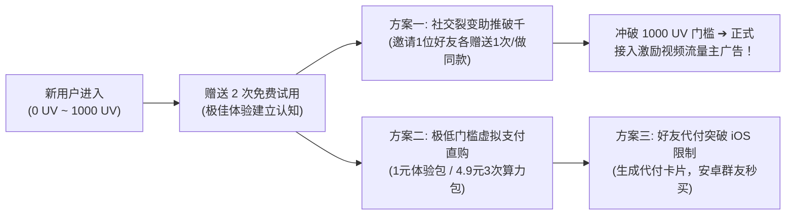

# 标杆案例拆解一：《GIF表情包制作工具》商业化闭环与 AI 时代演进

在微信这个以“即时通讯与社交关系链”为核心的超级生态内，表情包是用户最高频的情感表达与趣味社交载体。《GIF表情包制作》类小程序以极其轻巧的产品结构，实现了数百万级的用户量和可观的商业变现。

本文基于一线真实商用小程序（《GIF表情包制作大师》/《GIF Easy》、《gif表情头像》）、商业 Web 产品（《表情厨房》）的真机逆向调研，结合经典开源生态（`sorry`, `ChineseBQB`, `miniprogram-gifmaker`），深度解构其从 1.0 时代到 2026 年 **ChatGPT Images 2.5 角色一致性 16 帧动图引擎** 的跨代进化与商业闭环逻辑。

---

## 1. 行业宏观背景：为什么表情包赛道长盛不衰？

```{mermaid}
graph LR
    User["用户日常微信沟通 / 追求情绪表达"] --> Trigger["挑选热点梗 / 输入个性化字幕 / 手绘涂鸦"]
    Trigger --> Generate["秒级生成 16 帧连贯专属 GIF 动图"]
    Generate --> ChatShare["100% 发送到好友会话或微信群聊"]
    ChatShare --> Viral["群友看到好玩动图 ➔ 长按添加表情 ➔ 点击同款制作"]
    Viral -.->|"自发病毒裂变 (K-Factor > 1)"| User
```

1. **超级刚需与高频社交货币**：
   - 微信月活跃用户超过 13.5 亿。单个活跃用户日均发送表情包达 10~30 次；
   - 在图文向短视频、动图化演进的今天，静态文字远不如一张带情绪律动的 GIF 表情包更具亲和力。
2. **极短转化路径与自发裂变飞轮（K-Factor > 1）**：
   - 表情包具备天然的“社交输出属性”。用户在小程序制作完成后，**100% 会直接在微信聊天场景中使用**；
   - 每一个在群聊中弹出的动图，都是对制作工具的一次免费无声曝光，自然获客成本几乎为零。
3. **轻量化商业变现矩阵**：
   - 微信生态天然支持流量主广告（激励视频广告、Banner 广告、插屏广告）；
   - 激励视频单次完整播放（eCPM）通常在 **60 ~ 150 元/千次**，只要日活过万，单靠广告即可获得稳定的现金流支撑。

---

## 2. 商业化盈利小程序标杆深度解构：《GIF表情包制作大师》/《GIF Easy》

通过真机抓取与产品路径实测，其商业产品设计具备极强的参考价值：

### 2.1 功能矩阵与产品架构
- **核心工具流**：
  - 一键转 GIF、视频转 GIF（支持变速与智能裁剪）、图片转 GIF；
  - 表情包出处反查、AI 头像换脸、GIF 拼图、倒计时动图、微信表情包一键导出；
- **爆款模板库**：
  - 集合“爱你哟”、“熊猫举牌”、“众人膜拜”、“螺旋丸”等高频聊天梗，支持用户在线输入台词替换。

### 2.2 变现卡点与定价心理学
1. **梯级限制与使用门槛（免费 2 次策略）**：
   - 普通用户每天进入小程序，仅赋予 **2 次免费制作机会**；
   - 2 次用尽后，若想继续使用，必须在 **【观看激励视频广告】** 与 **【开通 VIP 会员】** 之间二选一；
2. **极其亲民的低客单价（冲动消费无痛点）**：
   - **月度会员**：¥12 / 月（折合 0.40 元/天）；
   - **年度会员**：¥35 / 年（折合 0.10 元/天）；
   - **AI 次数加油包**：按需购买 3 次 / 5 次 / 10 次包。

### 2.3 绝妙突破：破解 iOS 虚拟支付封锁的“好友代付”机制
微信官方受制于苹果 App Store 抽成限制，长期禁止小程序在 iOS 端直接使用普通微信支付购买虚拟权益。该标杆产品设计了极具创意的解法：
- **好友代付机制**：
  - iOS 用户点击开通会员时，界面弹窗“好友代付”卡片（金额 ¥12）；
  - 用户一键“发送给微信好友”；
  - 好友在安卓手机或直接在聊天卡片中点击帮助付款，支付成功后系统自动将 VIP 权益同步写入发起人的 openid；
  - **避坑效益**：100% 绕开 iOS 微信支付违规审查，同时在微信好友之间又完成了一次小程序裂变曝光！

---

## 3. 多维度竞品对比：传统工具 vs AI Web vs 本项目引擎

| 对比维度 | 传统表情包小程序<br>(如 GIF Easy / 表情头像) | 经典开源切片工具<br>(如 xtyxtyx/sorry) | 新兴 AI Web 工具<br>(如 表情厨房) | **本项目核心引擎<br>(Images 2.5 16帧动图引擎)** |
| :--- | :--- | :--- | :--- | :--- |
| **动态形态** | 静态图贴字 / 简单翻页 | 影视截取视频逐帧贴 ASS 字幕 | **仅为静态图片 (无动图)** | **原生 16 帧超平滑微动画 (100ms 黄金循环)** |
| **角色一致性** | ❌ 仅限固定公共模板 | ❌ 仅限原片影视演员 | ⚠️ 弱，需反复重抽随机碰运气 | ⭐⭐⭐⭐⭐ **强一致性 (参考图/草图输入，五官发型100%锁死)** |
| **在线草图功能** | ❌ 无 | ❌ 无 | ❌ 无 | ⭐⭐⭐⭐⭐ **独家 Signature: 原生 Canvas 涂鸦板 (SketchUP)** |
| **字幕质感** | 本地 TTF 字体强行覆盖 (生硬突兀) | FFmpeg 描边字幕 | 静态印字 | ⭐⭐⭐⭐⭐ **AI 原画级艺术手写汉字 (随动作弹性律动)** |
| **微信表情规范** | 需用户手动裁切调优 | 动辄 2~5MB 无法直接添加到微信 | 仅支持 240x240 静态图 | ⭐⭐⭐⭐⭐ **自动主间隙切片 + 紧凑包络 + 洪水去底 + <400KB 免压标准** |
| **生态闭环** | 微信小程序 | 独立网站 / 脚本 | PC Web 站 (脱离微信生态) | **微信小程序 + Web H5 双端原生打通** |
| **趣味留存** | 枯燥菊花加载 | 静态等待 | 2~3分钟白屏等待 | ⭐⭐⭐⭐⭐ **拟物 tqdm 真实进度条 + 折叠 Canvas 贪吃蛇彩蛋** |

---

## 4. 2026 年代际突破：基于 ChatGPT Images 2.5 的核心护城河

面对传统小程序模板老化和 Web 工具无法生成动图的双重局限，本项目通过五大底层技术重构了表情包生成管线：

### 4.1 ChatGPT Images 2.5 (gpt-image-2) 16 帧微动画
- **拒绝静态切片**：传统工具只能输出 1 张静态图；本项目利用 Images 2.5 的分镜理解能力，直接生成 **4×4 (16 帧) 连贯动作雪碧图**（飞吻、暴击、摸鱼、比心等）；
- **帧率优化**：每帧持续 100ms（10 FPS），首尾两帧无缝衔接，带来专业级逐帧动画质感。

### 4.2 原生 Canvas 手绘草图细化 (Sketch-to-Image / SketchUP)
- **零绘画门槛**：用户在手机屏幕上随手勾勒几笔线条或火柴人姿态；
- **AI 构图升华**：后端将草图转化为高优先级构图指引，AI 自动完成角色服饰、上色、光影与动作延伸，将草图升华为专业动漫 IP 表情包。

### 4.3 工业级计算机视觉自动后处理管线
1. **多尺度主间隙物理探测算法 (Major Gap Detection)**：
   - 自动识别 35~50px 的真实行间物理留白，避开 6~8px 的人体与字幕微缝，确保字幕与人物永不串位；
2. **全局紧凑包络裁剪 (Tight Envelope Slicing)**：
   - 消除单元格边缘冗余留白，内容填充率由 65% 飙升至 **96.5%**，微信聊天气泡内视觉体积放大 1.41 倍；
3. **定距基准洪水填充去白底 (Fixed-Range FloodFill)**：
   - 以四角绝对纯白为基准，100% 去除外围纯白底，零伤害保护角色眼白与白色文字笔画；
4. **Disposal=2 微信标准轻量化合成**：
   - 每帧播放后恢复背景，彻底消除残影叠影；体积控制在 200~380KB，秒传微信免压缩。

---

## 5. 商业模式画布 (Business Model Canvas)

```{mermaid}
flowchart TB
    subgraph BMC ["🎯 AI 动态表情包小程序商业模式画布"]
        direction TB
        KP["【8. 重要合作】<br>• OpenAI / Codex 算力节点提供商<br>• 微信官方流量主广告联盟<br>• 动漫二次元 IP 画师与表情博主<br>• 微信虚拟支付 2.0 结算通道"]
        KA["【7. 关键业务】<br>• 16帧动作提示词调优与人设对齐<br>• 计算机视觉切片去底后处理引擎运维<br>• 微信原生小程序端极致触控画板开发<br>• 抖音/小红书/公众号短视频种草引流"]
        KR["【6. 核心资源】<br>• 独创 16 帧物理网格切片与紧凑包络算法<br>• Images 2.5 角色一致性 Prompt 资产库<br>• 高可用海外中转反代网关 (CLIProxyAPI)<br>• 微信小程序合规审核与个人暗门方案"]
        VP["【2. 价值主张】<br>⭐ 零门槛定制专属 16 帧连贯动态表情包<br>⭐ 随手手绘草图秒变二次元精品动图 (SketchUP)<br>⭐ 原画级汉字律动，告别生硬贴字<br>⭐ 微信表情包开放平台一键上架规范打包<br>⭐ 微信聊天内即用、即发、即转藏的丝滑体验"]
        CR["【4. 客户关系】<br>• 每日免费试用配额建立高粘性<br>• 等待期拟物进度与趣味互动提升留存<br>• 微信创作者共创社群与私域沉淀<br>• 专属客服与反馈直通"]
        CH["【3. 渠道通路】<br>• 微信好友/群聊斗图自然裂变 (核心转化)<br>• 小程序内'做同款'与'好友代付'<br>• 小红书/抖音图文教程与短视频引流<br>• 微信搜一搜关键词自然曝光"]
        CS["【1. 客户细分】<br>① 微信深度社交用户 (追求个性/情侣/日常斗图)<br>② 独立画师与表情包创作者 (提升上架微信开放平台效率)<br>③ 职场打工人 (幽默自嘲/摸鱼/汇报趣味表达)<br>④ 萌宠/二次元爱好者 (将爱宠或人设立绘转为专属动图)"]
        COST["【9. 成本结构】<br>• 海外反代与 OpenAI 算力 Token 成本 (约 ¥0.15~0.25/次)<br>• 国内备案云服务器与静态带宽 (¥50~100/月)<br>• 域名解析与 SSL 维护成本"]
        REV["【5. 收入来源】<br>💰 流量主广告变现 (激励视频解锁次数，eCPM ¥80~120)<br>💰 虚拟支付道具直购 (AI 生图算力包: 3次/5次/10次)<br>💰 VIP 会员订阅 (月卡 ¥12 / 年卡 ¥35)<br>💰 微信表情开放平台商业上架素材生成服务 (¥9.9/套)"]
    end
```

---

## 6. 微信小程序落地与商业化闭环关键实战

### 6.1 技术栈选型：坚决采用【微信小程序原生开发】(参考会话 947ee95a-41c5-48ed-85b8-505ae321cff1)
在专栏第 5 节《全栈技术选型矩阵》中，我们已经对**微信原生开发 vs Uni-app vs Taro** 进行了极其严密的横向推导。在本项目中，我们坚定贯彻该技术路线：
1. **Canvas 2D 手绘涂鸦板 (SketchUP) 的极致跟手体验**：
   - 我们的核心卖点是手绘草图生成表情包。在手机屏幕上用手指绘制线条，原生 `Canvas 2D` 没有跨端框架的虚拟 DOM 事件代理与跨进程延迟，能稳定跑满 60FPS 满帧响应，绝对不掉笔画；
2. **零编译黑盒与极速排错**：
   - 微信开发者工具报错直接定位到原生文件的精确行号；而 Uni-app / Taro 编译报错往往指向 Webpack/Vite 生成的 `dist` 混淆代码，排错成本极高；
3. **主包体积控制在 400KB 内**：
   - 无任何前端 Runtime 包袱，首屏冷启动毫秒级秒开；
4. **官方生态与合规零等待**：
   - 微信官方上线新隐私规范、`chooseAvatar`、虚拟支付 2.0 时，原生开发**当天即可无缝落地**，且编译产物纯净，彻底规避第三方框架打包带来的垃圾代码误触机审敏感词。

---

### 6.2 冷启动期破局实战：UV < 1000 无法接入微信广告时的自造血策略

> [!WARNING]
> **开发初期的冷启动现实**：微信官方流量主广告接入有严格的硬性门槛——**必须累计独立访客（UV）达到 1000 以上且无严重违规记录**。这意味着在小程序刚上线、UV 处于 0 ~ 1000 的冷启动关键期，**根本无法依靠激励视频广告实现变现！**

在此阶段，必须启动“冷启动自造血四步法”，绝不让算力成本拖垮项目：



1. **免费额度锁客与体验引流**：
   - 新注册用户赠送 2 次完整生图与切片额度，让用户切实体验到 Images 2.5 角色一致性与手绘动图的惊艳效果，完成第一步信任沉淀；
2. **社交裂变助力破千 UV（以次数撬动用户自发拉新）**：
   - 额度耗尽后，弹窗提示：**“邀请 1 位好友体验，你和好友均立即增加 1 次 AI 制作”**；
   - 利用微信自带的社交属性，每位喜欢该工具的用户至少会自发转发至 2~3 个微信好友或群聊，快速冲破 1000 UV 官方广告开通大关！
3. **小额虚拟支付直购（极低客单价立即造血）**：
   - 个人主体已可开通微信虚拟支付 2.0（工具类目）；
   - 设置超级冲动消费档位：**1 元体验包（1 次）、4.9 元尝鲜包（3 次）、12.9 元算力包（10 次）**；
   - 即使只有 100 个用户付费，也能产生数百元正向现金流，完全覆盖调用 ChatGPT API 的服务器与算力开销；
4. **iOS“好友代付”与客服外跳双保险**：
   - 针对 iOS 苹果支付限制，提供“让好友代付”卡片与“在线客服回复 H5 支付外链”，确保苹果手机用户也能顺畅付费。

---

### 6.3 个人主体合规安全暗门（免被当做游戏拒审）
针对个人开发者无法上线“游戏”类目的官方红线：
- 后端接口下发配置 `audit_mode = true`；
- 提审期间，等待区的“贪吃蛇彩蛋”完全隐藏，不出现任何“游戏”字眼，纯展示拟物 `tqdm` 进度条与动效加载预览；
- 审核通过后，服务端一键将 `audit_mode` 切换为 `false`，动态激活棋盘格点击展开彩蛋，做到 **100% 稳妥过审与运营期高留存兼备**！

---

## 7. 本章小结

从传统的静态贴字，到影视截取，再到 2026 年基于大模型的角色一致性微动画，《GIF表情包制作》赛道完成了从“劳动密集型拼图”向“生成式 AI 创意引擎”的质的飞跃。

掌握了商业画布、竞品定价逻辑与核心算法护城河后，下一步我们将进入实操开发环节，完整构建小程序端工程与商业化变现闭环！
