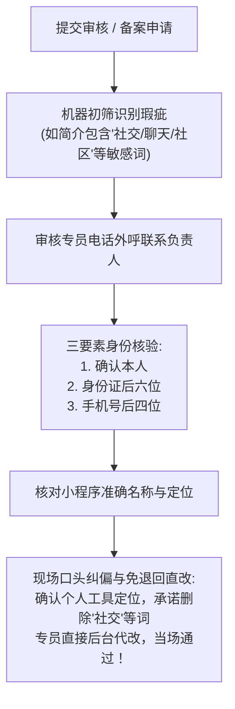

# 小程序账号注册、类目选型与工信部 ICP 备案

开发微信小程序的第一步，是在微信公众平台（`mp.weixin.qq.com`）拥有合法的“小程序身份证”。2023 年 9 月起，工信部全面落实“小程序必须完成 ICP 备案方可上架”的强制性规定。本章手把手带你完成账号注册与备案全流程。

---

## 1. 账号注册与主体选型（避坑首则）

在访问微信公众平台点击“立即注册”选择“小程序”时，第一个面临的抉择是**主体类型**：

| 主体类型 | 认证费用 | 微信支付/虚拟支付能力 | 核心优劣势分析 |
| :--- | :--- | :--- | :--- |
| **个人主体** | 免费（身份证核验） | ❌ **无法开通微信官方支付**（仅能通过纯积分、代币或赞赏） | 门槛最低，适合纯工具、纯技术展示或免费知识库。无法开展商业化支付交易。 |
| **个体工商户** | 30元/次（年审认证） | ✅ **完全支持微信支付与虚拟支付** | 办理简单（很多地区支持网上免费办理个体户执照），具有企业级接口权限，是**独立开发者兼职副业的首选**。 |
| **企业主体** | 300元/次（年审认证） | ✅ **具备全量接口与高级能力** | 权限最完整，支持绑定公众号、开放平台及企业微信，适合正规公司运营。 |

> **关键建议**：如果你未来打算开展专栏付费或虚拟资产变现，强烈建议办理一张“个体工商户营业执照”（经营范围包含：信息技术咨询服务、软件开发、互联网销售等），以免后期个人主体无法接入支付导致推倒重来。

---

## 2. 服务类目选型（避免触发前置审批）

在【设置】➔【基本设置】➔【服务类目】中，类目的选择直接决定了小程序的“生死”：

```{mermaid}
graph TD
    Category[选择服务类目] --> Safe[安全免审类目: 工具/教育/IT科技]
    Category --> Danger[高危前置审批类目: 知识付费/出版物/社交/论坛]
    Safe --> Pass[无需额外证件 极速过审]
    Danger --> Reject[强制要求 ICP证/出版物许可证/EDI证]
```

### 2.1 推荐选用的安全类目（即选即用）
- **IT科技 > 软件与信息技术服务**
- **工具 > 效率 / 信息查询**
- **教育 > 在线教育（部分免审） / 语言培训**

### 2.2 绝对不能碰的雷区类目
- ❌ **文娱 > 视频 / 资讯**（要求《信息网络传播视听节目许可证》）；
- ❌ **社交 > 社区 / 论坛**（要求电信增值业务许可证与网安备案）；
- ❌ **阅读 / 电子书**（强制要求《出版物经营许可证》）。

---

## 3. 小程序工信部 ICP 备案全流程（保姆级实操）

根据反电信网络诈骗法及工信部要求，未备案的小程序不得在微信内提供服务。

### 3.1 备案材料准备清单
1. **主办者身份证件**：身份证正反面彩色扫描件或高清拍摄；
2. **营业执照**（非个人主体）：最新版企业/个体工商户执照正本或副本彩色高清图；
3. **真实性核验单**：在备案过程中系统自动生成，打印签字后回传扫描件；
4. **负责人人脸核验**：通过微信小程序端人脸核验识别真人身份；
5. **前置审批文件**（若涉及特定行业，通用 IT 工具类无需提供）。

### 3.2 备案全流程四步法

```text
步骤1: 填写主体信息 ➔ 步骤2: 填写小程序信息 ➔ 步骤3: 平台初审 (1-2工作日) ➔ 步骤4: 工信部短信核验 ➔ 审核通过出号
```

1. **进入备案入口**：登录微信公众平台后台，首页顶部会有醒目的“去备案”横幅；
2. **录入小程序信息**：
   - **小程序名称**：必须与服务内容强相关，不得使用过于宽泛的行业词（如“知识库”、“编程学习”会被拒，应使用“数创库知识库”等带独特品牌词的命名）；
   - **小程序简介**：规范填报，例如：“提供计算机软件开发与技术图解类文档的查阅与学习工具”；
   - **服务内容标签**：勾选与前述服务类目相吻合的标签。
3. **腾讯平台初审**：腾讯官方团队会在 1~2 个工作日内完成合规性初审，若有不规范之处会电话或后台留言指引修改；
4. **工信部 12381 短信核验（最关键！）**：
   - 腾讯初审通过后，工信部系统会向负责人填写的手机号发送带有核验码的短信（发送方为 `12381`）；
5. **通信管理局终审**：省管局会在 3~15 个工作日内完成审核并下发备案号，备案号将自动同步并悬挂在小程序的设置与更多信息中。

### 3.3 审核人员外呼电话实战应对避坑（核心秘籍）

如果在提交资料或小程序简介、名称存在瑕疵（例如**简介中不慎包含了“社交”、“聊天”、“交友”、“社区”等个人主体严禁触碰的字眼**），腾讯官方审核团队或管局审核人员会主动拨打负责人的预留手机号进行外呼核验。



#### 1. 审核电话接听标准话术与要素核验
当接到审核人员电话时，保持从容专业，审核人员会依次核对以下关键安全要素：
1. **本人身份确认**：
   - 审核员：“请问您是 xxx 吗？”
   - **标准回答**：“**你好，是我本人。**”
2. **核心身份与安全验证**：
   - **身份证后六位**：必须能够脱口而出（例如：`* * * * * * 1 2 3 4 5 X`）；
   - **手机号后四位**：核验注册时填写的联系电话后四位（例如：`* * * * 8 8 8 8`）；
3. **小程序准确全称**：
   - 准确报出申请的小程序名称（如：“表情包制作大师”或“数创库技术知识库”）；
4. **功能定位与文案口径（个人主体绝对禁区：社交）**：
   - 审核员通常会指出：“你的简介里写了‘聊天表情包’或‘社交互动’，**个人小程序介绍不能出现‘社交’等相关内容**。”
   - **标准回答**：“好的老师，明白！**我们是纯粹的个人自用图像编辑与辅助工具，没有任何社交、聊天或社区功能**。您可以帮我把‘社交’两个字去掉，改成‘提供个人图片处理与动图效果制作工具’。”

#### 2. “当场直改免打回”的黄金技巧
- **千万不要与审核员争辩**：“我们这个做表情包发到微信聊天里，为什么不算社交？”此类争论会导致审核员直接以“服务内容涉及社交类目”驳回；
- **小问题现场代改**：腾讯审核员的权限很高，对于简介描述、标签微调等文字小问题，**只要在电话中口头确认授权修改，专员可以直接在管理后台帮你一键修改并当场通过**！省去驳回后重新填表、重新排队 2~3 天的巨大时间成本。

---

## 4. 本章小结

账号注册与 ICP 备案是搭建微信生态商业资产的“准生证”。选对主体与类目，能为你节省数周乃至数月的前置审批纠缠。牢记审核电话的核验要素（本人、身份证后六位、手机后四位、小程序名称）与“个人绝不沾社交”的定位准则，即使遇到审核瑕疵也能当场顺畅过关。完成备案后，我们即可进入后台获取核心凭证并配置安全网络通道。

