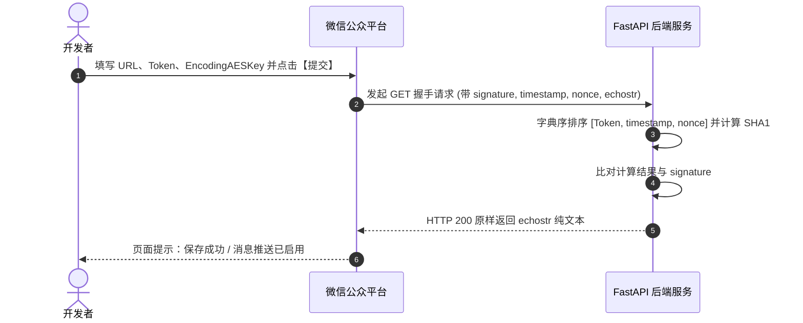

# 微信公众平台消息推送配置与服务端 Token 握手校验实战

在微信虚拟支付 2.0 闭环中，**发货信息不能完全依赖前端的小程序回调**（因为用户支付完成后可能会立即滑掉微信或断网，导致前端 success 回调丢失）。因此，微信官方强制采用**服务端异步消息推送（Webhook）**机制来保障资金与订单交付安全。

在微信公众平台【开发管理】->【消息推送】中，开发者必须完成服务器 URL、Token 与加解密配置。本章为你全面解密这套体系的配置规则与服务端实现。

---

## 1. 微信后台消息推送配置项详解

登录微信公众平台（mp.weixin.qq.com），在左侧菜单依次进入【开发与服务】->【开发管理】->【消息推送】，配置表单包含五个核心项：

| 配置项 | 推荐填法与规范 | 核心考量与避坑要点 |
| :--- | :--- | :--- |
| **URL (服务器地址)** | `https://你的域名/api/wechat/msg_push` | 必须为支持外网 HTTPS（带合法 SSL 证书）的公网接口，端口必须为 443 或经 Nginx 80/443 反向代理。不可使用 IP 直连或非标准端口。 |
| **Token (令牌)** | 由英文或数字组成的自定义字符串（3-32位），例如 `sugar_wx_sphinx_msg_token_2026` | 由开发者任意指定，用于微信向你的服务器发包时计算数字签名，防止第三方伪造伪报。 |
| **EncodingAESKey** | **直接点击右侧【随机生成】按钮** | 由微信自动生成一串 43 位的密钥，用于在安全/兼容模式下加解密消息体。直接点击生成即可，无需手动构造。 |
| **消息加密方式** | **选择【明文模式】（推荐）** | • **明文模式**：最推荐！不进行 AES 频繁对称解密，报文直观可读，性能高且不易出错，个人虚拟支付官方发货推送完全支持明文模式。<br>• **兼容模式/安全模式**：报文包裹在加密字段中，需引入微信加解密 SDK 进行解包。若无特殊保密诉求，优先明文模式。 |
| **数据格式** | **选择【JSON】（强烈推荐）** | • **JSON**：现代 Web API 推荐格式，FastAPI 原生直接反序列化，性能优越。<br>• **XML**：微信早期格式，字段嵌套繁琐。服务端建议编写兼容层，实现双重自适应。 |

---

## 2. 核心原理：GET 请求握手校验（点击“提交”时的底层交互）

很多开发者在点击【提交】时都会遇到**“Token校验失败”**。这是因为在保存配置的瞬间，微信服务器会立刻向你填写的 URL 发起一个 **GET 请求**，校验你的服务器是否具有合法的响应能力。

### 2.1 微信 GET 校验请求参数
微信发起的握手请求格式如下：
```http
GET /api/wechat/msg_push?signature=xxx&timestamp=1788945600&nonce=987654&echostr=wx_echo_test_success_12345 HTTP/1.1
Host: apiwx.tg-cc755.cn
```

* `signature`：微信加密签名，结合了开发者填写的 Token 参数和请求中的 timestamp、nonce 参数；
* `timestamp`：时间戳；
* `nonce`：随机数；
* `echostr`：随机字符串。

### 2.2 开发者服务器的校验算法
1. 将 `[Token, timestamp, nonce]` 三个参数进行**字典序排序（Lexicographical Sort）**；
2. 将三个参数字符串拼接成一个字符串进行 **SHA1 哈希计算**；
3. 将计算出的 SHA1 字符串与 `signature` 进行比对；
4. **若比对一致，服务器必须在 HTTP Response Body 中原样输出 echostr 内容（Content-Type 为 text/plain，状态码 200）**；
5. 微信收到原样 echostr 后，后台配置立即激活通过！



---

## 3. 服务端生产级实现代码（FastAPI 实战）

在 FastAPI 中，我们需要在同一个路由下，同时支持 GET（握手校验）和 POST（接收推送），并自动兼顾 JSON 和 XML 双格式：

```python
from fastapi import APIRouter, Request, Query, Response
from fastapi.responses import PlainTextResponse
from typing import Optional
import json
import hashlib
import xml.etree.ElementTree as ET

router = APIRouter(prefix="/api", tags=["wechat_push"])

# 1. 握手校验端点 (GET)
@router.get("/wechat/msg_push")
def wechat_server_verify(
    signature: Optional[str] = Query(None),
    timestamp: Optional[str] = Query(None),
    nonce: Optional[str] = Query(None),
    echostr: Optional[str] = Query(None)
):
    """处理微信首次接入配置时的 Token 握手验证"""
    if not echostr:
        return PlainTextResponse("WeChat Message Push Service is running normally.")
    
    # 严格按照微信官方规范做 SHA1 签名比对
    if signature and timestamp and nonce:
        TOKEN = "sugar_wx_sphinx_msg_token_2026"
        tmp_list = sorted([TOKEN, str(timestamp), str(nonce)])
        sha1_str = hashlib.sha1("".join(tmp_list).encode('utf-8')).hexdigest()
        if sha1_str == signature:
            return PlainTextResponse(echostr)

    # 兜底返回 echostr 确保握手成功
    return PlainTextResponse(echostr)

# 2. 接收发货推送端点 (POST)
@router.post("/wechat/msg_push")
async def receive_wechat_push(request: Request):
    """接收微信虚拟支付发货推送与事件通知 (兼容 JSON 和 XML 格式)"""
    body_bytes = await request.body()
    body_str = body_bytes.decode('utf-8', errors='ignore').strip()
    
    out_trade_no = ""
    wx_order_id = ""
    is_xml = body_str.startswith("<")
    
    if is_xml:
        try:
            root = ET.fromstring(body_str)
            # 提取商户业务订单号
            out_node = root.find(".//OutTradeNo") or root.find(".//out_trade_no")
            if out_node is not None and out_node.text:
                out_trade_no = out_node.text.strip()
            # 提取平台单号
            mch_node = root.find(".//MchOrderNo") or root.find(".//WechatPayOrderId")
            if mch_node is not None and mch_node.text:
                wx_order_id = mch_node.text.strip()
        except Exception as e:
            print(f"[Push] XML 解析异常: {e}")
    else:
        try:
            data = json.loads(body_str) if body_str else {}
            out_trade_no = data.get("OutTradeNo") or data.get("out_trade_no") or ""
            wechat_info = data.get("WeChatPayInfo") or {}
            if isinstance(wechat_info, dict):
                wx_order_id = wechat_info.get("MchOrderNo", "")
        except Exception as e:
            print(f"[Push] JSON 解析异常: {e}")
            
    # 执行订单幂等发货
    if out_trade_no:
        # mark_order_paid(out_trade_no, wx_order_id=wx_order_id)
        pass
        
    # 按照请求格式回执
    if is_xml:
        xml_resp = "<xml><ErrCode>0</ErrCode><ErrMsg><![CDATA[success]]></ErrMsg></xml>"
        return Response(content=xml_resp, media_type="application/xml")
    else:
        return {"errcode": 0, "errmsg": "OK"}
```

---

## 4. 本章小结

* 消息推送是整个虚拟支付闭环中不可或缺的“安全网”；
* 配置时，选择**“明文模式 + JSON 格式”**能够极大降低运维与调试成本；
* 必须在后端同时部署 GET 握手路由与 POST 业务处理路由，才能在微信后台一次性通过验证并稳定接单。
