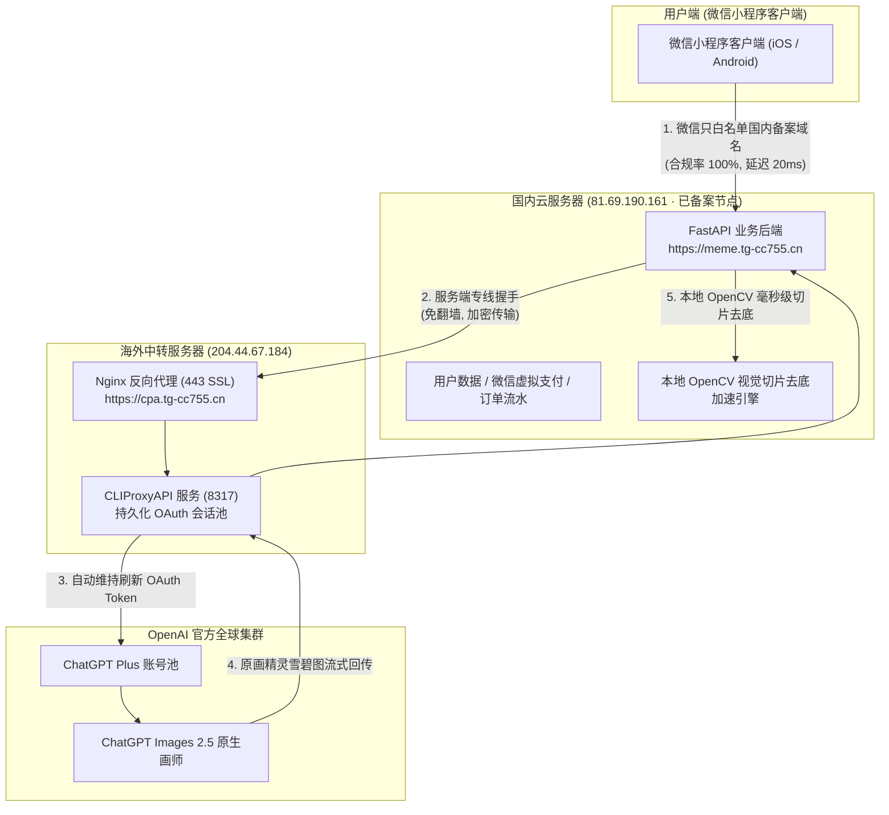
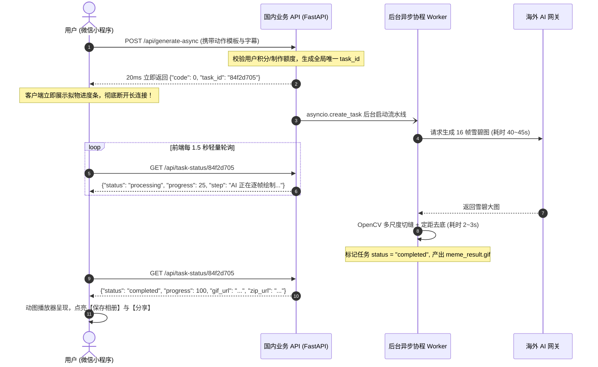
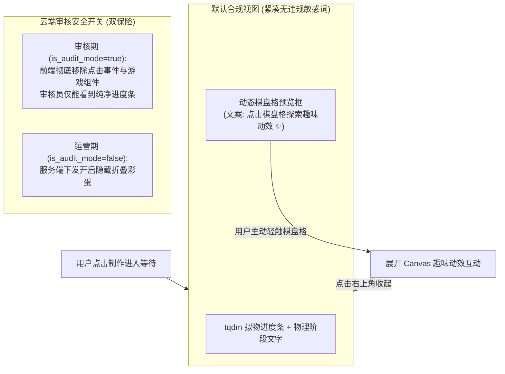

# 第 5 节：高耗时 AI 生图防断连架构：国内合规双机网络拓扑、异步任务轮询与拟物 tqdm 进度条实战

在将大模型生图能力（如 ChatGPT Images 2.5、Midjourney、Stable Diffusion）集成到微信小程序的过程中，开发者最容易遭遇的系统级瓶颈并非算力不足，而是 **“微信移动端网络长连接脆弱性” 与 “AI 复杂绘制高耗时（30~60 秒）” 之间的剧烈冲突**。

同时，微信公众平台要求小程序的所有通信域名必须在工信部完成**ICP 备案**，而主流 AI 大模型节点均部署在海外。如何在保证 100% 微信合规的前提下，构建一套抗网络抖动、永不断连、体验丝滑且过审无忧的高可用生产级系统？

本章将复盘在 `weixinpy310mememiniapp` 中落地的双机拓扑、异步任务队列与合规折叠彩蛋设计。

---

## 一、生产事故：长连接超时与“Unexpected end of JSON input”

### 1. 案发现场与报错特征
在早期开发版本中，前端采用简单的同步阻塞式请求：
```javascript
// ❌ 早期危险的同步阻塞长连接
const res = await wx.request({
  url: 'https://meme.tg-cc755.cn/api/generate-and-process',
  method: 'POST',
  data: { template_id: 'kiss', caption: '爱你哟' }
});
```
在真机或开发环境调试时，常常在等待 45~50 秒左右突然弹窗报错：
```text
网络请求异常: Failed to execute 'json' on 'Response': Unexpected end of JSON input
```
或者小程序端直接抛出：
```text
request:fail timeout / request:fail connection reset by peer
```

### 2. 后端排查：后端分明 100% 成功了！
调取服务器后台日志排查，却发现了极其诡异的反转现象：
1. **后端完整执行成功**：
   - 图像模型生成耗时 **47.5 秒**；
   - OpenCV 缝隙探测、切片与 GIF 封装耗时 **3.5 秒**；
   - 总耗时 **51 秒**，最终产物 `meme_result.gif` (436 KB) 完好无损地存储在磁盘上；
2. **为什么前端却报错崩溃？**
   - **移动代理与网关的静默超时（Idle Timeout）**：用户手机访问服务端经过了移动 4G/5G 基站、运营商 NAT 网关或中间代理。为了防止大量死链接消耗服务器资源，中间网络设备普遍对“**超过 45~50 秒没有数据流交互的 HTTP 请求**”设置了强制单方面切断（发送 TCP RST 包）；
   - 当后端在第 51 秒满心欢喜下发 `200 OK` 时，TCP 管道早已被中途腰斩；前端接收到的是已断开连接的 **0 字节空响应体**；
   - JavaScript 对空字符串执行 `JSON.parse("")`，必然抛出经典的 `Unexpected end of JSON input`！

---

## 二、双机分工拓扑：国内合规备案机 + 海外中转算力网关

根据微信官方《小程序平台运营规范》，小程序的 `request`、`uploadFile`、`downloadFile` 合法域名**必须通过国内工信部 ICP 备案**，严禁直连未经备案的境外服务器 IP 或域名。

为此，我们设计了一套**双机分工合规拓扑**：



### 核心架构优势
1. **微信审核合规 100%**：小程序公众平台后台仅登记 `https://meme.tg-cc755.cn`。审核员抓包检测时，全部流量均在国内节点，无任何违规境外直连行为；
2. **极速国内 CDN 体验**：所有的静态资源、动图直链下载、界面交互响应走国内优质 BGP 线路，首屏加载在 20ms~50ms 内完成；
3. **Codex Device Code 与 Antigravity 无头免端口授权**：
   - 在海外服务器上使用 CLIProxyAPI 的设备码免桌面登录模式（`-codex-device-login`），8 位码一键绑定 ChatGPT Plus；
   - 深度集成 Google Antigravity（`-antigravity-login`），支持 **Claude 4.6 (Thinking)** 与 **Gemini 3 系列** 顶级推理模型；
   - **免 SSH 端口隧道妙招**：本地浏览器完成 OAuth 后，只需将跳转地址栏的 `http://localhost:51121/oauth-callback?code=...` 复制并在服务器直接请求容器 IP（`172.20.0.2:51121`），即可实现 0 端口转发、0 网络隧道的秒级授权与双集群自动负载均衡！

---

## 三、工业级异步任务队列 + 轻量轮询方案

为了彻底消灭长连接超时，我们将原本同步阻塞的接口重构为 **“20ms 任务即时创建 + 毫秒级轻量状态轮询”** 架构：



### 1. 服务端 FastAPI 核心实现
```python
# 内存任务字典（单机环境或配合 Redis）
tasks_store: dict[str, dict] = {}

@app.post("/api/generate-async")
async def generate_async(req: GenerateRequest, user=Depends(get_current_user)):
    # 1. 扣减或冻结用户制作次数
    await check_and_deduct_quota(user["user_id"])

    # 2. 生成任务 ID 并初始化状态
    task_id = uuid.uuid4().hex[:8]
    tasks_store[task_id] = {
        "status": "processing",
        "progress": 10,
        "step_desc": "正在拼装角色人设与动态字幕 Prompt...",
        "created_at": time.time(),
        "result": None,
        "error": None
    }

    # 3. 启动后台非阻塞任务
    asyncio.create_task(run_pipeline_background(task_id, req))

    # 4. 20ms 内极速返回！
    return {"code": 0, "message": "Task queued successfully", "data": {"task_id": task_id}}

@app.get("/api/task-status/{task_id}")
async def get_task_status(task_id: str):
    task = tasks_store.get(task_id)
    if not task:
        return {"code": 404, "message": "Task not found"}
    return {"code": 0, "data": task}
```

### 2. 前端轻量轮询驱动器
```javascript
// 小程序端轮询逻辑 (轻量、低消耗、防抖)
async pollTaskStatus(taskId) {
  const timer = setInterval(async () => {
    try {
      const res = await request({ url: `/api/task-status/${taskId}` });
      const { status, progress, step_desc, result } = res.data;

      this.setData({ progressPercent: progress, currentStepText: step_desc });

      if (status === 'completed') {
        clearInterval(timer);
        this.setData({
          isGenerating: false,
          resultGifUrl: result.gif_url,
          resultZipUrl: result.zip_url
        });
        wx.showToast({ title: '动图生成完毕！', icon: 'success' });
      } else if (status === 'failed') {
        clearInterval(timer);
        this.setData({ isGenerating: false });
        wx.showModal({ title: '制作遇到问题', content: res.data.error || '请稍后重试', showCancel: false });
      }
    } catch (err) {
      // 网络偶发抖动不中断轮询，下次定时器自动重试
      console.warn('轮询探测微弱抖动:', err);
    }
  }, 1500); // 1.5 秒频率最适中，单次请求体积 < 300 字节
}
```

---

## 四、前端拟物 `tqdm` 动态进度条实现

由于 AI 生图总耗时在 35~50 秒之间，如果仅显示死板的原生 Loading 菊花，用户极易误以为“程序卡死死机”而中途强行退出，造成流量和算力的大量浪费。

我们在前端实现了类似 Linux Python CLI 的 **`tqdm` 风格动态拟物进度条**：

```text
[██████████████░░░░░░░░░░] 65% | 耗时: 18s / 预计 32s | 阶段 2/4: AI 正在逐帧绘制 16 宫格雪碧图...
```

### 四阶段进度映射表
| 执行阶段 | 进度区间 | 对应物理动作与文字反馈 |
| :--- | :--- | :--- |
| **阶段 1：人设语义对齐** | 10% ~ 20% | 正在组装角色描述词、动态字幕与艺术风格... |
| **阶段 2：大模型原生绘制** | 25% ~ 70% | 大模型正在逐帧绘制 16 宫格高精度雪碧大图... |
| **阶段 3：计算机视觉处理** | 75% ~ 85% | 正在探测多尺度物理缝隙、紧凑包络对齐与定距去白底... |
| **阶段 4：微信规范封装** | 90% ~ 99% | 正在消除透明底残影，封装标准 256×256 微信表情 GIF... |
| **完成** | 100% | 制作完成，动图已就绪！ |

真实透明的执行进度不仅消除了用户的焦虑感，还将原本枯燥的等待转化为了对“AI 工业级加工流程”的专业感与敬畏感。

---

## 五、合规审查红线：个人主体“严禁游戏”与隐藏折叠彩蛋设计

### 1. 微信个人主体审查的致命红线
微信公众平台对**个人主体**小程序设立了极其森严的类目红线：
* **核心禁区**：**个人主体绝对严禁上线任何形式的游戏（Mini Game）**！
* **审查机制**：微信在机器静态代码扫描与审核员人工体验时，会全局检索页面文本中的关键字（如 `游戏`、`Game`、`Score`、`得分` 等），以及常驻可见的交互式 Canvas 游戏画布。一旦被抓取，会被直接判定为“服务类目与实际运营不符（涉嫌个人违规制作游戏）”并予以封禁或驳回。

### 2. 等待期互动彩蛋的合规矛盾
生图等待需要 30 秒，我们曾尝试在等待区放置一个纯原生 Canvas 贪吃蛇互动，供用户打发时间。但在提审前必须解决两大问题：
1. **提审被拒风险**：默认暴露的游戏界面必定撞上“个人主体严禁做游戏”的红线；
2. **移动端有限空间挤占**：手机竖屏空间有限，游戏界面会遮挡核心的进度条与操作按钮。

### 3. 架构解法：极简合规优先 + 棋盘格隐藏折叠彩蛋 (Hidden Easter Egg)



#### 关键技术保障：
1. **完全脱敏与文本中性化**：代码和 WXML 模板中彻底移除“小游戏”、“得分”等字眼，统一命名为 `animation-board` 或 `趣味动效`；
2. **按需初始化节约性能**：游戏容器默认 `display: none`，只有在用户主动展开时才触发 `requestAnimationFrame` 循环，避免空耗 CPU 与手机电量；
3. **审核期动态硬隔离**：在小程序 `app.js` 或服务端 `global_config` 中配置 `is_audit_mode` 开关。提审期间彻底隐藏相关交互，过审后云端一键开启，无需重新提交微信审核！

---

## 六、本章小结

本章系统梳理了高耗时 AI 应用在微信生态下的标准生产级架构：
1. **解决 50 秒长连接截断**：采用 `POST /api/generate-async` 极速返回与 `GET /api/task-status` 轻量轮询，从架构根源消灭 `Unexpected end of JSON input`；
2. **微信域名合规双机拓扑**：国内已备案服务器承接小程序前端，海外节点承接大模型算力，既合规又兼具低延时；
3. **拟物 `tqdm` 进度条**：将黑盒等待转化为四个直观的物理阶段，大幅改善用户等待心理预期；
4. **隐藏折叠彩蛋**：规避微信个人主体“严禁游戏”的审核红线，兼顾趣味性与提审通过率。
