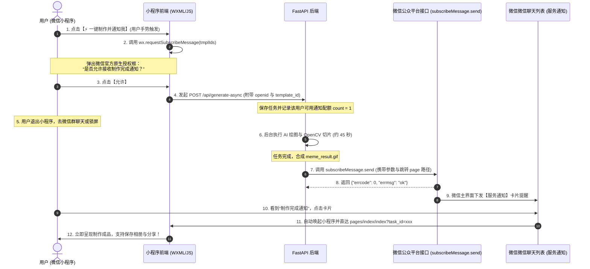

# 第 6 节：高耗时任务必配：微信小程序订阅消息选型、模板配置与异步触达全链路实战

在 AI 生图、动图渲染或音视频转码等业务场景中，后端计算通常需要 **30 秒至 1 分钟**。实测数据表明：超过 70% 的用户在等待超过 15 秒后，会顺手将微信小程序切入手机后台去聊天或刷朋友圈。

如果缺乏有效的**离线召回机制**，用户很容易将刚刚提交的任务遗忘，导致功能体验断裂、作品留存率与复访率急剧下跌。

**微信小程序“订阅消息 (Subscribe Message)”** 是微信官方提供的最权威、点击率最高（通常 > 60%）、且完全合规的站外触达手段。本章将详细拆解：
1. 如何在微信公众平台后台挑选并获取专属 **模板 ID (Template ID)**；
2. 针对 AI 生图与高耗时制作场景，推荐最合适的**一次性订阅模板与关键词组合**；
3. 微信订阅消息严苛的**字段格式校验巨坑 (47003 / 43101)** 与避坑速查表；
4. 前端手势唤起授权（`wx.requestSubscribeMessage`）与后端 Python 异步推送（`subscribeMessage.send`）的完整生产代码。

---

## 一、全链路业务架构时序图

订阅消息必须严格遵循 **“前端手势主动授权 ➔ 后端沉淀授权配额 ➔ 异步任务完工 ➔ 消耗配额定向下发 ➔ 微信服务通知唤醒回流”** 的闭环：



---

## 二、微信公众平台后台获取模板 ID (Template ID) 全流程

### 1. 获取路径
1. 打开电脑浏览器，登录 **微信公众平台**（[mp.weixin.qq.com](https://mp.weixin.qq.com)）；
2. 在左侧菜单栏依次点击：**【功能】➔【订阅消息】**；
3. 切换至 **【公共模板库】** 选项卡。

### 2. 为什么选择“一次性订阅 (One-Time Subscription)”？
在微信体系中，订阅消息分为两种类型：
* **一次性订阅（强烈推荐 · 个人与企业主体全支持）**：
  - 用户在前端主动勾选并点击“允许”一次，开发者服务器就获得 **1 次** 向该用户下发通知的权利；
  - 下发一条消息后，该次授权立即作废（1:1 消费原则）；如果需要再次下发，需等待用户下次在小程序中再次授权；
  - **门槛极低**，个人开发者小程序与企业小程序均可直接免费使用，覆盖 99% 的工具与制作类业务。
* **长期订阅（绝大多数开发者无法开通）**：
  - 用户授权一次后，开发者可长期不限次数下发；
  - **严苛限制**：仅面向政务、民生医疗、公共交通、教育等极少数特定政府/国企主体开放。普通工具、商业、个人主体**无法申请**。

---

## 三、高耗时 AI 制作场景最推荐的模板与关键词

在微信公众平台的【公共模板库】中，搜索与你的小程序**服务类目（如【工具 - 图片文字】或【工具 - 效率】）**相匹配的关键词：

### 1. 首选推荐模板：《制作完成通知》（最契合 AI 生图 / 动图生成）
* **模板标题**：`制作完成通知`（或搜索关键词：`制作完成`）
* **模板编号参考**：`1423` 等（不同类目编号略有不同，认准标题即可）
* **关键词字段推荐勾选（选择 3~4 个核心项）**：

| 字段占位符 | 字段名称 | 推荐填入内容示例 | 限制与格式规范 |
| :--- | :--- | :--- | :--- |
| **`thing1.DATA`** | 制作内容 / 作品名称 | `AI 趣味动态表情包` | 限制 20 个以内字符（严禁超长） |
| **`phrase2.DATA`** | 制作状态 | `制作成功` | 限制 5 个以内汉字（如“处理完成”、“生成成功”） |
| **`time3.DATA`** | 完成时间 | `2026-09-11 02:30:15` | 标准时间格式 |
| **`thing4.DATA`** | 温馨提示 / 备注 | `点击卡片立即查看并保存相册` | 限制 20 个以内字符 |

---

### 2. 备选通用模板：《任务完成通知》或《生成完成通知》
若你的主类目下未搜到“制作完成通知”，可搜索以下通用标题：
* **《任务完成通知》**：
  - `thing1.DATA` (任务名称)：`16帧连贯动图渲染`
  - `phrase2.DATA` (任务状态)：`已完成`
  - `time3.DATA` (结束时间)：`2026-09-11 02:30:15`
  - `thing4.DATA` (备注)：`已为您保存至表情合集`
* **《处理结果通知》**：
  - `thing1.DATA` (处理事项)：`动态表情包制作`
  - `phrase2.DATA` (处理状态)：`处理成功`
  - `time3.DATA` (处理时间)：`2026-09-11 02:30:15`
  - `thing4.DATA` (提示说明)：`快去微信聊天发给好友吧`

> 💡 **获取模板 ID**：在微信后台勾选完上述关键词并提交后，系统会为你的小程序分配一个长字符串，即为 **`template_id`**（例如：`a8F2kL90xPq_Mn7YwZb3Cd1Ef4Gh5Ij6Kl7Mn8Op9Qr`）。把它复制保存到后端配置文件或环境变量中。

---

## 四、微信订阅消息最严苛的格式强校验陷阱 (Cheat Sheet)

微信对于订阅消息发送接口（`subscribeMessage.send`）的数据校验极其严格，**只要有一个字段类型或长度不合规，整条消息就会被直接拒发**，并抛出经典错误码！

| 字段类型前缀 | 格式定义与限制 | 典型错误做法 (100% 触发 47003 报错) | 正确做法 |
| :--- | :--- | :--- | :--- |
| **`thing`** | 事物/文本，**严格限制 20 个以内字符**（1 个汉字算 1 个字符） | ❌ 传了很长的文字：“您于2026年9月制作的高精度AI动态表情包已经成功生成啦” (超过 20 字) | ✅ 精简截断：“AI动态表情包已完成” (不超过 20 字) |
| **`phrase`** | 汉字短语，**严格限制 5 个以内汉字** | ❌ 传了“正在为您加急制作中” (7个汉字) 或 英文 "Success" | ✅ 传标准短词：“制作成功”、“已生成” |
| **`character_string`**| 英文、数字及常用标号，**严禁包含任何中文字符** | ❌ 传了“订单号ABC12345” | ✅ 传纯数字/字母：“ABC12345” |
| **`time`** | 时间格式 | ❌ 传了时间戳 `1788945600` | ✅ 传标准格式字符串：`2026-09-11 02:30:00` |
| **`number`** | 纯数字 | ❌ 传了带单位的字符串：“100个” | ✅ 传纯数字字符串：“100” |

---

## 五、前端开发实战：手势驱动授权调用

### 1. 为什么不能在 `onLoad` 里自动弹窗？
微信基础库对用户隐私保护做了严格限制：
* **硬性铁律**：`wx.requestSubscribeMessage` **必须且只能由用户的手势行为（如点击按钮 `bindtap`）直接同步触发**；
* **典型错误**：在页面的 `onLoad`、`onShow` 生命周期里自动弹窗，或者把调用写在 `wx.request` 的异步 `then/await` 回调之后；
* **报错后果**：微信客户端将直接抛出错误：
  ```text
  requestSubscribeMessage:fail can only be called by user gesture
  ```

### 2. 小程序前端标准实现代码

```html
<!-- WXML: 必须绑定在用户点击按钮上 -->
<button class="btn-primary" bindtap="handleStartGenerateAndSubscribe">
  ⚡ 一键制作 (完成后微信通知我)
</button>
```

```javascript
// Page JS: pages/index/index.js
const TEMPLATE_ID_MEME = 'a8F2kL90xPq_Mn7YwZb3Cd1Ef4Gh5Ij6Kl7Mn8Op9Qr'; // 替换为你后台申请的模板ID

Page({
  data: {
    isSubscribed: false
  },

  async handleStartGenerateAndSubscribe() {
    // 1. 在用户点击的同步上下文中，立即唤起微信原生订阅授权弹窗
    try {
      const subRes = await this.requestSubscription([TEMPLATE_ID_MEME]);
      if (subRes[TEMPLATE_ID_MEME] === 'accept') {
        console.log('用户已同意接收制作完成通知');
        this.setData({ isSubscribed: true });
      } else {
        console.warn('用户拒绝或关闭了订阅通知');
      }
    } catch (subErr) {
      console.warn('订阅授权弹窗跳过或不支持:', subErr);
    }

    // 2. 无论用户是否同意订阅，都不阻断正常的 AI 制作任务提交
    this.submitGenerateTask();
  },

  requestSubscription(tmplIds) {
    return new Promise((resolve, reject) => {
      wx.requestSubscribeMessage({
        tmplIds: tmplIds,
        success: (res) => resolve(res),
        fail: (err) => reject(err)
      });
    });
  },

  async submitGenerateTask() {
    wx.showLoading({ title: '正在排队提交...' });
    const res = await app.request({
      url: '/api/generate-async',
      method: 'POST',
      data: {
        template_id: 'kiss',
        caption: '爱你哟',
        can_send_notice: this.data.isSubscribed // 告知后端是否具备通知额度
      }
    });
    wx.hideLoading();

    if (res.code === 0) {
      const taskId = res.data.task_id;
      wx.showToast({ title: '已进入后台制作', icon: 'success' });
      // 启动轻量轮询驱动进度条
      this.startPolling(taskId);
    }
  }
});
```

---

## 六、后端开发实战：FastAPI 异步完成任务后下发通知

当后端的异步工作协程（`run_pipeline_background`）完成雪碧图切片去底、生成好 `meme_result.gif` 时，调用微信官方接口下发通知。

### 1. 微信订阅消息发送接口规范
* **请求方式**：`POST`
* **接口 URL**：`https://api.weixin.qq.com/cgi-bin/message/subscribe/send?access_token=ACCESS_TOKEN`
* **核心请求体参数**：
  - `touser`：用户的唯一 `openid`
  - `template_id`：微信后台申请的模板 ID
  - `page`：用户在服务通知中点击卡片时打开的小程序页面路径，例如 `pages/index/index?task_id=84f2d705`
  - `data`：模板关键词键值对
  - `miniprogram_state`：跳转小程序类型：`developer` (开发版)、`trial` (体验版)、`formal` (正式版，默认)

### 2. 生产级 Python 下发实现

```python
import httpx
import logging
from datetime import datetime

logger = logging.getLogger(__name__)

async def send_wechat_subscribe_notice(
    access_token: str,
    openid: str,
    template_id: str,
    task_id: str,
    action_title: str = "AI趣味表情包"
) -> bool:
    """
    下发任务制作完成订阅通知
    """
    url = f"https://api.weixin.qq.com/cgi-bin/message/subscribe/send?access_token={access_token}"

    # 严格对齐微信字段格式与 20 字截断安全保护
    clean_title = (action_title[:17] + "...") if len(action_title) > 18 else action_title
    now_str = datetime.now().strftime("%Y-%m-%d %H:%M:%S")

    payload = {
        "touser": openid,
        "template_id": template_id,
        # 点击通知卡片直达小程序结果页，实现无缝回流闭环
        "page": f"pages/index/index?task_id={task_id}",
        "miniprogram_state": "formal", # 调试时可改为 trial 或 developer
        "lang": "zh_CN",
        "data": {
            "thing1": {
                "value": clean_title # 必须 <= 20 字符
            },
            "phrase2": {
                "value": "制作成功" # 必须 <= 5 个汉字
            },
            "time3": {
                "value": now_str
            },
            "thing4": {
                "value": "点击立即查看动图与保存" # 必须 <= 20 字符
            }
        }
    }

    async with httpx.AsyncClient(timeout=10.0) as client:
        resp = await client.post(url, json=payload)
        data = resp.json()

    if data.get("errcode") == 0:
        logger.info(f"订阅消息发送成功: openid={openid}, task_id={task_id}")
        return True
    else:
        errcode = data.get("errcode")
        errmsg = data.get("errmsg")
        logger.warning(f"订阅消息发送失败: errcode={errcode}, errmsg={errmsg}")
        return False
```

---

## 七、订阅消息核心错误码速查表 (Cheat Sheet)

在实际联调中，微信最常见的报错码及解决方案如下：

| 错误码 (errcode) | 官方含义说明 | 根本原因与彻底根治方案 |
| :--- | :--- | :--- |
| **`0`** | `ok` | 发送成功，微信将在几秒内送达用户的“服务通知”面板。 |
| **`43101`** | `user refuse to accept the msg` | **配额已耗尽或用户未授权**：<br>1. 用户在弹窗中点了“取消”；<br>2. 用户之前虽然授权过，但那次授权已经被上一次推送消耗掉了（一次性订阅 1:1 原则，未进行二次授权）；<br>3. 用户在微信设置中关闭了小程序的接收通知开关。 |
| **`47003`** | `argument invalid! data.xxx.value invalid` | **字段格式或长度校验失败**：<br>1. 极高频陷阱！`thing` 字段超过了 20 个字符；<br>2. `phrase` 字段超过了 5 个汉字，或者传入了英文；<br>3. 请务必在后端发送前加入 `value[:20]` 安全切片截断！ |
| **`41030`** | `page invalid` | **跳转页面路径不存在**：<br>`page` 填写的路径在 `app.json` 的 `pages` 数组中不存在。注意路径前面**不要加斜杠 `/`**（正确：`pages/index/index`，错误：`/pages/index/index`）。 |
| **`40001`** | `invalid credential` | `access_token` 已过期或无效，需重新刷新服务端的微信凭证。 |
| **`40037`** | `invalid template_id` | 模板 ID 填写错误，或者该模板属于其他小程序（每个模板 ID 与特定 AppID 强绑定）。 |

---

## 八、本章小结

高耗时业务不是性能死穴，善用订阅消息能够将“等待流失”逆转为“惊喜回流”：
1. **模板选型**：首选【工具】类目下的 **《制作完成通知》** 或 **《任务完成通知》**，类型为 **一次性订阅**；
2. **关键词规范**：牢记 `thing` 限制 20 字、`phrase` 限制 5 个汉字的硬性红线，必须在服务端做好截断兜底；
3. **交互规范**：必须由用户点击手势触发 `wx.requestSubscribeMessage` 弹窗；
4. **闭环回流**：消息参数中的 `page` 务必带上 `task_id`，让用户一点卡片就能直接看到成果并一键存入相册！
