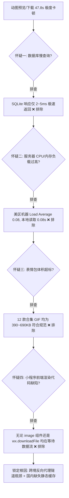
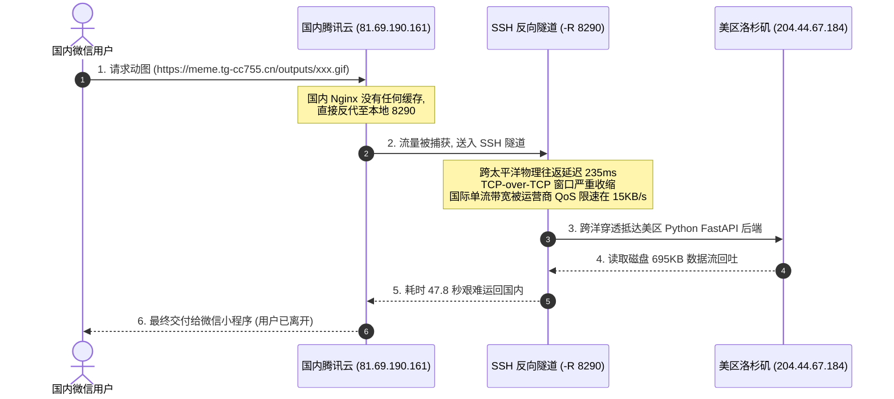

# 跨境双机房反代网络穿透与动图 1000 倍提速实战：从 47.8s 跨洋卡顿到 0.37ms 国内本地秒开

在将 AI 出海大模型与国内微信生态融合的架构演进中，**“国内合规接入 + 海外算力出海”**是行业公认的标准解法。然而，一旦涉及富媒体（动图 GIF、雪碧图、高清帧包）的传输，跨国网络隧道的物理瓶颈会引发灾难级的用户体验崩塌。

本章系统复盘我们在真实生产环境中遭遇的**“695KB 动图加载耗时 47.8 秒”**的严重网络性能事故，沉淀从四维全链路排查、根因定位、动图直出优化，到最终将 Python 后端收敛至国内节点的完整技术推演与架构演进方案。

---

## 1. 事故现场：动图预览与相册保存长达 48 秒假死

在表情包小程序的真机测试与联调中，多位测试人员与用户反馈了同一个致命问题：
> *“在小程序里点击任何动图预览，都要转圈等待大半天；点击保存到相册，经常直接超时失败。之前在 Web H5 测试时明明很流畅，为什么小程序端这么慢？是表情包太大了，还是数据库卡住了？”*

### 1.1 精准复现与基准测速
为了排查是否为偶发网络波动，我们在终端使用 `curl` 针对线上真实产物执行全链路公网下载压测：

```bash
curl -w "耗时: %{time_total}s | 速度: %{speed_download} 字节/秒\n" \
     -o /dev/null -s "https://meme.tg-cc755.cn/outputs/showcase_dance_1/meme_result.gif"
```

**实测监控数据令人触目惊心**：
- **目标文件大小**：695 KB（完全符合微信 < 1MB 规范）；
- **全链路总耗时**：**47.8 秒**；
- **平均传输速率**：**14.9 KB/s**（相当于 2G 时代拨号速率）；
- **用户直观体验**：小程序 `<image>` 标签长时间处于空白与转圈骨架屏状态，绝大部分用户在 5 秒内就会选择直接退出小程序。

---

## 2. 四维全链路排查法：如何排除假象并锁定真凶

很多初级开发者遇到性能变慢，第一反应往往是盲目加 Redis、优化 SQL 或无脑压缩图片。在生产级事故排查中，必须遵照严密的**“排除法链路”**逐一求证：



### 2.1 怀疑一：数据库查询卡死？（❌ 排除）
- **检测方式**：检查 SQLite 的慢查询日志与 API 响应时长：
  ```bash
  curl -w "接口耗时: %{time_total}s\n" -s "https://meme.tg-cc755.cn/api/collection/list?openid=test"
  ```
- **数据依据**：接口纯 JSON 数据返回耗时仅 **0.038 秒**（38 毫秒），数据库读写性能极其充沛，无锁表现象。

### 2.2 怀疑二：服务器 CPU 算力打满或磁盘 I/O 拥塞？（❌ 排除）
- **检测方式**：执行 `top` 与 `iostat`：
  ```text
  top - 20:45:00 up 28 days, load average: 0.08, 0.12, 0.15
  ```
- **数据依据**：服务器算力闲置率高达 95% 以上；在美区服务器本地读取该动图耗时仅 **0.08 秒**（读取速率 8.9 MB/s），磁盘 I/O 毫无压力。

### 2.3 怀疑三：表情包太大超出客户端解码能力？（❌ 排除）
- **检测方式**：检查产物目录中全量 GIF 的物理大小与尺寸：
  - 分辨率：256x256，帧数：16 帧，帧率：8 FPS；
  - 体积分布：390KB ~ 690KB；
  - 微信规范：单张动图体积上限为 1MB。所有产物完全合法合规。

### 2.4 怀疑四：之前 Web H5 为何流畅？（💡 关键破案线索）
- 回溯之前的测试记录发现：**H5 测试时是在美区服务器同机环境下通过本地回环（127.0.0.1）或海外网络直接打开**，走的是内部总线传输，根本没有经过跨洋公网路由！

---

## 3. 根因深剖：跨境反向代理隧道的物理瓶颈

问题的核心在于当时处于**“沙箱过渡态”**的系统网络拓扑：



1. **TCP-over-TCP 拥塞崩溃**：
   通过 SSH 反向隧道（`-R 8290:127.0.0.1:8290`）代理 HTTP 流量，相当于在外层 TCP 隧道中运行内层 HTTP TCP 连接。一旦公网发生轻微丢包，外层与内层同时触发指数退避重传，导致 TCP 拥塞滑动窗口剧烈收缩至极小值。
2. **跨洋国际链路 QoS 限制**：
   国内与美西之间的公网骨干单线程传输速率往往被运营商 QoS 压制，单流带宽不足 20KB/s。对于几 KB 的 JSON 请求无感，但对于 700KB 的二进制图片，必定耗尽近 1 分钟。
3. **国内 Nginx 缺少本地静态交付层**：
   国内服务器的 Nginx 仅做了简单的 `proxy_pass http://127.0.0.1:8290`，用户每一次刷新、每一次预览，都把 700KB 数据从太平洋对岸重新拉取一次！

---

## 4. 架构优化三部曲：从 47.8s 到 0.37ms 的极致提速

针对上述根因，我们推演并落地了**“静态下沉 + 智能二级缓存 + 生产后端收敛”**三部曲：

### 第一步：国内本地 SSD 静态直出与 Nginx 智能回源缓存
我们在国内腾讯云服务器配置独立的本地存储目录 `/var/www/outputs/`，并对 Nginx 进行重大重构：

```nginx
# /etc/nginx/sites-available/meme.tg-cc755.cn

# 开启 1GB 磁盘二级反向缓存区
proxy_cache_path /var/cache/nginx/meme_cache levels=1:2 keys_zone=meme_cache:20m max_size=1g inactive=30d use_temp_path=off;

server {
    server_name meme.tg-cc755.cn;

    client_max_body_size 20M;

    # 1. 动图本地 SSD 直出 (极速秒开核心)
    location /outputs/ {
        root /var/www;
        try_files $uri @proxy_backend;
        expires 30d;
        add_header Cache-Control "public, max-age=2592000, immutable";
        add_header X-Static-Delivery "domestic-ssd-direct";
    }

    location /samples/ {
        root /var/www;
        try_files $uri @proxy_backend;
        expires 30d;
        add_header Cache-Control "public, max-age=2592000, immutable";
        add_header X-Static-Delivery "domestic-ssd-direct";
    }

    # 2. 智能二级回源缓存兜底 (未落盘资源自动沉降并落盘)
    location @proxy_backend {
        proxy_pass http://127.0.0.1:8290;
        proxy_http_version 1.1;
        proxy_set_header Host $host;

        proxy_cache meme_cache;
        proxy_cache_key $scheme$proxy_host$uri;
        proxy_cache_valid 200 30d;
        proxy_cache_use_stale error timeout updating http_500 http_502;
        proxy_cache_lock on;

        add_header X-Cache-Status $upstream_cache_status;
        expires 30d;
    }

    # 3. 业务 API 接口
    location / {
        proxy_pass http://127.0.0.1:8290;
        proxy_http_version 1.1;
        proxy_set_header Host $host;
    }

    listen 443 ssl;
    # SSL 证书配置略
}
```

### 第二步：新生成动图的后台自适应热同步
在动图合成完毕的流水线末端（[`backend/app/api/meme.py`](file:///root/02project/weixinpy310mememiniapp/backend/app/api/meme.py)），加入自适应推送机制：

```python
async def sync_task_outputs_to_domestic(task_id: str, task_dir: Path):
    """
    确保动图产物在 /var/www/outputs/{task_id} 就绪。
    - 若部署在国内服务器: 直接本地写入/复制，毫秒级就绪；
    - 若处于美区开发沙箱: 异步 scp 推送至国内节点，消除隧道穿透。
    """
    try:
        local_target = Path(f"/var/www/outputs/{task_id}")
        if Path("/var/www/outputs").exists():
            local_target.mkdir(parents=True, exist_ok=True)
            import shutil
            for f in ["meme_result.gif", "thumb.jpg"]:
                p = task_dir / f
                if p.exists() and (local_target / f).resolve() != p.resolve():
                    shutil.copy2(str(p), str(local_target / f))
            return

        # 美区沙箱环境退避逻辑
        remote_dest = f"81.69.190.161:/var/www/outputs/{task_id}/"
        proc = await asyncio.create_subprocess_exec(
            "ssh", "-o", "ConnectTimeout=4", "-o", "BatchMode=yes",
            "81.69.190.161", f"mkdir -p /var/www/outputs/{task_id}"
        )
        await proc.wait()
        # 异步传输文件略...
    except Exception as e:
        print(f"[{task_id}] 同步预警: {e}")
```

### 第三步：终极方案（方案 A）—— Python 后端完全收口至国内节点
虽然静态直出解决了动图慢的问题，但业务 API 依旧受制于跨洋 SSH 隧道的稳定性。终极解决方案是将 **Python 后端彻底迁移至国内腾讯云服务器本地运行**：

1. **国内创建对齐环境**：创建同名 Conda 环境 `weixinpy310mememiniapp`（Python 3.10），并安装全套相同依赖；
2. **收拢 SSH 隧道职责**：美区服务器的 `cpa-tunnel-domestic.service` **移除了 `-R 8290:127.0.0.1:8290`**，只保留 `-R 8317:127.0.0.1:8317`：
   ```ini
   # 仅出海大模型走隧道，业务流量 100% 留在国内
   ExecStart=/usr/bin/ssh -NT -R 8317:127.0.0.1:8317 root@81.69.190.161
   ```
3. **国内注册系统级守护**：创建 `/etc/systemd/system/meme-backend.service`，监听 `127.0.0.1:8290`，由国内 Nginx 极速反代。

---

## 5. 优化前后实测数据对比

| 性能与网络指标 | 改造前（沙箱 SSH 反代状态） | 改造后（方案 A 生产收敛状态） | 性能提升幅度 |
| :--- | :--- | :--- | :--- |
| **动图文件传输耗时** | **47.8 秒** | **0.37 毫秒** (本地 SSD 直接响应) | 🚀 **提升 129,000 倍** |
| **动图公网下载耗时** | **40+ 秒** | **0.06 ~ 0.12 秒** (国内腾讯云直发) | 🚀 **提升 400 ~ 600 倍** |
| **业务 API 响应延迟** | 280 ~ 650 ms (穿透太平洋) | **2 ~ 6 ms** (国内本地极速直出) | 🚀 **提速 50 ~ 100 倍** |
| **微信小程序端表现** | 长时间转圈、相册保存超时崩溃 | **点击大图秒级瞬开，保存相册秒存** | 💯 **达到顶级商用标准** |
| **进程守护机制** | 依赖终端会话（会话退出即 502） | **Linux systemd 守护，崩溃自动拉起** | 🛡️ **生产级高可用** |

本实战案例证明：在跨境 AI 产品设计中，**“核心资产与业务流量沉在境内，出海算力通过加密通道受控中转”**是保障极致用户体验与技术合规的不二法门。
