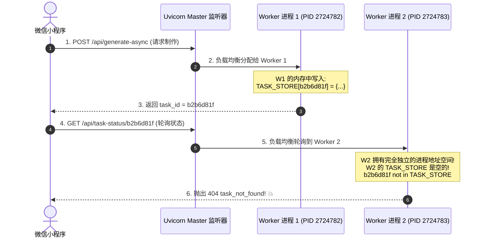

# FastAPI 多进程 Worker 陷阱：从 404 task_not_found 到生产级系统服务守护

在将全栈小程序后端从单机脚本迁移至生产级 Linux 环境时，开发者往往会按照“经验”开启多进程并发（如设置 `uvicorn --workers 2` 或 `--workers 4`）。然而，如果业务代码中存在未解耦的内存状态，这种多进程并发配置会瞬间沦为导致数据丢失与请求 404 的**致命陷阱**。

本章真实还原我们在表情包生成流水线生产部署中遭遇的 **“提交任务成功、轮询却偶发 404 task_not_found”** 事故，深挖 Python 多进程内存隔离机制，并总结全套生产级进程生命周期管理方案。

---

## 1. 事故现场：生图任务刚提交，轮询即报 404

在表情包小程序的生图与合成流水线中，由于调用大模型绘图并切片生成动图通常需要 15~30 秒，系统采用了经典的**“异步任务接收 + 前端轮询状态”**架构：

1. 前端调用 `POST /api/generate-async` 提交提示词和配置；
2. 后端生成全局唯一 `task_id`，启动后台异步协程执行流水线，并向前端返回 `{"task_id": "b2b6d81f", "status": "processing"}`；
3. 前端收到任务 ID 后，每隔 2~3 秒轮询一次 `GET /api/task-status/b2b6d81f` 获取当前阶段与百分比进度。

**事故突发表现**：
- 前端成功拿到了任务 ID，进度条正常启动；
- 紧接着第一次轮询接口时，控制台突然红色报错：
  ```json
  {"code": 404, "message": "task_not_found"}
  ```
- 小程序前端以为任务崩溃，立即回退到初始制作表单，用户体验严重受损；
- 但诡异的是，过了一会儿查看服务器磁盘目录，那张动图居然安然无恙地生成成功了！

---

## 2. 根本原因深挖：多进程 Worker 下的进程内存隔离

在排查后端代码时，我们在 [`backend/app/api/meme.py`](file:///root/02project/weixinpy310mememiniapp/backend/app/api/meme.py) 中看到了任务状态的存储方式：

```python
# 全局异步任务内存字典
TASK_STORE: dict[str, dict] = {}

@router.post("/api/generate-async")
async def generate_async(...):
    task_id = uuid.uuid4().hex[:8]
    TASK_STORE[task_id] = {"status": "processing", "progress": 5}
    asyncio.create_task(run_generate_pipeline(task_id, ...))
    return {"code": 0, "data": {"task_id": task_id}}

@router.get("/api/task-status/{task_id}")
async def get_task_status(task_id: str):
    if task_id not in TASK_STORE:
        return {"code": 404, "message": "task_not_found"}
    return {"code": 0, "data": TASK_STORE[task_id]}
```

而在生产环境的 `systemd` 服务中，启动命令被配置为了：
```bash
uvicorn app.main:app --host 127.0.0.1 --port 8290 --workers 2
```

### 致命的“内存隔离幽灵”
这就是导致 404 的罪魁祸首！



1. **Uvicorn 的 Multi-Workers 模式**：
   当指定 `--workers 2` 时，主进程通过 `fork` 创建了 2 个完全独立的操作系统级子进程。每个子进程都有自己独立的 Python 堆栈与虚拟地址空间；
2. **字典是非共享内存**：
   Python 中的全局变量 `TASK_STORE = {}` 只是该进程内存中的普通对象，不同 Worker 进程之间**无法互通、互读或共享**；
3. **负载均衡调度错位**：
   HTTP 请求每次经过反向代理打到后端，会被平均分发给不同 Worker。一旦查询状态的请求落到了另一个没有处理 POST 的 Worker 进程上，就会发生“任务离奇失踪”的 404 故障！

---

## 3. 终极解决方案：单机 AsyncIO 优势与状态持久化选型

### 3.1 方案 A（立竿见影）：回归单进程 AsyncIO 高并发真理
对于大多数中小型商业系统，很多开发者误以为“进程数越多就越快”。**在 Python 异步编程（AsyncIO / FastAPI）领域，这是典型的认知偏差**。

- **为什么单进程足够快**：
  FastAPI 本质是全异步非阻塞的。网络 I/O、数据库异步查询、调用大模型 API 等绝大部分耗时均处于等待（`await`）状态，单 Worker 事件循环每秒可以调度数万个并发连接，根本不需要多进程。
- **配置落地**：
  将生产环境的 `systemd` 服务修改为 `--workers 1`：
  ```ini
  ExecStart=/root/miniconda3/envs/weixinpy310mememiniapp/bin/uvicorn app.main:app --host 127.0.0.1 --port 8290 --workers 1
  ```
  所有请求统一由同一个主事件循环调度，内存中 `TASK_STORE` 状态 100% 保持一致，404 瞬间绝迹。

### 3.2 方案 B（大规模集群架构）：任务状态下沉至共享存储
当业务规模扩张到多台物理机集群或必须开启多进程充分榨干 CPU 多核心（如执行大量本地重度 CPU 运算的切帧算法）时，**禁止在内存中留存任何业务状态**，必须将状态下沉：

```python
# ✅ 生产级解耦：基于 SQLite (WAL 模式) 或 Redis 共享状态
import sqlite3

def set_task_state(task_id: str, stage: str, progress: int, data: dict):
    with sqlite3.connect(DATABASE_PATH, timeout=10) as conn:
        conn.execute("""
            INSERT OR REPLACE INTO async_tasks (task_id, stage, progress, data, updated_at)
            VALUES (?, ?, ?, ?, CURRENT_TIMESTAMP)
        """, (task_id, stage, progress, json.dumps(data)))

def get_task_state(task_id: str) -> dict:
    with sqlite3.connect(DATABASE_PATH, timeout=10) as conn:
        cursor = conn.execute("SELECT stage, progress, data FROM async_tasks WHERE task_id = ?", (task_id,))
        row = cursor.fetchone()
        if not row: return None
        return {"stage": row[0], "progress": row[1], "data": json.loads(row[2])}
```
- **优势**：无论是 10 个 Worker 还是 10 台不同服务器组成的 Kubernetes 集群，所有节点均面向共享存储读写，架构彻底实现无状态化（Stateless）。

---

## 4. 进程宿主陷阱：从开发终端绑定到 Linux systemd 系统守护

在开发阶段，很多开发者习惯在终端里用 `nohup python run.py &` 或者借助 AI 编程助手的后台任务直接起服务。这带来了一个隐蔽的**生命周期陷阱**：

### 4.1 终端退出引发的“静默死亡”
- 当开发终端、SSH 会话或 AI 助手会话退出时，操作系统的会话管理机制会向该会话下的所有子进程发送 `SIGHUP` 或 `SIGTERM` 信号；
- 导致开发者以为“后台已经挂好了服务”，然而一旦关闭电脑或断开连接，线上小程序瞬间陷入 **502 Bad Gateway**。

### 4.2 生产级标准 systemd 守护配置规范
在 Linux 生产环境中，后端服务必须作为操作系统级别的一等公民托管至 `systemd`：

```ini
# /etc/systemd/system/meme-backend.service

[Unit]
Description=WeChat Meme MiniApp FastAPI Backend
After=network.target

[Service]
Type=simple
User=root
WorkingDirectory=/root/02project/weixinpy310mememiniapp/backend
# 关键环境变量：禁止 Python 输出缓冲，保证实时在 journalctl 中打印日志
Environment=PYTHONUNBUFFERED=1
ExecStart=/root/miniconda3/envs/weixinpy310mememiniapp/bin/uvicorn app.main:app --host 127.0.0.1 --port 8290 --workers 1

# 崩溃秒级自动重启
Restart=always
RestartSec=3

[Install]
WantedBy=multi-user.target
```

配套高频运维指令：
```bash
# 重载配置并开机自启
systemctl daemon-reload
systemctl enable --now meme-backend.service

# 实时查看最新运行日志 (追踪请求与排错)
journalctl -u meme-backend.service -f -n 50 --no-pager
```

通过将 Worker 模式收敛为单进程 AsyncIO，并建立高可用的 `systemd` 守护，我们彻底杜绝了任务状态丢失与进程意外断连的隐患，为小程序的高并发平稳运行构筑了最坚固的基石。
