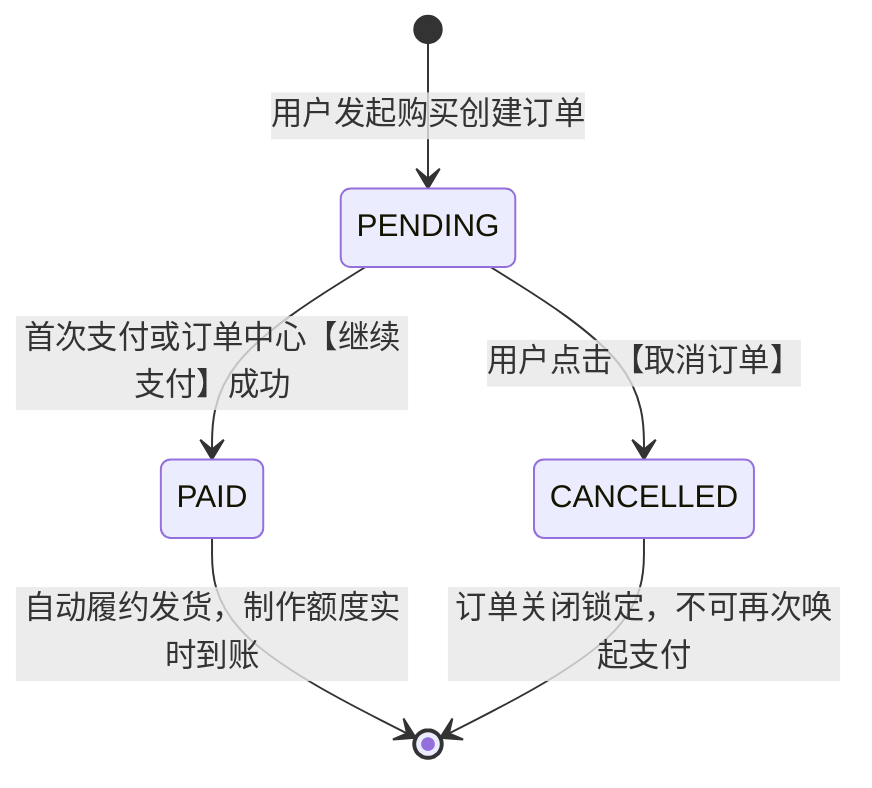

# 微信虚拟支付 2.0 (XPay) 全流程避坑、API 免 Excel 自动化上架与电商化订单闭环实战 (附错误码速查表)

> **导读与实战价值**：  
> 微信虚拟支付 2.0（XPay，基于短剧/数字道具 `short_series_goods` 模式）是个人小程序与创作者唯一官方合规的真钱收银通道。然而在实际接入过程中，从微信管理后台 Excel 导入格式、价格单位换算（元 vs 分）、后台无删除按钮，到 iOS 特有的 Apple IAP 事务重入拦截、腾讯全国 Midas 节点缓存同步延迟，处处充满隐性技术陷阱。  
> 本篇系统盘点实战中遭遇的核心报错与避坑经验，给出**纯代码 API 一键自动化上架道具方案（彻底告别手工 Excel）**、**电商式“取消订单/继续支付”双层架构**以及**高频错误码速查手册 (Cheat Sheet)**。

---

## 核心知识点与经验摘要 (备忘速查)

1. **道具价格单位陷阱 (`GOODS_PRICE_INVALID: -15013`)**：
   - 微信管理后台 Excel 导入模板的表头单位是 **“元”**，若填入 `100` 会被识别为 `100.00元 (10000分)`；
   - 代码签名的 `goodsPrice` 严格要求为 **“分”**（1元传 `100`）；
   - 单位不一致相差 100 倍即报此错。微信后台无删除道具功能，需覆盖修改或用 API 发布新道具。
2. **免 Excel 一键全自动道具发布 (Python 核心代码)**：
   - 微信官方提供 `/xpay/start_upload_goods`（上传）与 `/xpay/start_publish_goods`（发布）服务端接口；
   - 携带 HMAC-SHA256 计算的 `pay_sig` 签名，脚本一键秒级推送到正式现网或沙箱，省去人工上传与 Excel 维护。
3. **道具创建全网同步冷却期 (`COIN_OR_PRODUCT_ID_CREATED_IN_RECENTLY`)**：
   - 此报错表示：**AppID、OfferID、密钥签名（paySig/signature）、道具 ID 与价格 100% 正确！**
   - 腾讯米大师（Midas）网关全国边缘 CDN 节点与防刷风控强制设有 15 ~ 30 分钟同步冷却，静待即可自动恢复。
4. **iOS 端特有报错 (`requestVirtualPayment fail ios支付时订单号重复`)**：
   - **根因**：iOS 微信虚拟支付底层接入 Apple 支付事务队列（Transaction Queue），初次拉起收银台后，该 `outTradeNo` 被系统锁定。退出后再次拿同一单号请求，iOS 底层风控直接拦截；
   - **解法**：采用主流电商的 **“业务主订单号 + 动态支付流水号”** 双层设计。重试支付时派发唯一新单号（如 `MEME_..._R9fe5`，长度严格限制在 $\le 32$ 字符），通过 Webhook 异步通知精准归集履约。
5. **电商化订单中心闭环设计**：
   - 支持 `PENDING`（待付款）、`PAID`（已履约）、`CANCELLED`（已关闭）状态机；
   - 待付款订单提供【取消订单】（二次确认）与【继续支付】（动态流水重新拉起微信原生收银台）。
6. **编译与打包 (`project.private.config.json 无依赖文件`)**：
   - 本地开发工具生成的私有偏好配置文件，打包时被自动优化过滤，**100% 不影响运行与审核**。在 `packOptions.ignore` 和 `.gitignore` 显式忽略可静音提示。

---

## 一、 虚拟支付道具价格单位陷阱与 GOODS_PRICE_INVALID (-15013)

### 1.1 案发现场
前端调用 `wx.requestVirtualPayment` 时抛出异常：
```json
{
  "errMsg": "requestVirtualPayment:fail goods_price_invalid",
  "errCode": -15013
}
```

### 1.2 根因分析与对比矩阵
微信公众平台管理后台（【虚拟支付】->【道具管理】）与底层接口对**价格单位**定义不同：

| 渠道 / 场景 | 期望的价格单位 | 示例输入 | 微信底层折算金额 |
| :--- | :--- | :--- | :--- |
| **后台 Excel 批量导入模板** | **元 (Yuan)** | `1` / `5` / `9.9` | 1.00元 / 5.00元 / 9.90元 |
| **代码/API 参数 (`goodsPrice`)** | **分 (Cent)** | `100` / `500` / `990` | 1.00元 / 5.00元 / 9.90元 |

> **⚠️ 典型踩坑路径**：
> 开发者按代码习惯在 Excel 里填入 `100`、`500`、`990`，微信后台导入后将其认定为 **100元 (10000分)、500元 (50000分)、990元 (99000分)**。
> 当小程序前端按 1 元扣费传入 `goodsPrice: 100` 时，Midas 网关校验 `100 != 10000`，立即触发 `-15013: GOODS_PRICE_INVALID`。

### 1.3 后台无删除按钮的解法
微信公众平台后台道具一旦生成，**没有提供删除选项**：
- **方案 A（覆盖式修改）**：在后台道具列表中直接点击【修改】，修正道具名称与价格（单位为元），提交后重新发布生效。
- **方案 B（代码发布全新前缀）**：使用全新命名的 ID（如 `meme_100` 替代 `item_100`），直接通过 API 一键发布，由数据库做双前缀向下兼容。

---

## 二、 彻底告别 Excel：代码调用官方 API 一键上传与发布道具 (附完整核心代码)

使用官方 API 替代 Excel 导入，既能实现版本控制，又能防止单位混淆。

### 2.1 官方核心接口
1. **批量上传/更新道具**：`/xpay/start_upload_goods`
2. **批量发布道具至现网/沙箱**：`/xpay/start_publish_goods`
3. **查询道具发布进度**：`/xpay/query_publish_goods`

### 2.2 签名算法 pay_sig 计算
$$\text{pay\_sig} = \text{HMAC-SHA256}(\text{uri} + "\&" + \text{post\_body}, \text{AppKey})$$
- `uri`：请求的 URI 路径，例如 `/xpay/start_upload_goods`；
- `post_body`：请求体 JSON 字符串（紧凑无空格，`separators=(',', ':')`）；
- `AppKey`：现网（`env=0`）必须使用现网正式 AppKey。

### 2.3 完整开箱即用脚本 (`sync_xpay_props.py`)

```python
"""
微信小程序虚拟支付 2.0 (XPay) 服务端自动化道具上架与发布脚本
路径：backend/scripts/sync_xpay_props.py
"""
import time
import json
import hmac
import hashlib
import requests

# ----------------- 配置信息 -----------------
WX_APPID = "wx86e299efa495d1f6"
WX_APPSECRET = "your_wx_appsecret"
XPAY_APP_KEY = "your_live_app_key"   # 现网正式 AppKey
XPAY_ENV = 0                        # 0: 现网正式, 1: 沙箱测试
# --------------------------------------------

def get_access_token() -> str:
    url = f"https://api.weixin.qq.com/cgi-bin/token?grant_type=client_credential&appid={WX_APPID}&secret={WX_APPSECRET}"
    resp = requests.get(url, timeout=10)
    data = resp.json()
    token = data.get("access_token")
    if not token:
        raise ValueError(f"获取 access_token 失败: {data}")
    return token

def calc_pay_sig(uri: str, post_body: str, appkey: str) -> str:
    msg = f"{uri}&{post_body}"
    return hmac.new(appkey.encode("utf-8"), msg.encode("utf-8"), hashlib.sha256).hexdigest()

def sync_props():
    token = get_access_token()

    # 定义标准黄金计费档位 (price 单位严格为整数“分”)
    items = [
        {
            "id": "meme_100",
            "name": "动图制作尝鲜包1元",
            "price": 100,             # 100分 = 1.00元
            "remark": "尝鲜包20次额度",
            "item_url": "https://api.yourdomain.cn/uploads/goods_icon.png"
        },
        {
            "id": "meme_500",
            "name": "动图制作超值包5元",
            "price": 500,             # 500分 = 5.00元
            "remark": "超值包120次额度",
            "item_url": "https://api.yourdomain.cn/uploads/goods_icon.png"
        },
        {
            "id": "meme_990",
            "name": "动图制作尊享包9元9",
            "price": 990,             # 990分 = 9.90元
            "remark": "尊享包300次额度VIP",
            "item_url": "https://api.yourdomain.cn/uploads/goods_icon.png"
        }
    ]

    for item in items:
        # 1. 批量上传/更新道具
        print(f"📦 正在上传道具: {item['id']} ({item['price']}分)...")
        uri = "/xpay/start_upload_goods"
        payload = {"upload_item": [item], "env": XPAY_ENV}
        post_body = json.dumps(payload, ensure_ascii=False, separators=(',', ':'))
        pay_sig = calc_pay_sig(uri, post_body, XPAY_APP_KEY)
        url = f"https://api.weixin.qq.com/xpay/start_upload_goods?access_token={token}&pay_sig={pay_sig}"
        resp = requests.post(url, data=post_body.encode("utf-8"), headers={"Content-Type": "application/json; charset=utf-8"}, timeout=10)
        print(f"   上传响应: {resp.text}")
        time.sleep(2)

        # 2. 批量发布道具至目标环境
        print(f"🚀 正在发布道具: {item['id']} (env={XPAY_ENV})...")
        uri = "/xpay/start_publish_goods"
        payload = {"publish_item": [{"id": item["id"]}], "env": XPAY_ENV}
        post_body = json.dumps(payload, ensure_ascii=False, separators=(',', ':'))
        pay_sig = calc_pay_sig(uri, post_body, XPAY_APP_KEY)
        url = f"https://api.weixin.qq.com/xpay/start_publish_goods?access_token={token}&pay_sig={pay_sig}"
        resp = requests.post(url, data=post_body.encode("utf-8"), headers={"Content-Type": "application/json; charset=utf-8"}, timeout=10)
        print(f"   发布响应: {resp.text}")
        time.sleep(2)

    print("🎉 全部道具自动化发布完成！彻底告别 Excel 繁琐导入！")

if __name__ == "__main__":
    sync_props()
```

---

## 三、 道具创建与更新的全网同步冷却期：COIN_OR_PRODUCT_ID_CREATED_IN_RECENTLY

### 3.1 报错现象
刚在后台创建完道具或运行脚本发布后，立即在真机点击支付，控制台报错：
```text
requestVirtualPayment:fail COIN_OR_PRODUCT_ID_CREATED_IN_RECENTLY
```

### 3.2 为什么说这是“成功的重大信号”？
在微信 Midas 支付网关中，该校验处于整个链路的最末端：
1. **已验证 AppID 与 OfferID 真实有效**；
2. **已验证现网 AppKey 签发的 paySig 与用户态 signature 100% 验签通过**；
3. **已验证道具 ID 存在且 price 价格吻合一致**。
只有以上全部通过后，系统才会检测节点缓存时间。为了防范 CDN 边缘节点延时与刷单套现漏洞，腾讯对新上线/新调价道具实行 **15 ~ 30 分钟全网同步冷却期**。

### 3.3 应对策略
**切勿重复修改代码或参数！** 耐心等待 15 ~ 30 分钟后重新编译或扫码，收银台便会直接调起。

---

## 四、 iOS 端特有报错：requestVirtualPayment fail ios支付时订单号重复 与电商化流水号解法

### 4.1 案发现场
用户在充值弹窗退出未付款，随后在【订单中心】点击【继续支付】，Android 手机可能正常调起，但 iPhone (iOS) 直接弹出：
```text
requestVirtualPayment:fail ios支付时订单号重复
```

### 4.2 底层原因剖析 (Apple IAP 事务队列)
- iOS 上的微信虚拟支付受限于 **Apple 支付事务队列（Transaction Queue）**；
- 只要在 iOS 设备上唤起过一次收银台，该 `outTradeNo` 即被系统队列标记为“处理过”；
- 即使用户中途退出，该单号在 iOS 本地队列也留有记录；若重试时依然使用原单号，iOS 微信底层风控直接拦截。

### 4.3 解决方案：“业务主订单号 + 动态支付交易流水号” 双层设计

```
                 【用户订单中心】
           业务主订单号: MEME_1789081221_03009e (永久固定不变)
                          │
         ┌────────────────┴────────────────┐
         ▼ 首次支付                       ▼ 订单中心点击【继续支付】
   支付流水号 1:                     支付流水号 2:
   MEME_1789081221_03009e            MEME_1789081221_03009e_Rc874
         │                                 │
         └────────────────┬────────────────┘
                          ▼
            微信异步支付成功通知 Webhook
                          │
                          ▼
        精准归集到业务主订单并发放额度，状态变更为 PAID
```

#### 关键约束：
- 微信 `outTradeNo` 限制最大长度为 **32 字符**；
- 主订单号（22位，如 `MEME_1789081221_03009e`） + 重试后缀 `_R` + 4位十六进制随机字符 = **28 位字符**，严格满足 $\le 32$ 规范。

#### 服务端重签核心实现：
```python
def resume_xpay_order(openid: str, order_id: str) -> Dict[str, Any]:
    order = get_order_by_id(order_id)
    if not order or order['openid'] != openid:
        raise ValueError("订单不存在或无权操作")
    if order['status'] != 'PENDING':
        raise ValueError(f"订单状态为【{order['status']}】，无法继续支付")

    # 1. 派发全新独立流水号 (严格 <= 32字符)
    retry_suffix = uuid.uuid4().hex[:4]
    pay_trade_no = f"{order_id}_R{retry_suffix}"

    # 2. 更新订单表最新流水记录
    update_order_trade_no(order_id, pay_trade_no)

    # 3. 构造请求参数，attach 中记录原始 order_id
    sign_data_dict = {
        "offerId": settings.XPAY_OFFER_ID,
        "buyQuantity": 1,
        "env": settings.XPAY_ENV,
        "currencyType": "CNY",
        "productId": order['package_id'],
        "goodsPrice": order['amount'],
        "outTradeNo": pay_trade_no,
        "attach": json.dumps({"openid": openid, "order_id": order_id, "pkg_id": order['package_id']})
    }

    sign_data_str = json.dumps(sign_data_dict, separators=(',', ':'))
    pay_sig = calc_pay_sig("requestVirtualPayment", sign_data_str, settings.XPAY_APP_KEY)
    signature = calc_signature(sign_data_str, get_user_session_key(openid))

    return {
        "order_id": order_id,
        "trade_no": pay_trade_no,
        "payment_params": {
            "signData": sign_data_str,
            "paySig": pay_sig,
            "signature": signature,
            "mode": "short_series_goods"
        }
    }
```

---

## 五、 电商化订单中心闭环设计：待付款、继续支付与取消订单

### 5.1 状态机流转



### 5.2 前端订单中心页面实现 (WXML / JS)

#### WXML 卡片操作栏：
```html
<view wx:for="{{orders}}" wx:key="order_id" class="order-card">
  <view class="order-header">
    <text class="pkg-name">{{item.package_title}}</text>
    <text class="badge {{item.status === 'PAID' ? 'badge-green' : (item.status === 'PENDING' ? 'badge-gold' : 'badge-gray')}}">
      {{item.status === 'PAID' ? '已支付·已发货' : (item.status === 'PENDING' ? '待付款' : '已取消')}}
    </text>
  </view>

  <!-- 待付款订单操作按钮组 -->
  <view wx:if="{{item.status === 'PENDING'}}" class="order-actions">
    <button class="btn-cancel" size="mini" bindtap="onCancelOrder" data-id="{{item.order_id}}">取消订单</button>
    <button class="btn-pay" size="mini" bindtap="onRepayOrder" data-id="{{item.order_id}}">继续支付</button>
  </view>
</view>
```

#### JS 事件处理：
```javascript
Page({
  onCancelOrder(e) {
    const orderId = e.currentTarget.dataset.id;
    wx.showModal({
      title: '取消订单',
      content: '确定要取消该待付款订单吗？',
      confirmText: '确定取消',
      confirmColor: '#ef4444',
      success: (res) => {
        if (res.confirm) {
          app.cancelVirtualPayment(orderId, () => this.fetchOrders());
        }
      }
    });
  },

  onRepayOrder(e) {
    const orderId = e.currentTarget.dataset.id;
    app.resumeVirtualPayment(orderId, () => this.fetchOrders());
  }
});
```

---

## 六、 编译与打包避坑：project.private.config.json 无依赖文件 处理

### 6.1 现象与疑问
在开发者工具预览或上传时提示：
```text
project.private.config.json 无依赖文件
```
- **结论**：**100% 正常，完全不影响功能与审核**。
- **原理**：微信开发者工具本地自动生成的个人偏好设置文件，业务代码不会引用它，微信打包器在构建时会自动过滤剔除，避免将本地配置打进线上包。

### 6.2 静音配置
在 `project.config.json` 中增加忽略规则：
```json
{
  "packOptions": {
    "ignore": [
      {
        "type": "file",
        "value": "project.private.config.json"
      }
    ],
    "include": []
  }
}
```

---

## 七、 微信虚拟支付 2.0 核心错误码速查手册 (Cheat Sheet)

| 错误代码 / 报错信息 | 触发原因 | 根本解决方案 |
| :--- | :--- | :--- |
| `GOODS_PRICE_INVALID` (-15013) | 道具价格严重不匹配（Excel 按“元”导入，代码按“分”签名，相差 100 倍） | 代码中严格传“分”，后台修正单位为“元”，或直接运行 API 脚本自动发布 |
| `COIN_OR_PRODUCT_ID_CREATED_IN_RECENTLY` | 道具刚新建或刚改价，腾讯 Midas CDN 全网节点同步与防刷冷却中 | **参数签名已全部正确通过！** 无需改代码，耐心等待 15~30 分钟即可 |
| `ios支付时订单号重复` | iOS 端退出支付后，复用原单号再次调起 `wx.requestVirtualPayment` | 采用“业务主单号 + 动态支付流水号”架构，重试时派发全新流水号（$\le 32$ 字符） |
| `INVALID_SIGN` / 签名错误 | `paySig` 或 `signature` 算法错误，或混淆了沙箱/现网密钥 | 现网环境（`env=0`）必须使用现网正式 AppKey，`signData` 字符串去除多余空格 |
| `USER_SESSION_KEY_INVALID` | 传给用户态签名的 `session_key` 失效 | 前端调用 `wx.login` 重新登录换取最新 `session_key` 并存入服务端缓存 |
| `OFFER_ID_INVALID` | `offerId` 填错或与申请虚拟支付的 AppID 不匹配 | 登录小程序后台【虚拟支付】核对正确的 10 位纯数字 OfferID |

