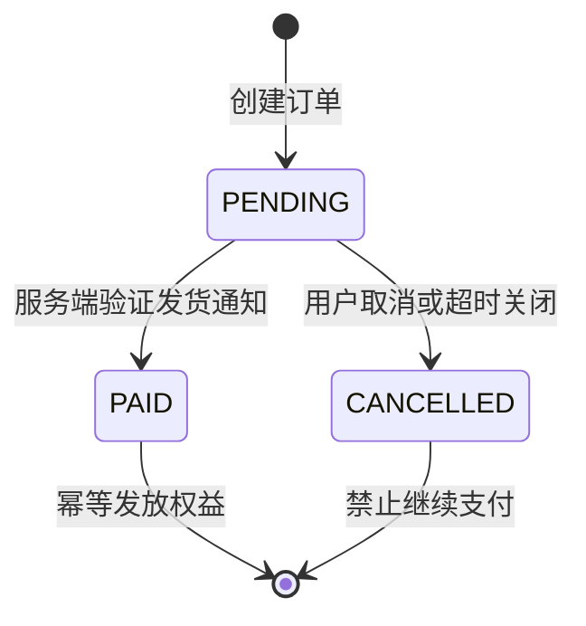

# 本次生产联调复盘：虚拟支付回调、订阅消息、时区与前端故障

本章把近期真实联调过程中的结论沉淀为一份发布 runbook，覆盖国内服务器、微信小程序消息推送、虚拟支付发货通知、SAS 回调、订阅消息、订单中心、时区和 AI 表情包前端体验。所有密钥均使用占位符；正式值只放服务器 `.env`。

## 1. 先启动后端，再配置微信消息推送

当前生产主路径：

```text
后端 .env → 启动 FastAPI → 公网 /health → GET Token 握手 → 微信后台保存 URL → 等待约 5 分钟传播 → 1 元真机验收
```

后台配置如下：

| 字段 | 值 |
| --- | --- |
| URL | `https://meme.tg-cc755.cn/api/wechat/msg_push` |
| Token | 服务端 `.env` 的 `WX_MSG_TOKEN`，不是 `XPAY_CALLBACK_TOKEN` |
| EncodingAESKey | 微信后台点击【随机生成】得到的 43 位值，保存到 `WX_MSG_AES_KEY` |
| 加密方式 | 当前联调：明文模式；切换安全模式需接入解密 SDK |
| 数据格式 | 当前联调：JSON；服务端建议兼容 XML |

服务器示例：

```bash
cd /root/02project/weixinpy310mememiniapp/backend
source /root/miniconda3/bin/activate weixinpy310mememiniapp
uvicorn app.main:app --host 127.0.0.1 --port 8290 --workers 2
curl -fsS https://meme.tg-cc755.cn/health
```

微信保存 URL 时会先发 GET：服务端按 `SHA1(sort(Token, timestamp, nonce))` 校验并原样返回 `echostr`。生产环境对错误签名应返回 403，而不是无条件返回 `echostr`。平台允许的用户消息和事件会转发到已配置地址，但这不等于后端可读取任意微信私聊内容；只处理平台定义的事件类型，并对非支付事件快速回成功。

## 2. 原生发货通知与 `/api/pay/notify` 不是同一个回调

原生 `wx.requestVirtualPayment` 的履约主路径是 `/api/wechat/msg_push`：解析 JSON/XML，校验业务订单、用户、环境、商品 ID、价格和数量，然后在事务中幂等地执行 `PENDING → PAID` 与额度/权限发放。

`/api/pay/notify` 只在接入 SAS/服务商信封回调时使用。服务商通常通过 `TC-Payment-Callback` 或控制台配置 URL，并要求使用独立的回调 Token；报文含 `eventType`、`event`、字符串 `payload`、`payEventSig`、`transactionId`、`outTradeNo`。签名是 `HMAC-SHA256(app_key, event + "&" + payload)`，成功回包为 `returnCode: "0"`、`data: "ok"`。参考：[腾讯云回调 API](https://intl.cloud.tencent.com/zh/document/product/1219/67644)、[回调签名](https://www.tencentcloud.com/document/product/1219/74865)、[虚拟支付发货实践](https://intl.cloud.tencent.com/zh/document/product/1219/74868)。

前端 success 只能触发一次状态刷新，不能直接增加额度。电脑扫码支付后额度仍是 0 时，按以下顺序排查：

1. 查数据库订单是否仍为 `PENDING`；
2. 查 Nginx/API 是否有 `/api/wechat/msg_push` 或 `/api/pay/notify` 请求；
3. 查虚拟支付后台是否打开道具发货推送，环境、OfferID、商品 ID、价格是否一致；
4. 使用平台“重试/重新发送发货通知”；
5. 保存原始报文、订单号、平台流水号后再定位，禁止重复付款或手工发货。

## 3. 订单中心、取消支付与中国时区

订单中心页面是 `pages/order/order`，查询接口是 `/api/user/orders`，两者都不是支付回调地址。推荐状态机：



用户取消收银台不应自动发货；继续支付要生成新的支付流水号，并在 `attach` 关联原业务订单，避免 iOS 重复订单号。SQLite 可以继续保存 UTC；API 输出统一转换为 `Asia/Shanghai`（UTC+8），前端不要二次加 8 小时，日志保留带偏移量的 ISO 8601 时间。

## 4. 订阅消息是离线提醒，不是支付回调

在小程序后台【功能 → 订阅消息】选择与“制作完成/任务完成/订单状态”匹配的模板，复制当前 AppID 的真实 `template_id`，同时写入后端和前端配置。前端必须在用户点击“开始制作/通知我”时调用 `wx.requestSubscribeMessage`；用户拒绝不能阻断任务。后端完成任务后调用 `cgi-bin/message/subscribe/send`，`page` 可跳转 `pages/order/order?order_id=...` 或结果页。

模板字段以实际模板为准；历史实现用过 `character_string1`、`thing2`、`time3`、`thing5`，不能照抄到新模板。`thing`、`phrase`、`character_string` 和 `time` 各有长度/格式约束，发送失败应记录告警并保留站内轮询。参考：[订阅消息接口与模板配置](https://www-sg.tencentcloud.com/zh/document/product/1219/57734)。

## 5. 前端和视频故障清单

| 现象 | 原因 | 修复策略 |
| --- | --- | --- |
| `@swc/runtime/_array_without_holes.js` 不存在 | ES5/SWC 转译注入了小程序包外 runtime | 关闭不必要的 ES5 编译，使用 `.slice()`、`.concat()`、`push()`，清理开发者工具缓存。 |
| `wx://not-found` | 页面、分包或组件路径/大小写不一致 | 检查 `app.json`、`usingComponents` 和页面四件套。 |
| 视频转 GIF 找不到 `ffmpeg` | tmux/systemd 的 `PATH` 未包含可执行文件 | `command -v ffmpeg` 获取绝对路径并注入服务环境，启动后打印 `shutil.which`。 |
| 合集数量大于屏幕可见数量 | 卡片横向滚动到右侧，固定高度留下空白 | 移动端改自适应两列/流式布局，稳定 `wx:key`，详情按 ID 去重；写入后使列表/精选/详情缓存失效。 |
| 结果页无法传播 | 只有保存按钮，没有预览和转发钩子 | 先展示图片/GIF/视频预览，再提供 `open-type="share"`、`onShareAppMessage`、保存相册和加入合集。 |
| 图片加字位置不一致 | 文本漂浮在图片外层 | 在服务端或 Canvas 中把文字合成到图片下方，保存、预览、分享使用同一产物。 |

小程序不能通过脚本直接把媒体注入好友聊天气泡；合规路径是预览 → 保存相册 → 用户在微信表情面板添加。分享卡片可以携带作品封面和“做同款”参数，但不要把它当成自动发消息接口。

## 6. 生产验收

```bash
python -m compileall -q backend
curl -fsS https://meme.tg-cc755.cn/health
```

完成 1 元测试后，必须同时留存：GET 握手日志、发货 POST 原文（脱敏）、平台流水号、订单状态变化、额度流水、订阅消息返回值和前端真机录屏。确认重复通知不会重复发货、时区没有二次转换、前端缓存不会显示旧合集后，才逐步开放正式档位。

