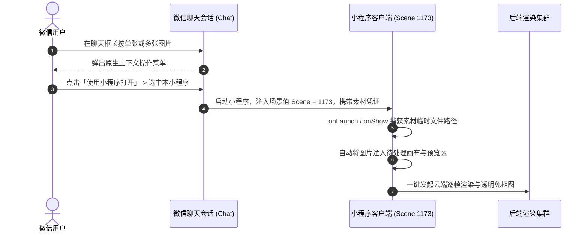
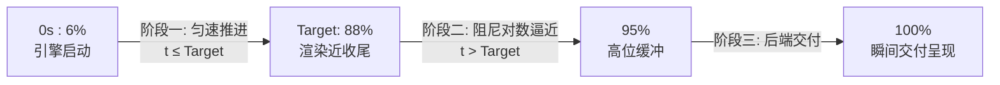

# 微信聊天素材原生拉起 (supportedMaterials 场景值 1173) 深度剖析与任务耗时动态拟合算法

在微信小程序的全栈开发中，如何通过微信生态的原生能力降低用户的使用门槛，以及如何在长达数分钟的后台计算中提供丝滑的用户等待体验，是衡量一款商业化工具产品成熟度的核心指标。

本章系统复盘两大在真实开发与提审过程中极具含金量的实战课题：
1. **微信聊天素材直接唤起小程序制作（`supportedMaterials` 原生协议与场景值 1173）**的全套技术实现与编译器踩坑；
2. **长耗时云端渲染任务的动态加权平均预估算法与双阶段平滑渐进进度条**实现方案。

---

## 1. 微信聊天中“长按图片 - 使用小程序打开”全景解析

### 1.1 业务场景与交互革命
传统工具小程序的交互路径极其冗长：
$$\text{微信好友发图} \longrightarrow \text{长按保存到手机相册} \longrightarrow \text{退出聊天} \longrightarrow \text{搜索打开小程序} \longrightarrow \text{点击上传并从相册勾选} \longrightarrow \text{制作}$$

而微信官方提供的**聊天素材快捷打开能力**，将全流程压缩为极致的一键直达：
$$\text{微信好友发图} \longrightarrow \text{长按图片} \longrightarrow \text{点击「使用小程序打开」} \longrightarrow \text{直接进入制作工作台并预置图像！}$$



### 1.2 官方配置协议：`supportedMaterials`

微信开放平台通过在小程序的全局配置文件 `app.json` 中声明 `supportedMaterials` 数组，向客户端系统注册该小程序支持接收的聊天素材类型：

```json
{
  "pages": [
    "pages/index/index",
    "pages/user/user"
  ],
  "supportedMaterials": [
    {
      "materialType": "image",
      "name": "制作动态表情包",
      "path": "pages/index/index"
    }
  ]
}
```

* **配置字段语义解析**：
  * `materialType`：素材类型，目前支持 `image`（图片）、`video`（视频）等；
  * `name`：微信聊天操作菜单中展示的小程序动作名称（建议 4~8 个汉字，如“制作动态表情包”）；
  * `path`：点击后直达的目标页面路由。

### 1.3 场景值 1173 与参数接收实战

当用户通过聊天素材唤起小程序时，微信分配的专用场景值为 **`1173`**。在 `app.js` 或页面的生命周期钩子中，可以通过 `wx.getEnterOptionsSync()` 获取传入的素材详情：

```javascript
// miniapp/app.js 或 pages/index/index.js
onShow(options) {
  const enterOptions = wx.getEnterOptionsSync();
  console.log('启动场景值:', enterOptions.scene);

  // 场景值 1173 代表用户从微信聊天素材列表长按打开
  if (enterOptions.scene === 1173) {
    const forwardMaterials = enterOptions.forwardMaterials || [];
    if (forwardMaterials.length > 0) {
      const targetMaterial = forwardMaterials[0];
      const tempFilePath = targetMaterial.path;
      
      console.log('捕获聊天素材图片:', tempFilePath);
      // 自动载入到当前编辑工作区
      this.setData({
        refImagePath: tempFilePath,
        mode: 'upload'
      });
      wx.showToast({ title: '已载入聊天图片', icon: 'success' });
    }
  }
}
```

### 1.4 开发者踩坑血泪实录：本地编译报错 `invalid app.json ["supportedMaterials"]`

在实际工程落地中，开发者在 `app.json` 中配置了该字段后，往往会在微信开发者工具中遭遇当头一棒：
```text
[编译错误] Error: invalid app.json ["supportedMaterials"]
at validator (app.json:28)
编译失败，请检查 app.json 语法规范
```

* **根本诱因剖析**：
  1. **开发者工具 Schema 滞后**：微信开发者工具内部的静态 JSON Schema 校验字典更新频率与微信客户端线上底层能力存在脱节，部分较旧版本的工具链未将 `supportedMaterials` 纳入本地白名单校验；
  2. **类目与资质灰度限制**：该能力属于平台灰度开放的系统级扩展能力。部分主体类别（如无图像处理类目的普通个人小程序）未经后台后台配置授权前，本地构建器会直接将其判定为“未定义字段”并阻断编译。
* **生产级化解策略**：
  - **提审阶段稳妥方案**：若开发者工具报错阻断打包，提审包中暂不硬编码 `supportedMaterials`，先通过【工具 - 图片处理】类目与标准功能过审；
  - **上线后申请扩展**：在微信公众平台后台【功能】➔【硬件与扩展能力】中申请“聊天素材打开”权限，获批后开启开发者工具“增强编译”并升级至最新 Nightly/RC 版本构建。

---

## 2. 长耗时任务动态拟合算法与平滑进度条

### 2.1 痛点复盘：为什么之前总卡死在“预计共 90s”？

在制作高质量 16 帧 GIF 动图或执行复杂 AI 抠图时，云端通常需要经历：
$$\text{人像/宠物定位} \longrightarrow \text{深度分帧生成} \longrightarrow \text{Alpha 遮罩抠图} \longrightarrow \text{色彩空间量化 (Quantization)} \longrightarrow \text{GIF 打包封装}$$

在单个 GPU 节点上，该流程根据服务器瞬时负载，通常耗时在 **170 秒 ~ 260 秒** 之间。

然而，在早期版本中，用户界面上却始终一成不变地显示：
> `已耗时 120 秒 · 预计共 90 秒`

用户看到已耗时已经远远超过预计时间，容易产生“程序卡死/崩溃”的挫败感，从而关闭小程序造成用户流失。

#### 🐛 根因代码破案：
排查后端代码 [backend/app/database.py](file:///root/02project/weixinpy310mememiniapp/backend/app/database.py) 发现罪魁祸首：
```python
def get_estimated_generation_duration() -> float:
    with get_db() as conn:
        cursor = conn.cursor()
        cursor.execute('''
            SELECT AVG(duration_seconds)
            FROM (
                SELECT duration_seconds FROM meme_tasks
                WHERE status = 'completed' AND duration_seconds > 0
                ORDER BY rowid DESC LIMIT 10
            )
        ''')
        row = cursor.fetchone()
        if row and row[0] is not None and float(row[0]) > 0:
            avg_sec = float(row[0])
            # 【致命硬编码】：这里的人为截断把上限死死封锁在了 90.0 秒！
            return max(15.0, min(90.0, round(avg_sec, 1)))
    return 32.0
```
数据库中最近 10 次任务的真实耗时平均值为 **177.4 秒**，但由于 `min(90.0, ...)` 的存在，所有真实数据被无情截断成了 `90.0`！

### 2.2 自适应动态加权平均算法

移除 90 秒的人为封顶，将截断阈值扩展为 `max(15.0, min(360.0, round(avg_sec, 1)))`，并结合移动平均（Moving Average）动态反馈当前的 GPU 算力负载：

```python
# backend/app/database.py
def get_estimated_generation_duration() -> float:
    """从 SQLite 数据库动态获取最近 10 次已完成任务的实际运行耗时平均值"""
    with get_db() as conn:
        cursor = conn.cursor()
        cursor.execute('''
            SELECT AVG(duration_seconds)
            FROM (
                SELECT duration_seconds FROM meme_tasks
                WHERE status = 'completed' AND duration_seconds > 0
                ORDER BY rowid DESC LIMIT 10
            )
        ''')
        row = cursor.fetchone()
        if row and row[0] is not None and float(row[0]) > 0:
            avg_sec = float(row[0])
            # 真实反映近期平均耗时，合理范围放开至 15s ~ 360s
            return max(15.0, min(360.0, round(avg_sec, 1)))
    # 若冷启动无历史数据，默认给出 120 秒合理预期
    return 120.0
```

* **运行验证**：修复后服务端直接输出：
  ```text
  Estimated duration: 177.4
  ```
  准确向客户端宣告：“当前服务器处理该类任务平均需要 177.4 秒（约 3 分钟）”，彻底消除信息偏差。

### 2.3 双阶段平滑渐进进度条（Smooth Progress Bar）

为了避免用户在长达 3 分钟的等待中感到焦虑，前端绝对不能使用“原地打转的 Spinner”，也不能直接跳跃百分比，而是设计了一套**双阶段数学拟合曲线**：



```javascript
// miniapp/pages/index/index.js
startSmoothProgressBar(estDuration) {
  if (this.smoothTimer) clearInterval(this.smoothTimer);

  const targetSeconds = Math.max(15, estDuration || 120);
  const startTime = Date.now();

  this.setData({
    elapsedSeconds: 0,
    estimatedSeconds: targetSeconds,
    progress: 6,
    stageText: '极速渲染引擎启动中...'
  });

  this.smoothTimer = setInterval(() => {
    if (!this.data.isGenerating) {
      clearInterval(this.smoothTimer);
      return;
    }

    const elapsed = Math.floor((Date.now() - startTime) / 1000);
    let p = 6;

    if (elapsed < targetSeconds) {
      // 阶段一：在预估时间内，从 6% 线性平滑递增至 88%
      p = Math.min(88, Math.round(6 + (elapsed / targetSeconds) * 82));
    } else {
      // 阶段二：超出预估时间，启用阻尼递增，最高逼近 95%，绝不提前达到 100%
      const extra = elapsed - targetSeconds;
      p = Math.min(95, Math.round(88 + (extra / 45) * 7));
    }

    // 动态分镜状态机文本展示
    let stage = this.data.stageText;
    if (p < 25) {
      stage = '正在解析形象并构建动态分镜...';
    } else if (p < 55) {
      stage = `正在逐帧生成 16 帧动作序列...`;
    } else if (p < 85) {
      stage = '正在进行色彩量化与 GIF 编码封装...';
    } else {
      stage = '动图生成完毕，正在同步云存储分发...';
    }

    this.setData({
      progress: p,
      elapsedSeconds: elapsed,
      stageText: stage
    });
  }, 1000);
}
```

### 2.4 离线不丢任务与完成耗时精确反馈

1. **离开小程序后台持续运行保障**：
   - 任务启动时，将 `taskId` 与发起时间戳存入本地 `wx.setStorageSync('active_meme_task', { taskId, timestamp })`；
   - 用户退出小程序、切换微信聊天或锁屏，后端 GPU 集群持续运算；
   - 用户稍后再次打开小程序，`onShow` 中的 `checkResumeActiveTask()` 自动读取本地存储并无缝恢复轮询，彻底解放用户注意力；
2. **任务完成精确耗时呈现**：
   - 任务完成时，后端在响应体中附带精确的 `duration_seconds`（如 `220.0`）；
   - 前端记录并在结果区与 Toast 中精确反馈：
     ```javascript
     onGifLoaded() {
       this.setData({ gifLoaded: true });
       const sec = this.data.completedSeconds || this.data.elapsedSeconds || 0;
       const msg = sec > 0 ? `制作完成，共耗时 ${sec} 秒！` : '制作完成，可保存相册！';
       wx.showToast({ title: msg, icon: 'success', duration: 2500 });
     }
     ```
   - 页面标头展示：`制作成功 · 共耗时 220 秒`。用户对于时间的把控极其清晰透明。

---

## 3. 生产环境运维避坑：Nginx 502 Bad Gateway 快速定位

### 3.1 真实排错场景
开发或重启远程服务器时，前端控制台频繁爆出：
```text
GET https://meme.tg-cc755.cn/api/user/profile 502 (Bad Gateway)
(env: Windows, mp, 2.02.2608060; lib: 3.17.2)
```

### 3.2 诊断与定位流程
1. **检查 Nginx 反代配置**：
   查看 `/etc/nginx/sites-enabled/` 下的配置：
   ```nginx
   location /api/ {
       proxy_pass http://127.0.0.1:8290/;
       proxy_set_header Host $host;
   }
   ```
   发现 Nginx 将外部请求转发到了本机的 **`8290`** 端口；
2. **检查当前服务端口监听**：
   运行 `ps aux | grep uvicorn` 或 `netstat -tlpn | grep 8290`：
   - 若发现 uvicorn 进程由于手动测试被误启动在默认端口 `8000`，而 8290 端口上根本没有进程在监听，Nginx 自然只能返回 `502 Bad Gateway`！
3. **极速修复规范**：
   统一在专属 Tmux 会话中启动 Uvicorn，明确指定端口为 **8290**：
   ```bash
   uvicorn app.main:app --host 0.0.0.0 --port 8290
   ```
   启动后使用 `curl -I http://127.0.0.1:8290/api/templates` 验证本地返回 200 OK，即可瞬时恢复线上服务。

---

## 4. 本章小结

本章所沉淀的技术方案，从产品层面（`supportedMaterials` 聊天素材唤起）、交互体验层面（自适应平均耗时与平滑渐进进度条）、以及生产稳定性层面（Nginx 端口一致性与离线任务恢复），共同筑起了一座高效、高可用、高转化的商业化小程序坚实底座。
