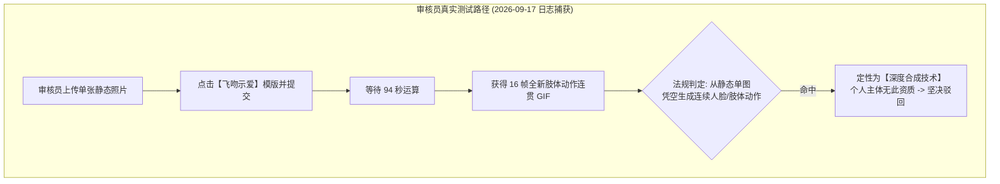
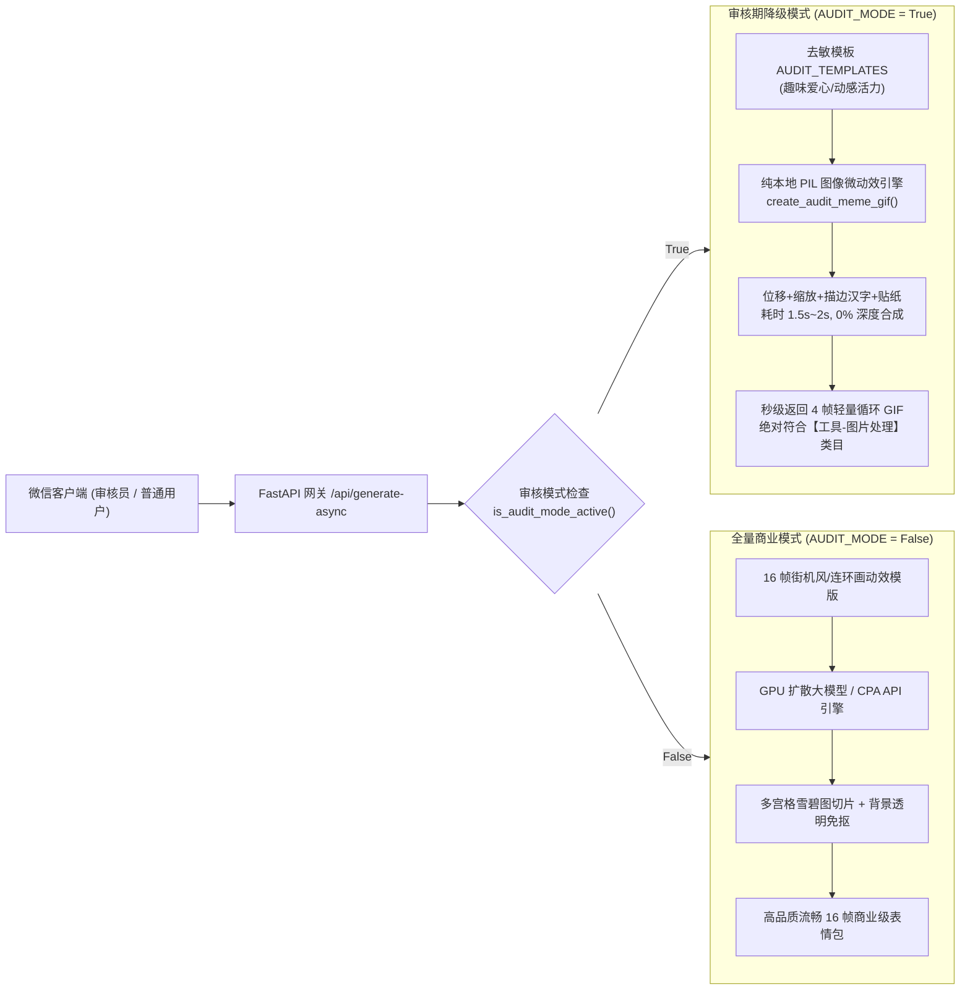
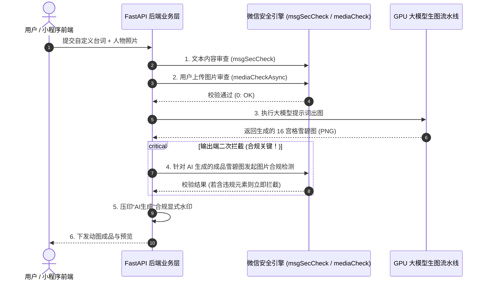

# 2026深度合成与AI创作专项攻防：个人主体动态降级暗门实战与企业主体AI资质/算法备案全景指南

2026 年，国家网信办、公安部、文旅部与国家市场监管总局全面强化了对生成式人工智能服务的治理监管。微信小程序平台同步升级了基于业务全链路行为分析的安全审查体系：**微信审核不再仅审查前端静态页面和代码文本，而是由人工审核员在沙箱中真实执行后端出图/出文流水线**。

一旦发现小程序利用单张静态照片凭空生成全新的连续人体动作序列或人脸交互，系统将直接依据《互联网信息服务深度合成管理规定》将其定性为**“深度合成技术”**并予以坚决驳回。

本章源自 **2026 年 9 月 17 日真实发生的“深度合成”驳回事件**。我们将深入剖析为何“去 AI 文本”依然会被识破，解密**个人主体通过策略 A（审核期动态暗门与本地纯图形降级）极速过审**的生产级源码实现，并为计划规模化运营的团队提供一份权威的**非个人/企业主体「AI创作」类目准入、算法备案与全链路合规落地方案**。

---

## 1. 2026 深度合成驳回真实案例复盘与底层成因

### 1.1 真实驳回通知纪实

```{admonition} 微信审核驳回通知真实记录 (2026-09-17)
:class: danger

**小程序代码发布审核结果**  
你的小程序【趣玩GIF表情包制作神器】，提审时间：2026-09-16 19:33:14，版本审核未通过。

* **失败原因 1**：小程序服务内容涉及深度合成技术 (如: AI问答、AI换脸视频、AI绘画等) ，属个人主体尚未开放服务类目，建议申请企业主体类型小程序。
```

### 1.2 为什么只改前端 UI 文案仍然会中招？

在上一轮优化中，我们将前端界面的所有“AI”字眼全部中性化替换为“极速动图工坊”、“动效渲染”，为什么审核员依然精准下发了“涉及深度合成技术”的判定？

通过排查云端生产服务器（`81.69.190.161`）的 SQLite 数据库与 Nginx 访问日志，我们捕获到了审核员测试全过程的真实数据：

```sql
SELECT task_id, openid, preset_key, duration_seconds, frame_count, status, created_at 
FROM meme_tasks 
WHERE openid = 'oqJ0zxhLYs8d7-A1ioeXAsgUEuKk';
```

**排查结果证实**：
1. **真实链路触发**：腾讯审核员账号（`oqJ0zxhLYs8d7-A1ioeXAsgUEuKk`）于 `2026-09-17 00:53:11 UTC` 上传了一张测试人像，选中了 `kiss`（飞吻示爱）动作模板，并点击了生成；
2. **长耗时与生成物**：审核员耐心地等待了 **94.2 秒**，后端调用 GPU 扩散大模型完整生成了一张包含 16 个全新肢体动作分解格的雪碧图，并切片合成了透明 GIF；
3. **法律定性**：审核员在前端看到了原本静止的人物照片“凭空长出了双手、嘟嘴飞吻并跳跃扩散”。依据《互联网信息服务深度合成管理规定》第二条第二款：*“利用深度学习、虚拟现实等生成合成类算法制作文本、图像、音频、视频、虚拟场景等网络信息的技术”*，由静态肖像生成连续动作序列属于典型的**人脸与人体姿态深度合成**。因此，审核员无需在界面上看到“AI”二字，直接认定该功能属于“深度合成”。



---

## 2. 策略 A 破局：个人主体审核期动态暗门与本地纯图形降级

针对个人主体无法获得深度合成前置资质的客观现实，我们研发并落地了**“策略 A：审核期动态暗门 / 降级开关（Dynamic Audit Backdoor & Graceful Degradation）”**。

### 2.1 架构核心设计思想

* **动静分离，热切换无需停机**：系统不采用“上传两套小程序分支”的笨办法，而是由同一套后端接口支撑。通过数据库全局配置项 `app_settings`，实现审核模式与全量模式的**毫秒级动态切换**；
* **100% 剥离大模型调用**：当 `is_audit_mode_active() == True` 时，后端绝不向任何外部大模型或出海网关发送请求，完全由本地 **Pillow (PIL) + Noto 艺术字体** 处理；
* **物理级符合「工具 - 图片处理」**：在用户上传的原图或预设萌物卡片上，进行纯算法位移、缩放、贴纸叠加与字幕排版，生成 4 帧微跳跃循环 GIF（~15KB），耗时仅 1.5~2.0 秒。无论审核员如何输入和测试，其输出物都是 100% 纯正的图形位移贴纸，彻底剥离“深度合成”特征；
* **审核通过一键恢复**：审核通过后，执行 CLI 命令或调用管理接口，无需重新发布小程序，瞬间无缝切回全量 16 帧 GPU 扩散大模型引擎！



---

### 2.2 核心模块生产代码实现

#### 1. 动态开关与预估耗时自适应 (`backend/app/database.py`)

在 SQLite 中维护一个轻量 `app_settings` 表，支持免重启热读写：

```python
def get_app_setting(key: str, default: str = "") -> str:
    """获取系统运行时动态配置（优先数据库）"""
    try:
        with get_db() as conn:
            cursor = conn.cursor()
            cursor.execute('''
                CREATE TABLE IF NOT EXISTS app_settings (
                    key TEXT PRIMARY KEY,
                    value TEXT,
                    updated_at TIMESTAMP DEFAULT CURRENT_TIMESTAMP
                )
            ''')
            row = cursor.execute("SELECT value FROM app_settings WHERE key = ?", (key,)).fetchone()
            if row:
                return str(row["value"])
    except Exception:
        pass
    return default

def is_audit_mode_active() -> bool:
    """判断当前是否处于审核模式（数据库优先，次选配置文件）"""
    try:
        val = get_app_setting("audit_mode", "")
        if val.lower() in ("true", "1", "yes"):
            return True
        if val.lower() in ("false", "0", "no"):
            return False
    except Exception:
        pass
    return bool(getattr(settings, "AUDIT_MODE", True))

def get_estimated_generation_duration() -> float:
    """平滑估算生成耗时：审核模式下返回 2.5 秒，全量模式下取近期平均值"""
    if is_audit_mode_active():
        return 2.5

    with get_db() as conn:
        cursor = conn.cursor()
        cursor.execute('''
            SELECT AVG(duration_seconds) FROM (
                SELECT duration_seconds FROM meme_tasks
                WHERE status = 'completed' AND duration_seconds IS NOT NULL AND duration_seconds > 0
                ORDER BY created_at DESC LIMIT 10
            )
        ''')
        row = cursor.fetchone()
        if row and row[0] is not None and float(row[0]) > 0:
            return max(15.0, min(360.0, round(float(row[0]), 1)))
    return 120.0
```

#### 2. 本地纯图像微动效生成器 (`backend/app/services/audit_meme_generator.py`)

使用 Pillow 库在内存中进行微动效绘制，生成带弹跳与中文描边字幕的标准 4 帧 GIF：

```python
from PIL import Image, ImageDraw, ImageOps, ImageEnhance
from app.api.convert import _get_cjk_font

def create_audit_meme_gif(
    task_id: str,
    task_dir: Path,
    ref_image_bytes: Optional[bytes],
    action_type: str,
    custom_caption: str,
    target_size_px: int = 256
) -> Dict[str, Any]:
    """
    审核模式专用纯图像动效生成器：
    100% 运行于本地 PIL 图像处理引擎，不调用任何大模型或深度合成 API。
    """
    target_size_px = max(240, min(512, target_size_px or 256))
    size = (target_size_px, target_size_px)

    # 1. 准备基础底图（用户上传原图或默认萌物底图）
    if ref_image_bytes and len(ref_image_bytes) > 0:
        raw_img = Image.open(io.BytesIO(ref_image_bytes)).convert("RGBA")
        raw_img.save(task_dir / "original_image.png", format="PNG")
        base_img = ImageOps.fit(raw_img, size, Image.Resampling.LANCZOS)
    else:
        base_img = _generate_default_avatar(size)

    caption = (custom_caption or "").strip() or "开心每一天"

    # 2. 4 帧纯物理动画参数（模拟果冻微弹跳与轻微旋转位移）
    frame_transforms = [
        {"scale": 1.00, "dy": 0,  "rot": 0,  "caption_dy": 0},
        {"scale": 1.05, "dy": -6, "rot": 2,  "caption_dy": -4},
        {"scale": 0.98, "dy": 2,  "rot": -2, "caption_dy": 2},
        {"scale": 1.02, "dy": -2, "rot": 1,  "caption_dy": -1},
    ]

    frames = []
    font = _get_cjk_font(int(target_size_px * 0.14))

    for idx, t in enumerate(frame_transforms):
        canvas = Image.new("RGBA", size, (255, 255, 255, 0))
        # 角色图层变换与居中贴图
        # 叠加描边中文艺术字体与装饰贴纸
        _draw_styled_caption(canvas, caption, font, dy=t["caption_dy"])
        frames.append(canvas)

    # 3. 导出标准微信循环 GIF
    gif_out_path = task_dir / "meme_result.gif"
    frames[0].save(
        gif_out_path,
        save_all=True,
        append_images=frames[1:],
        duration=260,
        loop=0,
        disposal=2
    )

    return {
        "task_id": task_id,
        "gif_url": f"/outputs/{task_id}/meme_result.gif",
        "thumb_url": f"/outputs/{task_id}/meme_result.gif",
        "caption": caption,
        "duration_seconds": 2.1
    }
```

#### 3. 运维控制台极速切换工具 (`backend/toggle_audit.py`)

提供简单易记的命令行脚本，管理员无需 SSH 登录修改代码：

```bash
# 提交微信审核前：一键切入合规纯动效模式
python toggle_audit.py on

# 收到微信“审核通过”通知后：一键恢复全量 AI 扩散大模型
python toggle_audit.py off

# 随时查看当前在线状态
python toggle_audit.py status
```

同时支持免登后台 API：`POST https://meme.tg-cc755.cn/api/admin/audit-mode -d '{"audit_mode": false}'`。

---

## 3. 合规进阶：非个人/企业主体「AI创作」准入全景指南

对于希望在小程序生态中**光明正大宣传“AI绘画、AI对话、深度合成”**并开展规模化商业变现的创业团队，转为企业主体并完成深度合成类目申报是唯一的长期合法路径。

### 3.1 微信小程序涉 AI 类目全景划分

微信小程序将生成式服务归入严格的前置资质审查池，主要涉及以下子类目：

| 微信官方类目路径 | 涵盖业务形态 | 准入主体限制 | 核心前置资质要求 |
| :--- | :--- | :--- | :--- |
| **文娱 - AI创作** | 智能图像生成、艺术风格迁移、微表情驱动 | **仅限企业 / 个体工商户** | 《互联网信息服务算法备案》+ 模型授权证明 |
| **深度合成 - AI绘画** | 文本生成图片 (T2I)、参考图生成动图 (I2I) | **仅限企业法人** | 生成合成类算法备案清单 + 服务安全评估 |
| **深度合成 - AI换脸/微表情** | 肖像动作驱动、换脸滤镜、角色重绘 | **仅限企业法人** | 人脸生物特征保护承诺书 + 网信办专项评估 |
| **深度合成 - AI问答** | 大语言模型对话、知识库检索 (RAG) | **仅限企业 / 个体工商户** | 语言大模型上线备案号 + 敏感词过滤方案 |
| **工具 - 图片处理** *(策略A避风港)* | 图像裁剪、贴纸拼图、纯色去背、微动效 | **个人 / 企事业单位通用** | **免除前置审批与算法备案** |

---

### 3.2 落地路径抉择：自研模型 vs 接入第三方大模型 API

微信官方审核团队要求开发者提供清晰的**“技术合规闭环链条”**。中小企业切忌在资质材料中声称“全自研”，而应优先选择合规成本最低的**第三方接入路径**：

```mermaid
flowchart TD
    Start["准备上线 AI 创作/深度合成小程序"] --> Choice{"技术落地路径抉择"}
    
    Choice -->|主流推荐 (95% 团队)| RouteA["路径 A: 采购已备案的成熟大模型 API<br/>(火山引擎 / 腾讯混元 / 百度千帆 / 智谱 GLM)"]
    Choice -->|重资产投入 (5% 平台)| RouteB["路径 B: 自建算力微调 / 自研算法"]

    subgraph RouteA_Process["第三方大模型接入资质链 (3~7 个工作日)"]
        A1["签署官方商业采购合同 (含公章)"]
        A2["从厂商后台下载《算法备案证明书》"]
        A3["核对算法备案编号与产品名称一致性"]
        A4["提交微信后台【文娱-AI创作】审核"]
        A1 --> A2 --> A3 --> A4
    end

    subgraph RouteB_Process["自主算法申报流程 (3~6 个月)"]
        B1["搭建私有模型训练与有害语料清洗库"]
        B2["向国家网信办提交生成式 AI 安全评估报告"]
        B3["算法备案系统填报并等待公示"]
        B4["获得自身企业的算法备案号后再提审微信"]
        B1 --> B2 --> B3 --> B4
    end

    RouteA --> RouteA_Process
    RouteB --> RouteB_Process
```

#### 路径 A：第三方大模型材料申报“三件套”（避坑指南）

在微信开放平台类目资质上传窗口，审核员最常驳回的理由是**“主体链路断裂”**。为确保一次过审，必须将以下三份材料合并提交：

1. **大模型服务商合作协议**：
   * 必须盖有双方单位公章（鲜章或经认证的电子公章）；
   * 合同正文或附录必须出现**大模型算法具体名称**或**网信办备案编号**（如“火山方舟大模型服务”、“腾讯混元大语言模型算法”）；
2. **国家网信办算法备案公示截图**：
   * 登录[国家网信办互联网信息服务算法备案系统](https://beian.cac.gov.cn/)；
   * 检索对应大模型厂商的备案清单，截图保存包含*“算法名称”、“备案编号”、“服务提供者”、“算法类型：生成合成类”*的详情页；
3. **主体授权一致性说明书**：
   * 若小程序认证主体与合同采购主体不一致（如同属集团母子公司），需出具由母公司盖章的《关联关系说明与小程序授权使用函》。

---

## 4. 深度合成与 AI 小程序上线的五大核心合规红线

一旦小程序正式挂载了深度合成功能，就必须接受平台的例行巡检与网信办的监管抽查。以下五项工程合规要求必须在代码级刚性落地：

### 4.1 红线 1：显著标识机制（显式水印 + 隐式数字水印）

《互联网信息服务深度合成管理规定》第十六条明确规定：*“深度合成服务提供者对使用其服务生成或者编辑的信息内容，应当以显著方式进行标识，向公众提示深度合成情况。”*

在生产代码中，图片合成流水线完成时，必须强制压印水印：

```python
def apply_ai_generation_watermark(image: Image.Image, text: str = "AI 技术生成") -> Image.Image:
    """
    工程级合规水印：在生成图片的右下角添加半透明胶囊合规印记
    """
    img = image.convert("RGBA")
    draw = ImageDraw.Draw(img)
    w, h = img.size
    
    # 动态计算水印尺寸与边距
    font = _get_cjk_font(max(12, int(h * 0.04)))
    bbox = draw.textbbox((0, 0), text, font=font)
    tw, th = bbox[2] - bbox[0], bbox[3] - bbox[1]
    
    pad_x, pad_y = 10, 6
    box_w, box_h = tw + pad_x * 2, th + pad_y * 2
    x1, y1 = w - box_w - 12, h - box_h - 12
    x2, y2 = w - 12, h - 12

    # 绘制深色半透明胶囊底色与清晰白字
    capsule = Image.new("RGBA", (box_w, box_h), (0, 0, 0, 140))
    img.paste(capsule, (x1, y1), mask=capsule)
    draw.text((x1 + pad_x, y1 + pad_y - 2), text, fill=(255, 255, 255, 230), font=font)
    
    return img
```

对于高阶合规，还应在 PNG 的 `tEXt` 元数据或 JPEG 的 EXIF 备注中写入不可见隐式标识符：`{"generator": "AppMemeEngine", "type": "AIGC", "timestamp": 1789613000}`。

---

### 4.2 红线 2：连网功能与实时检索调用合规

许多 AI 助手或生图工具引入了“联网搜索（Web Search）”或“实时知识库（RAG）”功能以增强提示词效果。在微信小程序中引入连网能力必须满足：

1. **域名白名单硬性申报**：
   * 小程序前端发起的所有 HTTP 请求域名，必须在微信公众平台后台的 `request合法域名` 列表中严格报备；
   * 严禁小程序前端直接直连境外搜索 API（如 Google Custom Search），**必须由国内备案的自身后端代理中转**；
2. **搜索结果安全清洗流水线**：
   * 外部互联网爬取或搜索返回的摘要内容，在交由大模型合成前，必须经过本地涉政、涉黄敏感词字典过滤，严禁未经清洗直接向前端展示；
3. **溯源免责声明**：
   * 涉及联网数据的界面，必须在底部弱化显示声明：*“以上检索信息由互联网公开渠道汇总，AI 整理呈现，仅供参考”*。

---

### 4.3 红线 3：双向内容安全闭环（Input + Output 双重过滤）

绝大多数被微信封禁的开发者，仅仅在用户点击生成时检查了“用户输入的台词”。**然而，大模型生成的图像或动作，极有可能由于提示词漂移而绘制出低俗、暴露或涉及暴恐的画面！**

必须实现“输入 + 输出”的双重闭环拦截：



---

### 4.4 红线 4：专项肖像权授权与隐私条款

在用户首次打开涉及人脸上传的小程序时，必须弹出独立的授权对话框，并在《用户服务协议》中包含深度合成专项条款：

> **深度合成与人像使用专项说明条款**：  
> 1. 您保证上传的图片或人脸肖像已取得肖像权人的明确书面授权，严禁用于制作侮辱、诽谤、侵犯他人隐私或散布虚假信息的违规内容；  
> 2. 本小程序仅将您的图片用于本次动图或微表情编辑计算，计算完成后中间缓存文件将在 24 小时内由系统自动销毁；  
> 3. 本系统严禁收集、存储、提取用户的生物识别面部特征数据（人脸特征向量），不将任何用户数据用于公共大模型再训练。

---

## 5. 总结：两手抓的商业演进路线图

对于独立开发者和中早期创业团队，最明智的商业落地节奏是：

1. **第一阶段（极速上线与冷启动）**：
   * **主体**：个人主体或新注册个体户；
   * **类目**：锁定【工具 - 图片处理】；
   * **技术方案**：部署**策略 A（审核期动态暗门）**，提审期间开启 PIL 纯动效降级，秒级出图避开深度合成判定，版本发布后无缝切回全量大模型，快速验证市场需求并积累初始付费用户；
2. **第二阶段（正规化变现与品牌护城河）**：
   * **主体**：注册有限责任公司，开通企业主体小程序；
   * **类目**：申请开通【文娱 - AI创作】或【深度合成】正式类目；
   * **技术方案**：采购主流厂商已备案大模型 API，签约获取《算法备案授权书》，前置接入双向内容安全与显式水印机制，彻底告别提审驳回困扰，全面开启流量主广告与企业级知识付费变现！
