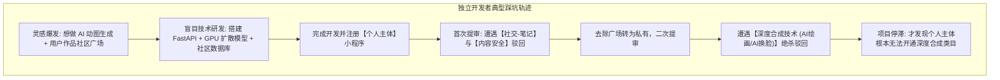
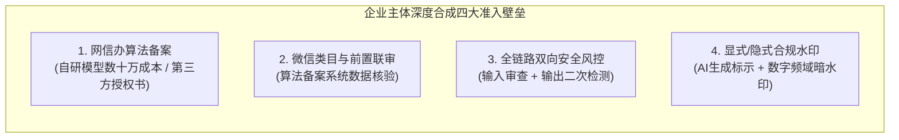
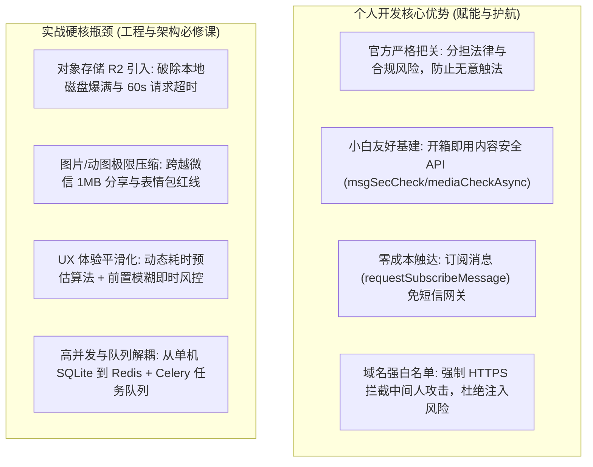
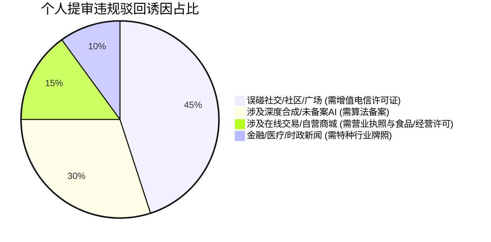
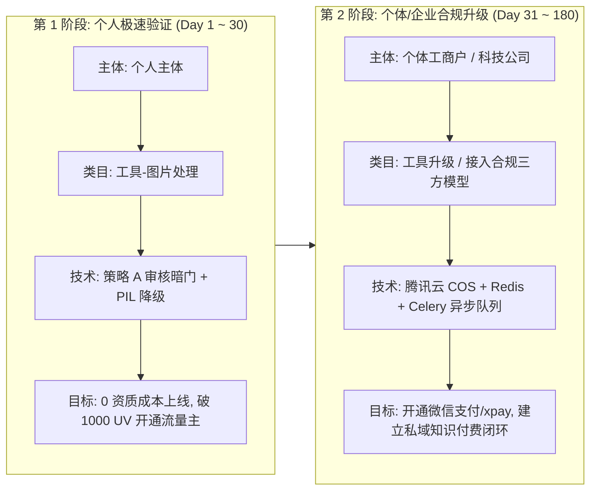

# 微信小程序生态实战全景复盘：个人开发者得失权衡、AI深度合成准入高墙与全量免资质类目权威对照表

在微信小程序从 0 到 1 的真实全栈研发与商业变现过程中，**90% 以上的技术开发者走过的最深痛的弯路，往往不是算法或架构写不出来，而是“埋头写了数万行代码，提交审核时才发现平台规则与法规政策根本不允许个人上线”**。

从最初的“做个 AI 动图生成与表情包广场社区”，到提审遭遇“**社交-笔记类目越界**”、“**内容安全未闭环**”以及“**深度合成技术属个人主体未开放服务类目**”的多轮重击，这一系列真实攻防让我们深刻认识到：**小程序的商业价值不仅在代码本身，更在于对平台生态边界、法规红线以及架构适配成本的精准掌控**。

本章源自真实生产环境下的踩坑与突破实录，全面复盘个人开发者在微信生态中的得与失，深度拆解企业主体在深度合成/AI创作领域面临的资质高墙，并结合**微信官方最新服务类目规范**，系统梳理出**个人主体可直接上线、免任何特殊资质的全量开放类目矩阵**，为独立开发者与早期创业团队提供一份坚实、清晰的航标图。

---

## 1. 真实踩坑实录：不查规则起步的血泪教训

许多技术背景浓厚的独立开发者习惯以“产品功能完备性”为第一导向，往往在本地完成架构搭建、引入大模型 API、做完前后端交互后，才兴冲冲地注册个人小程序并打包提审。然而，微信生态与常规的 Web 网站或境外 App 托管有着本质的不同——**它运行在高度受监管的封闭生态之中，有着极其严格的资质准入审查机制**。



### 1.1 盲区一：误将“UGC 内容沉淀”做成“社交社区”

在最初的设计构想中，我们希望用户生成的 GIF 动图能够沉淀在“公共表情广场”，供其他用户浏览、点赞、保存或二次创作。然而提审时官方直接判定：

> **驳回原因**：你好，你的小程序涉及用户自行生成内容（文字、图片、音频）的记录、分享，属【社交 - 笔记】范畴。

在我国互联网监管法规中，“用户生成内容（UGC）公开展示、互动评论、信息发布”属于**BBS 论坛/社区交友范畴**，微信要求运营主体必须持有省通信管理局颁发的**《中华人民共和国增值电信业务经营许可证》（ICP 许可证 / EDI 许可证）**。这项资质要求企业注册资本不低于 100 万元人民币，个人主体或无资质团队无论如何都无法申请。

### 1.2 盲区二：无资质触碰“AI创作与深度合成”

当把社区砍掉，改为纯工具化生成后，微信审核员在真实沙箱中上传单张照片，等待 90 秒后生成了 16 帧全新肢体动作的连贯飞吻动图，随即下发驳回通知：

> **驳回原因**：小程序服务内容涉及深度合成技术（如：AI问答、AI换脸视频、AI绘画等），属个人主体尚未开放服务类目，建议申请企业主体类型小程序。

依据《互联网信息服务深度合成管理规定》（国家互联网信息办公室、工业和信息化部、公安部联合令第 12 号），**利用深度学习或虚拟现实算法制作、生成人脸、人体姿态或全新图像内容，全部属于深度合成范畴**。微信对个人主体完全关闭了该类目的提审大门。

```{admonition} 核心认知觉醒：合规驱动开发 (Compliance-Driven Development)
:class: danger

在微信生态中，**“合规前置分析”必须先于“第一行代码的编写”**！  
如果方向触碰了个人主体的法规红线，哪怕后端的 GPU 调度多优雅、前端 Canvas 渲染多流畅，最终也只能变成无法见光的死代码。
```

---

## 2. 企业主体 vs 个人主体：深度合成高墙与微信生态降维优势

面对个人主体的限制，很多开发者的第一反应是：“那我就去注册一个个体工商户或有限责任公司，用企业主体上架，是不是就能自由开发 AI 产品了？”

答案是：**即使拥有企业主体，在深度合成与 AI 创作赛道，前置审核依然是一座让无数中小微企业望而却步的高山**。

### 2.1 企业主体做深度合成的“四大准入高墙”

企业主体想要合规上线深度合成类小程序，必须跨越极其严苛的行政与技术壁垒：



1. **国家网信办算法备案与安全评估**：
   * **自研模型路线**：需向省级网信办提交深度合成算法备案，提供完整的数据集来源合法性证明、算法逻辑说明、防沉迷与防欺诈机制、人工审核团队资质及专业的第三方安全评测报告。整套流程历时通常 3~6 个月以上，综合开销数十万元；
   * **调用第三方 API 路线（如文心、混元、商汤、智谱、Kimi 等）**：小程序必须提供第三方大模型原厂商加盖鲜章的**《算法备案授权书》**、**大模型服务协议**以及**该模型在网信办已获批的算法备案编号**。许多小模型聚合商或境外大模型（如 OpenAI、Midjourney）由于无法取得国内网信办备案号，在微信审核中会被**一票否决**。
2. **监管平台系统级数据比对**：
   微信审核团队与国家网信办算法备案库保持系统级同步。提审时填写的算法名称、备案号必须与提交的企业主体名称、统一社会信用代码完全一致，任何借壳、套牌行为均会被系统识别并封禁。
3. **全链路双向内容安全闭环**：
   企业不能仅在前端用户输入阶段做敏感词拦截，**必须在模型生成结果输出后，再次调用多媒体内容检测 API（如 `mediaCheckAsync`）进行二次把关**，严防“提示词正常但大模型幻觉生成涉黄涉暴图像”。
4. **强制性标识与溯源责任**：
   依照《生成式人工智能服务管理暂行办法》第十二条，生成的图片、视频必须压印**显式“AI生成”字样水印**，并在文件元数据中嵌入**不可见隐式数字盲水印**以备追溯。一旦发生利用生成物造谣欺诈事件，运营企业承担第一责任主体的法律后果。

### 2.2 既然如此繁琐，为何开发者依然前赴后继涌入微信小程序？

既然微信和小程序的合规要求如此严苛，为什么全网的独立开发者、SaaS 团队依然将微信小程序作为变现矩阵的核心阵地？因为与传统的 iOS / Android 原生 App 相比，微信生态拥有**降维打击级的综合优势**：

| 维度 | 传统原生 App (iOS / Android) | 微信小程序 (Mini Program) |
| :--- | :--- | :--- |
| **研发团队成本** | 需配置 iOS (Swift/OC) + Android (Kotlin/Java) + 后端，至少 3~5 人团队 | 前端 WXML/JS + 后端统一 API，单兵独立开发者即可全栈搞定 |
| **上架与分发阻力** | 苹果 App Store 审核严苛、易被下架；国内安卓应用市场超 10 家（华为、小米、OPPO、vivo 等），每家都要软著证书和年审 | 微信统一提审发布，一次过审全网（iOS / Android / 鸿蒙 / PC 微信）多端即时覆盖 |
| **渠道抽成比例** | 苹果 App Store 强制收取 **15% ~ 30% 苹果税**；部分安卓应用商店内购抽成高达 50% | 微信小程序虚拟支付（xpay）或商业方案结算手续费极低，利润空间最大化保留 |
| **获客与社交裂变** | 用户需经历“跳出网页 -> 下载 100MB 安装包 -> 安装权限授权 -> 注册账号”，流失率超 80% | **无需下载安装，即用即走**；`onShareAppMessage` 一键分享到微信群，好友点击秒开 |
| **支付转化门槛** | 需集成支付宝、微信支付多套 SDK，拉起外部 App 容易遭遇系统拦截或掉单 | **微信生态原生收银台**，面容 ID / 指纹秒级付款，支付完成率全网最高 |
| **被动商业变现** | 需自行接入穿山甲、优量汇等多家广告 SDK，打包复杂且容易被应用商店以“广告违规”下架 | 累计达到 1000 UV 即可直接开通**微信官方流量主**，插屏、激励视频、Banner 广告自动结算 |

---

## 3. 个人开发微信小程序的利弊全景透视

在权衡了法规红线与生态红利之后，我们更需要客观看待“以个人主体开发小程序”的内在优缺点。



### 3.1 优势剖析：平台护航与小白极度友好

1. **官方审核为个人开发者“挡子弹”**：
   许多新手开发者常抱怨微信审核员“死板、严苛”。但从法律角度来看，个人开发者往往缺乏专业的法务团队与合规风控经验。**微信官方的严格提审把关，客观上为个人开发者构筑了一道法律防火墙**。所有可能侵犯隐私、非法吸收公众资金、存在涉黄涉暴隐患的逻辑，在上线前就被平台拦截整改，分担并规避了开发者上线后遭遇行政处罚甚至刑事立案的巨大法律风险。
2. **顶级基建开箱即用，省去数万元三方服务采购**：
   * **内容安全检测**：微信原生提供 `msgSecCheck`（文本涉黄涉暴/政治敏感过滤）与 `mediaCheckAsync`（图片/音频多媒体合规检测），调用成本极低甚至免费，省去了自建千万级敏感词词库或购买阿里云/网易易盾昂贵风控服务的成本；
   * **订阅消息通知**：通过 `wx.requestSubscribeMessage`，小程序可以在任务完成后直接将生成状态推送至用户的微信“服务通知”，无需购买昂贵且审核严苛的第三方短信验证码套餐（SMS），也不依赖邮件服务器；
   * **域名白名单安全防御**：微信强制要求在后台配置白名单（`request`、`uploadFile`、`downloadFile`、`connectSocket`），并且全程强制使用 TLS 1.2+ HTTPS 通信。这直接从网络层绝杀了绝大多数常见的跨站脚本（XSS）、伪造跨站请求（CSRF）以及 DNS 劫持漏洞。

### 3.2 劣势与挑战：生产级必须跨越的四大工程难关

在享受平台便利的同时，真实世界的复杂业务会迅速击穿单机玩具架构。以下四项是个人全栈开发者在进阶生产级过程中必须攻克的硬核技术关卡：

#### 挑战 1：对象存储（Cloudflare R2 / 腾讯云 COS）架构跨越

* **本地磁盘爆满危机**：动图生成涉及多帧渲染、PNG 切片、雪碧图与高分辨率 GIF。如果直接保存在业务服务器本地（如轻量云的 40GB SSD），随着用户量激增，磁盘会在几天内被临时文件撑爆，导致数据库锁死、服务崩溃。
* **微信 60 秒请求超时限制**：微信小程序 `wx.request` 与 `wx.uploadFile` 默认网络超时时间为 60 秒。若动图渲染或直接通过后端中转大文件传输，极易引发前端超时报错或 Nginx `504 Gateway Timeout`。
* **破局解法**：全面拥抱对象存储（如 **Cloudflare R2** 无出口流量费模式，或腾讯云 COS）。通过服务端签发**预签名上传/下载直传 URL（Presigned URL）**，动图成品直接上云并通过全球边缘 CDN 加速分发，业务服务器仅处理计算与轻量元数据，实现架构彻底解耦。

#### 挑战 2：图片与动图大小极限压缩（突破 1MB 微信红线）

* **1MB 微信铁律**：在微信生态中，**聊天窗口直接添加自定义表情包的单图大小上限通常为 1MB（极个别版本放宽至 2MB，但超过 1MB 极易发送失败或触发微信强力模糊重压缩）**。若生成的 GIF 动图为 2~5MB，用户下载后根本无法在微信中当做表情发送，产品核心变现价值直接归零。
* **多阶段压缩流水线**：
  * **前端控制**：在用户上传阶段，利用 Canvas 进行等比下采样与 JPEG 有损压缩，保证入参不超过 1024x1024；
  * **后端调优**：在 Pillow / imageio 合成流水线中，引入自适应调色板量化（Color Palette Quantize 256 色/128 色）、Floyd-Steinberg 误差扩散抖动、帧率自适应抽帧（从 16 帧抽至 10~12 帧），将体积死死控制在 800KB 以内，兼顾画质与轻量化。

#### 挑战 3：用户体验（UX）的心理学平滑设计

* **消除“漫长等待的退缩焦虑”**：高质量动图渲染耗时往往在 30~90 秒之间。若前端仅展示一个转圈的 Loading 菊花图，超过 15 秒用户就会判定“系统卡死”并强行关闭小程序，导致用户留存率断崖式下跌。
* **工程落地方案**：
  1. **滑动窗口动态历史耗时算法**：根据服务器近期 50 次任务的真实运行时长，动态计算滑动均值，下发精确的等待预估（如“预计还需 91 秒，已击败全网 85% 的排队用户”）；
  2. **前置即时风控与模糊遮罩（Blur Preview）**：在用户选择图片时立即发起异步安全校验，如果命中违规立即在本地给予友好提示，绝不让用户白白等待 90 秒后才弹窗告知“图片违规”。

#### 挑战 4：高并发架构演进与消息队列（Celery + Redis）

* **SQLite 锁死瓶颈**：新手通常使用单文件 SQLite 作为数据库，一旦审核员与真实用户并发提交生成任务，SQLite 的写锁机制会瞬间触发 `OperationalError: database is locked`。
* **架构升级矩阵**：
  * **异步解耦**：引入 **FastAPI + Celery + Redis** 异步架构，前端请求进入后毫秒级生成 `task_id` 并立即响应，将重度图像渲染推入后台 Worker 队列异步执行；
  * **状态管理**：任务进度写入 Redis 内存缓存，小程序前端通过定时轮询或 WebSocket 优雅查询状态；
  * **持久化演进**：将核心账本与用户表平滑迁移至 PostgreSQL，实现高并发事务隔离与历史归档。

---

## 4. 微信官方权威对照：个人主体全量【免资质】开放类目全矩阵

为避免广大开发者重蹈“先做后拒”的覆辙，本节依据[微信官方《个人主体小程序开放的服务类目》规范](https://developers.weixin.qq.com/minigame/product/material/#%E4%B8%AA%E4%BA%BA%E4%B8%BB%E4%BD%93%E5%B0%8F%E7%A8%8B%E5%BA%8F%E5%BC%80%E6%94%BE%E7%9A%84%E6%9C%8D%E5%8A%A1%E7%B1%BB%E7%9B%AE)，整理出**个人主体开发者可自由申请、全量开放、且 100% 免任何行政许可证件的权威类目全矩阵**。

```{admonition} 官方类目规范权威直达
:class: tip

**微信官方文档指引**：  
[微信公众平台 · 个人主体小程序开放的服务类目官方说明](https://developers.weixin.qq.com/minigame/product/material/#%E4%B8%AA%E4%BA%BA%E4%B8%BB%E4%BD%93%E5%B0%8F%E7%A8%8B%E5%BA%8F%E5%BC%80%E6%94%BE%E7%9A%84%E6%9C%8D%E5%8A%A1%E7%B1%BB%E7%9B%AE)
```

### 4.1 个人全量免资质开放服务类目详表（推荐赛道）

以下类目个人开发者在微信公众平台后台点击即可添加，**审核系统不索要任何营业执照、行政批文或资格证书**：

| 一级类目 | 二级细分类目 | 典型应用与商业场景范例 | 核心合规约束与避坑要点 |
| :--- | :--- | :--- | :--- |
| **工具** *(独立开发首选黄金赛道)* | **图片处理** | 表情包动图制作、头像裁剪、拼图、滤镜调色、格式转换、尺寸压缩 | **本项目核心避风港**。严禁出现公开社交广场与生成式 AI 宣称，保持本地化工具属性 |
| | **办公** | 待办清单 (Todo)、番茄钟、工作日历、倒数纪念日、多功能计算器 | 适合结合微信订阅消息推送提醒，界面简洁实用 |
| | **记账 / 备忘录** | 个人日常收支记账、私密日记本、购物便签 | **数据必须仅限当前用户个人可见**，严禁演变为公众动态分享 |
| | **预约 / 排号** | 线下理发、个人工作室预约排队取号 | 仅限预约时间展示与号单叫号，**严禁涉及在线资金结算与预付款** |
| | **信息查询** | 天气预报、老黄历、单位换算、汇率计算、汉字成语词典 | 调用第三方权威公共数据 API，查询类工具流量主收益极佳 |
| | **文件传输 / 投屏** | 手机与电脑剪贴板互传、局域网屏幕投影工具 | 不得存储违法违规大文件，传输链路应点对点或定时清理 |
| **生活服务** | **家政保洁 / 搬家 / 开锁 / 管道疏通** | 个人便民师傅服务介绍、服务范围图文展示、一键拨打电话 | **纯静态信息展示**，严禁在小程序内完成交易闭环（接单分成属平台违规） |
| | **宠物生活** | 宠物相册日记、科学养宠指南、猫狗食谱分享 | 仅限知识科普与个人记录，**严禁进行活体动物在线交易与买卖** |
| | **摄影扩印 / 美业** | 个人摄影师客片影集展示、美甲美发发型参考画册 | 仅限作品展示与线下联系方式呈现 |
| **文娱** | **资讯** | 个人生活感悟随笔、行业学习手记、读书心得整理 | **红线类目**：严格禁止发布时事政治、社会突发热点及金融商业新闻 |
| | **情感** | 单向树洞倾诉、暖心晚安心语日历 | 仅限单向心理疏导与文字展示，**严禁提供双向陌生人交友匹配** |
| | **传统文化** | 唐诗宋词鉴赏、国学经典诵读、传统书法篆刻欣赏 | 弘扬传统文化优秀内容，审核通过率极高 |
| **餐饮** | **菜谱** | 私房菜家常菜谱教学、烘焙图文教程、减脂营养餐搭配 | 纯图文/视频教学，**严禁提供在线外卖订餐、堂食扫码点餐与配送服务** |
| **快递业与邮政** | **快递物流查询** | 输入单号查询顺丰/圆通/中通等物流轨迹流向 | 仅限轨迹数据展示，**严禁承接在线揽件、收单与运费代收** |
| **旅游** | **旅游攻略** | 自驾游路书、小众景点打卡指南、旅行行李清单 | 纯攻略内容分享，**严禁代售景区门票、机票酒店预订或组团收费** |
| **体育** | **体育赛事成绩查询 / 健身打卡** | 跑步打卡记录、个人俯卧撑卧推组数记录、公开马拉松成绩查询 | 适合配合激励视频广告做打卡变现 |
| **教育** | **在线教育 / 驾校培训** | 个人科目一模拟练习题库、个人读书打卡笔记 | 仅限题库与心得记录，**严禁开展正规学历教育、有偿学科培训与发证** |

### 4.2 个人主体【绝对禁止 / 一碰即死】红线类目黑名单

以下业务场景个人主体**绝对不可涉足**，一经提审必遭驳回，多次违规甚至会导致小程序封号、开发者身份证被列入监管黑名单：



1. **社交社区类（论坛、交友、广场、问答、用户墙）**：
   * **法规依据**：《互联网信息服务管理办法》；
   * **硬性门槛**：必须持有企业法人主体《增值电信业务经营许可证》（ICP/EDI 许可证）；
2. **深度合成与 AI 创作（文生图、AI 换脸、人脸融合、智能体对话生成）**：
   * **法规依据**：《互联网信息服务深度合成管理规定》、《生成式人工智能服务管理暂行办法》；
   * **硬性门槛**：必须为企业主体，且具备国家网信办通过的算法备案号与安全评估报告；
3. **商家自营与电商平台（在线商城、多商家入驻、购物车结算）**：
   * **法规依据**：《中华人民共和国电子商务法》；
   * **硬性门槛**：需企业或个体工商户营业执照，涉及食品、化妆品等需对应《食品经营许可证》；
4. **医疗、药品与保健品（在线问诊、药品展示、挂号服务）**：
   * **法规依据**：《医疗机构管理条例》；
   * **硬性门槛**：需《医疗机构执业许可证》与卫健委前置批文；
5. **金融、理财、贷款与虚拟币**：
   * **法规依据**：《防范和处置非法集资条例》；
   * **硬性门槛**：国家金融监督管理总局专属特种金融牌照。

---

## 5. 总结：独立开发者的黄金生存法则与商业演进路径

回顾整个微信小程序全栈实战，我们可以为广大独立开发者总结出三条颠扑不破的**黄金生存法则**：



1. **法则一：小步快跑，顺水推舟，先在安全港拿结果**
   初创阶段不要一上来就死磕“算法备案”或“ICP 证”。最明智的策略是选择**【工具】一级类目下的免资质细分赛道（如图片处理、办公实用工具）**，利用个人主体极低的管理成本上线最小可行性产品（MVP）。提审期间通过**策略 A（动态暗门降级）**保证平稳合规过审，迅速积累前 1,000 名真实种子用户并开通广告变现。
2. **法则二：深刻理解微信生态的双刃剑，把约束转化为护城河**
   微信的审核严苛是挑战，也是天然的竞争壁垒。许多竞争对手因为摸不清规则被批量封杀；而当你熟练掌握了**内容安全双向闭环、无状态对象存储、1MB 动图极限压缩、动态耗时平滑预估**这一整套工程方案时，你的产品就具备了极高的技术韧性与稳定度。
3. **法则三：架构前瞻性，平滑升级商业主体**
   代码层面提前做好**用户数据解耦、计算与存储分离、任务异步队列化**。当个人小程序验证商业闭环并产生稳定正向现金流后，再平滑注册个体户或公司主体，通过微信官方的“小程序主体迁移”功能，将用户资产无缝过户至企业主体，进而正式签约备案模型、开通企业微信支付与大额变现矩阵，完成从“个人创作者”向“商业化科技企业”的华丽蝶变！
