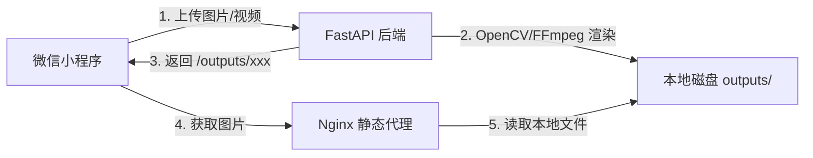

# Cloudflare R2 极速对象存储与全球 CDN 动静态分流架构实战

在微信小程序商业化落地进程中，随着用户生成内容（UGC）与 AI 生成表情包数量的爆发式增长，存储架构往往是系统遭遇的**第一个致命瓶颈**。

本节深入复盘从**单机本地磁盘目录**演进到 **Cloudflare R2 零出口流量费对象存储 + 全球边缘 CDN 分流**的完整生产级技术改造方案，详解为什么小程序不能直连对象存储、后端产物白名单过滤机制、以及存量历史媒体的秒级迁移实战。

---

## 一、架构演进：单机本地存储的四大死穴

在项目初期（MVP 阶段），最直观的做法是将用户生成的 GIF、拼接长图以及压缩图片保存在应用服务器的本地目录中（如 `/root/02project/weixinpy310mememiniapp/backend/storage/outputs/{task_id}/`），并通过 Nginx 进行静态映射：



当业务上线并在微信社群中裂变时，这种单机架构迅速暴露出四大生产级致命缺陷：

1. **VPS 磁盘瞬间被撑爆（Disk Full）**：
   一个 16 帧的动图生成任务，在处理过程中会产生 16 张中间态高清 PNG 帧图、临时裁切视频、调色板缓存与 ZIP 包。单个任务产生 15MB~35MB 临时文件，1000 次制作即可吞噬数十 GB 磁盘空间，导致 SQLite 数据库写入阻塞崩溃。
2. **多进程与多实例无法水平扩展（No Shared Storage）**：
   在启用多 Worker 进程或部署跨服务器高可用集群时，用户轮询任务状态落在 Worker A，而实际图片生成在 Worker B 的本地磁盘上，导致客户端出现大面积 `404 Not Found`。
3. **云厂商天价下行流量费（Egress Bandwidth Trap）**：
   国内主流云厂商（腾讯云/阿里云）按流量计费通常为 0.8元/GB，热门表情包被用户长按转发、在微信群聊中多次加载时，服务器带宽迅速跑满，甚至产生巨额下行流量账单。
4. **备份与容灾极度脆弱**：
   单点服务器一旦遭遇系统故障、重装或磁盘损坏，用户相册与历史作品数据将永久丢失，造成严重客诉。

---

## 二、为什么微信小程序绝不能直连 R2？

业界对象存储（如 AWS S3、阿里云 OSS）通常推崇“前端直传”方案，但在**微信小程序私域表情包生产场景**下，前端直连 R2 存在不可调和的业务与安全冲突：

```
                    ❌ 错误架构：小程序直连 R2 (不可行)
[微信小程序] -----------------(直传原始视频 80MB)-----------------> [Cloudflare R2]
     |                                                                   |
     +-- 泄露 AK/SK 风险                                               +-- 塞满未经校验垃圾文件
     +-- 域名未过微信白名单被封禁                                       +-- 后端无法控制帧处理质量

                    ✅ 正确架构：后端异步双写与产物白名单过滤
[微信小程序] ----(1. 业务鉴权上传)----> [FastAPI 业务网关]
                                             |
                              (2. FFmpeg/OpenCV 极速生成)
                                             |
                                             v
                                    [本地任务沙箱 outputs/]
                                             |
                              (3. 白名单提取: 仅提取最终 GIF/图)
                                             |
                              (4. boto3 S3 API 极速归档)
                                             |
                                             v
[微信小程序] <----(6. 返回全球 CDN URL)---- [Cloudflare R2 + CDN]
                                             |
                              (5. 立即清除本地中间态 PNG/MP4)
```

### 核心安全与业务考量：

1. **凭证隔离与防盗刷**：
   微信小程序客户端代码运行在不可控的宿主环境中，若分发临时 STS 凭证或配置公有直传，恶意用户极易通过逆向提取签名秘钥，将 R2 存储桶变为其免费的图床甚至滥用下行带宽。
2. **微信合法域名规范限制**：
   小程序后台【开发管理 → 开发设置】对 `uploadFile` 域名有严格要求（必须支持已备案的 HTTPS 域名且总数受限）。引入过多第三方直连域名会增加提审失败的风险。
3. **中间态垃圾隔离**：
   用户上传的原生视频（可能高达 50MB~100MB）仅在抽帧阶段有用。若直传 R2，存储桶将被海量无效原始视频塞满；通过后端流式接收并在处理后立刻丢弃，才能保持存储桶的轻量化。

---

## 三、后端异步双写与产物白名单架构实现

在 `backend/app/r2_storage.py` 中，设计了一套基于 **产物白名单（Durable Artifacts Whitelist）** 的异步归档引擎。

### 1. 产物白名单机制（防中间态污染）

```python
# backend/app/r2_storage.py

# 仅最终交付物与持久源文件允许进入 R2 存储桶
# 严格排除：frame_xxx.png（单帧中间图）、tmp_video.mp4（临时视频）、debug_patch.png 等
R2_FINAL_ARTIFACT_NAMES = frozenset({
    "meme_result.gif",       # 最终动图结果
    "compressed.gif",        # 瘦身压缩动图
    "compressed.jpg",        # 压缩图片
    "compressed.png",
    "card.png",              # 金句排版卡片
    "matting_result.png",    # 抠图结果
    "stitched.jpg",          # 长图拼接结果
})
R2_SOURCE_ARTIFACT_NAMES = frozenset({"input_sprite.png"})  # 原始九宫格母图
```

### 2. S3 兼容客户端与不可变缓存配置

Cloudflare R2 提供与 AWS S3 完全兼容的 API。在 Python 中通过 `boto3` 即可零成本接入：

```python
# backend/app/r2_storage.py
import boto3
from app.config import settings

def _client():
    if not is_r2_enabled():
        raise RuntimeError("R2 未启用或配置不完整")
    
    return boto3.client(
        "s3",
        endpoint_url=settings.R2_ENDPOINT_URL.rstrip("/"),
        region_name=settings.R2_REGION,  # 通常填 auto
        aws_access_key_id=settings.R2_ACCESS_KEY_ID,
        aws_secret_access_key=settings.R2_SECRET_ACCESS_KEY,
    )

def _upload_file(client, path: Path, bucket: str, key: str) -> None:
    # 为表情包与静态媒体注入 Immutable 强缓存策略（1 年）
    # 用户在微信中多次查看无需回源，极速秒开
    client.upload_file(
        str(path),
        bucket,
        key,
        ExtraArgs={
            "ContentType": _content_type(path),
            "CacheControl": "public, max-age=31536000, immutable",
        },
    )
```

### 3. 本地中间文件即时清理机制

当且仅当最终文件成功推送到 R2 后，触发本地垃圾清理函数，将磁盘占用降低 90% 以上：

```python
def cleanup_local_intermediates(task_dir: Path) -> None:
    """R2 发布成功后，彻底清理本地产生的中间临时文件"""
    for path in sorted(task_dir.rglob("*"), key=lambda item: len(item.parts), reverse=True):
        if path.is_file() and path.name not in R2_FINAL_ARTIFACT_NAMES | R2_SOURCE_ARTIFACT_NAMES:
            try:
                path.unlink()
            except OSError as err:
                logger.warning("清理中间文件失败 %s: %s", path, err)
```

---

## 四、全双工 URL 自适应与存量数据迁移实战

### 1. 前后端全双工 URL 兼容层

在迁移过程中，存量数据库中可能既包含老数据的相对路径（`/outputs/7e6fc.../meme_result.gif`），又包含新数据的 R2 全路径（`https://pub-r2.domain.com/meme_tasks/7e6fc.../meme_result.gif`）。

前端在 `miniapp/app.js` 与各页面展示层中实现全双工兼容解析器：

```javascript
// miniapp/app.js
resolveMediaUrl(url) {
  if (!url) return '';
  // 若已是 R2 或 CDN 的绝对 HTTPS 地址，直接返回
  if (url.startsWith('https://') || url.startsWith('http://')) {
    return url;
  }
  // 否则拼接源站服务器 API 域名
  const cleanPath = url.startsWith('/') ? url : `/${url}`;
  return `${this.globalData.baseURL}${cleanPath}`;
}
```

### 2. 存量历史媒体批量平滑迁移工具

针对服务器上历史遗留的数千个表情包目录，编写了支持断点续传的迁移脚本 `backend/scripts/migrate_outputs_to_r2.py`：

```bash
# 1. 模拟预览迁移清单（Dry Run，安全无副作用）
python -m scripts.migrate_outputs_to_r2 --dry-run

# 2. 正式执行批量并发迁移，同步更新 SQLite 数据库
python -m scripts.migrate_outputs_to_r2 --concurrency 6
```

迁移脚本内部核心流程包含：
1. **自动过滤非白名单产物**：跳过已损坏文件与零字节文件；
2. **ETag / MD5 比对**：已上传至 R2 的文件自动跳过，避免重复消耗网络；
3. **原子更新 SQLite 记录**：将 `meme_tasks.result_url` 和 `collections.cover_url` 原子替换为云端 CDN 链接；
4. **清理本地旧文件**：迁移完毕并验证可达后，释放数 GB 宝贵本地磁盘。

---

## 五、生产环境效益对比

| 指标 | 改造前（单机本地存储） | 改造后（Cloudflare R2 + CDN） |
| :--- | :--- | :--- |
| **下行带宽成本** | 腾讯云 0.8元/GB（日峰值几十元） | **0 元（Cloudflare R2 真正零出口费）** |
| **服务器磁盘占用** | 随生成量线性暴增，需定期手工删库 | **常年维持在 < 2GB 安全水位线** |
| **微信群加载延迟** | 跨地域延迟 150ms~300ms | **全球边缘节点 20ms~40ms 极速加载** |
| **集群扩展能力** | 严重受限，Worker 间无法共享文件 | **完全无状态，后端可任意水平横向扩容** |
| **容灾安全性** | 单盘崩溃即数据火葬场 | **多可用区持久化存储，99.999999999% 耐用度** |
