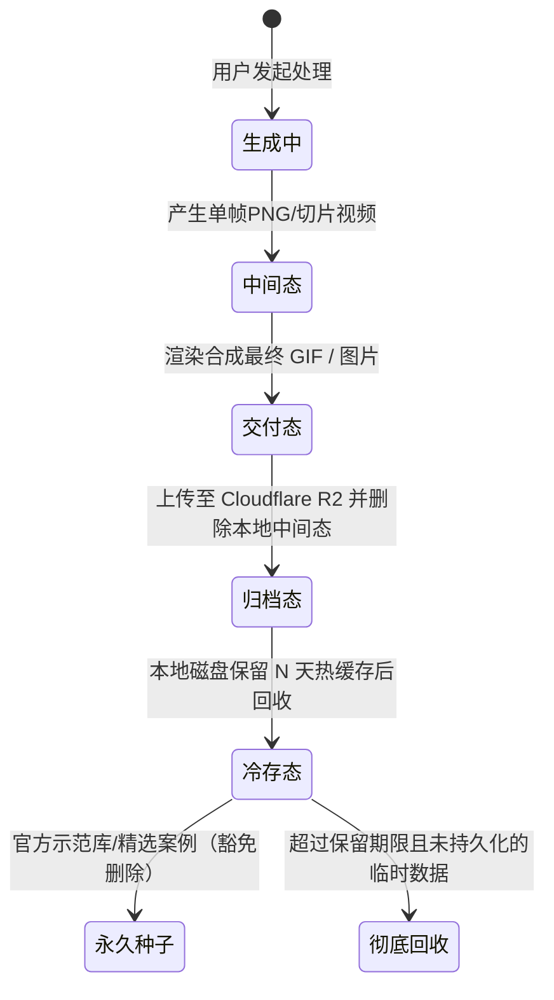

# 存储生命周期、延迟清理守护进程与官方种子保障

在多媒体与 AI 表情包类微信小程序的生命周期中，很多开发者容易走入两个极端：
- **极端 A（完全不清理）**：放任本地磁盘膨胀，几个月后服务器因 `No space left on device` 突发宕机，数据彻底火葬场；
- **极端 B（激进即时清理）**：任务一完成就把所有文件删得干干净净，导致微信群分享卡片失效、用户相册变成一片空白白块、二次编辑报 404。

本节系统介绍如何设计一套高可用、多层级的**媒体生命周期管理状态机与延时清理守护进程（Storage Cleanup Daemon）**，兼顾低成本与极佳的用户持久化体验。

---

## 一、媒体文件的全生命周期状态机

在真实业务场景中，媒体文件绝非“非生即死”，而是经历以下五个阶段：



### 为什么必须保留一定时间的“延迟清理”窗口？

1. **微信裂变卡片回溯（Social Sharing Loop）**：
   用户 A 制作了一张动图，分享到 500 人微信大群。群友 B 可能在 3 小时后甚至次日才点开卡片。如果本地或 CDN 存储在 10 分钟后就失效，新进群友将看到“图片已过期或损坏”，裂变转化链路瞬间熔断。
2. **“我的作品相册”持久化翻查**：
   用户会反复在“个人中心 → 我的作品”中查看并下载历史创作。作品记录若丢失，将直接导致用户付费意愿归零。
3. **二次创作与素材复用**：
   用户经常在作品相册中点击“加入合集”或“重新改字”。如果原始帧数据或母图被粗暴删除，二次生成将完全失败。

---

## 二、自动清理守护进程（Storage Cleanup Daemon）架构

在 `backend/app/storage_cleanup.py` 中，实现了一套非阻塞、低 I/O 占用的后台清理引擎。

### 1. 双重校验清理规则（数据库状态 + 文件 mtime）

为防止误删正在被异步线程读取的文件，清理守护进程采用“数据库标记”与“文件系统修改时间”双重校验：

```python
# backend/app/storage_cleanup.py
import time
from pathlib import Path
from app.config import settings

def prune_expired_scratch_files(max_age_hours: int = 24) -> int:
    """
    清理超期的临时未落库文件与废弃目录
    :param max_age_hours: 默认保留 24 小时缓冲期
    """
    now = time.time()
    cutoff = now - (max_age_hours * 3600)
    cleaned_count = 0

    outputs_dir = settings.OUTPUT_DIR
    if not outputs_dir.is_dir():
        return 0

    for task_dir in outputs_dir.iterdir():
        if not task_dir.is_dir():
            continue
            
        # 1. 种子白名单保护检查
        if is_seeded_task(task_dir.name):
            continue

        # 2. 检查目录最后修改时间
        dir_mtime = task_dir.stat().st_mtime
        if dir_mtime < cutoff:
            # 3. 验证该任务是否已被 R2 归档或为已废弃草稿
            if should_purge_task_directory(task_dir.name):
                shutil.rmtree(task_dir, ignore_errors=True)
                cleaned_count += 1
                
    return cleaned_count
```

### 2. 定时任务调度器与低峰期执行

清理任务不可在白天高峰期占用高额磁盘 I/O。在 FastAPI 应用启动时，将其挂载为后台异步定时器，在夜间低峰期轻量执行：

```python
# backend/app/main.py
@app.on_event("startup")
async def schedule_storage_maintenance():
    async def maintenance_loop():
        while True:
            # 每天凌晨 3:30 执行维护清理
            await asyncio.sleep(86400)
            try:
                prune_expired_scratch_files(max_age_hours=settings.TEMP_RETENTION_HOURS)
            except Exception as exc:
                logger.error("存储定时清理异常: %s", exc)
                
    asyncio.create_task(maintenance_loop())
```

---

## 三、官方种子数据与精选展台永久白名单保障

一个极为隐蔽的线上事故是：**定时清理脚本在凌晨扫描时，把系统内置的“精选模板”、“示范表情”和“新手体验卡片”一并当作过期数据删除了**，导致新用户注册进入小程序后首页大面积白屏！

在 `backend/app/database.py` 中，引入了 **种子数据防误删屏障（Keep Seeded Showcase Protection）**：

```python
# backend/app/database.py

# 官方预设演示任务 ID 与素材固定白名单
SEEDED_SHOWCASE_TASK_IDS = frozenset({
    "sample_kiss_001",
    "sample_worker_002",
    "sample_battle_003",
    "official_banner_default"
})

def is_seeded_task(task_id: str) -> bool:
    """判定是否为系统官方保护的精选种子任务"""
    if task_id in SEEDED_SHOWCASE_TASK_IDS:
        return True
    
    # 动态查询数据库：被置顶或加入官方探索合集的示范作品享有免删特权
    with get_db() as conn:
        cursor = conn.cursor()
        cursor.execute(
            "SELECT 1 FROM collections WHERE cover_url LIKE ? OR is_official = 1",
            (f"%{task_id}%",)
        )
        return cursor.fetchone() is not None
```

当守护进程扫描到这些目录时，一律无条件跳过，确保线上核心体验万无一失。

---

## 四、四级容灾分层缓存架构

为了在极端恶劣网络（如服务器机房临时断网、Cloudflare 边缘节点抖动、或国内弱网）下依然保持高可用，系统构建了**四级分层容灾体系**：

```
Level 1: 客户端本地缓存 (wx.getStorageSync + 小程序临时文件系统，0ms 秒开)
   │
   ▼ 命中失败
Level 2: Cloudflare 全球 CDN 边缘缓存 (Cache-Control 1 年，20ms~50ms 响应)
   │
   ▼ 边缘穿透
Level 3: Cloudflare R2 对象存储桶 (11个9数据持久性，原图无损归档)
   │
   ▼ R2 离线兜底
Level 4: 源站本地 outputs/ 目录 (保留最近 48 小时热数据，作为最终安全气囊)
```

这种分层架构实现了：
1. **95% 以上**的静态表情查看直接在 CDN 和客户端缓存中终结，源站零负载；
2. 即使源站遭遇重装或断网，只要前端已被 CDN 缓存或存放在 R2，用户依然能流畅转发与查看全部作品；
3. 本地磁盘空间被严格控制在可预测的恒定水平，告别磁盘报警。
