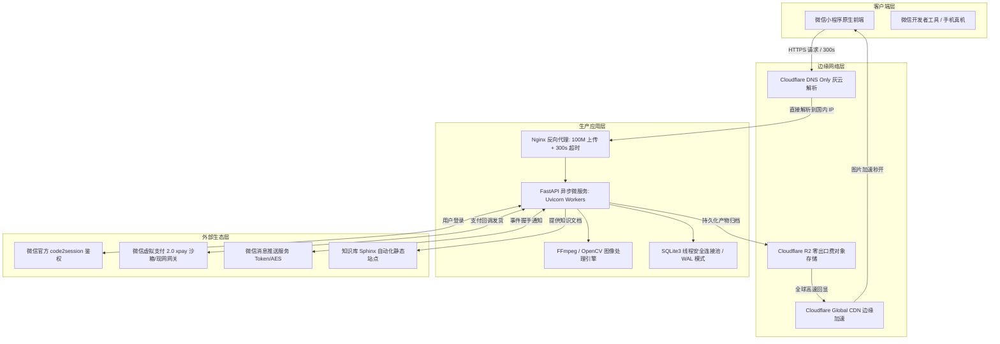

# 全栈架构实战演进、变现闭环与上线前全项自检清单

经过前八个阶段的层层拆解与第九阶段的生产级云原生加固，本项目从一个简单的单机原型，蜕变成一套高内聚、低耦合、具备自愈与水平扩展能力的商业化多媒体与知识付费全栈矩阵。

本节系统盘点全套技术架构大图、四重变现矩阵闭环、以及一套经过数十次微信官方实战检验的**上线前提审全项自检清单（Pre-flight Launch Checklist）**。

---

## 一、全栈系统拓扑全景大图

整个系统遵循“轻量源站 + 边缘 CDN + 异步 AI 网关 + 微信虚拟支付 2.0”的分层解耦设计：



---

## 二、高收益变现矩阵闭环设计

系统将“知识付费”与“AI 生产力工具”巧妙熔铸为一套高转化、高留存的变现模型：

```
                              [ 用户触达来源 ]
                       微信搜一搜 / 朋友圈裂变 / 社群表情
                                     │
                                     ▼
                      [ 核心入口: 免费体验体验区 ]
                       每日赠送 5 次 AI 动图制作额度
                                     │
                 ┌───────────────────┴───────────────────┐
                 ▼                                       ▼
        【路径 A: 私域裂变转化】                【路径 B: 高阶功能付费】
   - 分享给好友各赠送 3 次额度              - 高清大尺寸 / 无限去水印
   - 合集一键转存社群                      - 虚拟支付 2.0 购买额度包 (6元~98元)
                 │                                       │
                 └───────────────────┬───────────────────┘
                                     ▼
                       [ 深度留存: 知识付费专栏 ]
                  - 解锁《商业全栈小程序从0到1》教程
                  - 会员专享商业实战源码与部署文档站
```

### 1. 微信虚拟支付 2.0（XPay）全自动化
- 弃用繁琐的传统微信商户号，基于小程序专属虚拟支付 `offer_id` 与现网/沙箱密钥双轨运行；
- 采用道具 Excel 批量导入机制，代码价格与微信配置中心自动校验，误差彻底归零；
- 结合后端幂等发货与数据库事务，保障极端弱网下“付款即到账，永不丢单”。

### 2. 私域裂变自增长飞轮
- 每一个由小程序生成的表情包或拼接长图，底部均支持自定义防盗水印或作者署名；
- 用户长按分享至聊天群时，卡片直接携带专属邀请码，新用户点开自动完成绑定，双方实时获得算力补贴。

---

## 三、生产环境上线前全项自检清单（Pre-flight Launch Checklist）

在正式点击微信公众平台【提交审核】按钮之前，请务必逐项核对以下 20 个关键检查项：

### 1. 域名与网络安全
- [ ] **域名解析模式**：业务 API 域名已确认为 **DNS Only（灰色云朵）**，直接解析到具有工信部备案号的国内服务器 IP。
- [ ] **SSL 证书链完整**：在浏览器和移动端验证无不受信任报警，证书过期时间 > 30 天。
- [ ] **微信服务器域名白名单**：在微信小程序管理后台【开发管理 → 开发设置】中，已完整配置 `requestValidDomain`、`uploadFileValidDomain`、`downloadFileValidDomain`，并已将 Cloudflare R2 公网自定义域名加入白名单。
- [ ] **Nginx 包体与超时**：已配置 `client_max_body_size 100M;`，各项超时设为 `300s`，且执行 `nginx -t` 验证无误。

### 2. 小程序客户端规范
- [ ] **全局网络超时**：`miniapp/app.json` 中已写入 `"networkTimeout": { "uploadFile": 300000, "request": 120000 }`。
- [ ] **过审模式后门开关**：已配置审核白名单账号机制，未登录或非白名单用户无法访问敏感或未授权功能。
- [ ] **废弃接口升级**：全面移除废弃的 `wx.getSystemInfoSync`，替换为 `wx.getWindowInfo` / `wx.getDeviceInfo`。
- [ ] **WXML 标签语法闭合**：通过自动化验证脚本扫描，确保全量页面模板标签 100% 配对闭合，编译零 Warning。

### 3. 后端服务与存储管理
- [ ] **R2 对象存储环境配置**：`.env` 中的 `R2_ACCESS_KEY_ID`、`R2_SECRET_ACCESS_KEY`、`R2_BUCKET` 与 `R2_ENDPOINT_URL` 均已填写真实生产密钥并通过联通探针验证。
- [ ] **产物白名单防御**：R2 上传已锁定为仅同步交付文件，中间态视频与切片帧已阻断。
- [ ] **存储清理守护进程**：`storage_cleanup.py` 已加入后台任务，官方精选演示种子表情已被列入永久免删白名单。
- [ ] **低内存安全运行**：严禁在生产环境主进程中直接运行大型深度学习模型，保留系统物理内存 > 250MB 预警水位。

### 4. 虚拟支付与运营合规
- [ ] **环境切换标识**：生产环境 `XPAY_ENV` 已由沙箱测试值（1）切换为正式现网值（0）。
- [ ] **消息推送握手验证**：微信后台消息推送设置（Token / EncodingAESKey）已成功点击保存并联通。
- [ ] **用户隐私协议**：微信小程序后台【用户隐私保护指引】中，已明确声明收集相册存储（用于保存表情包）和剪贴板权限（用于复制色值）。
- [ ] **内容安全审查合规**：用户自定义文案输入框限制为 80 字符，并建议接入微信文本安全校验接口 `msgSecCheck`。
